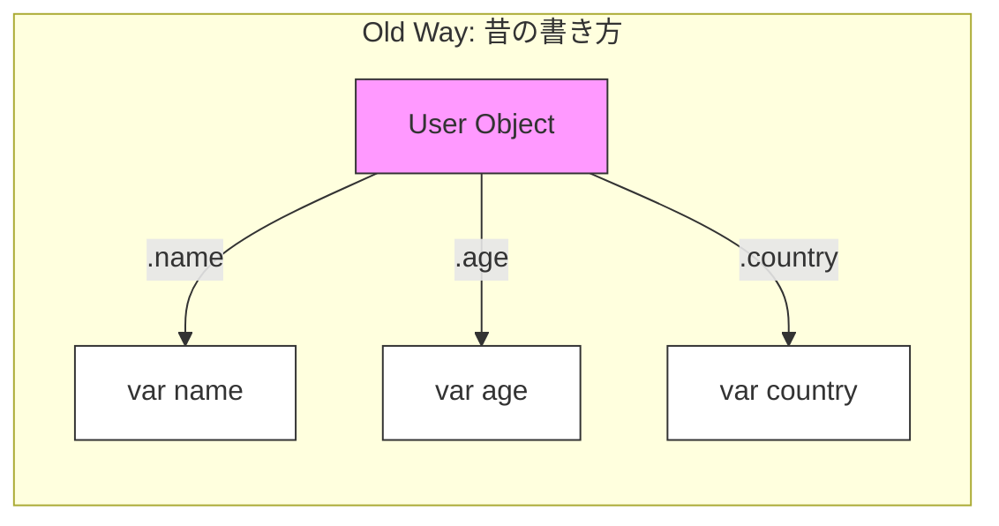
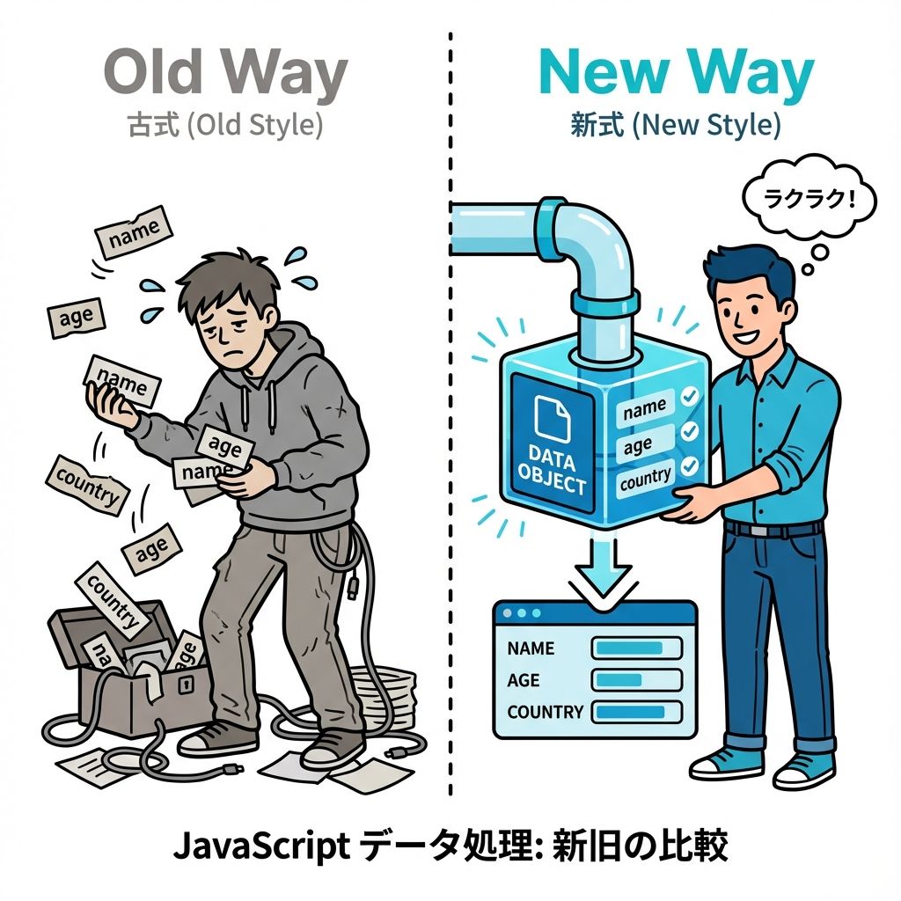

# 🌱 第1章　なぜ"新しい書き方"が生まれたの？

---

## 🕰️ むかしのJavaScriptは、ちょっと不便でした

JavaScriptは最初、**「小さな動きをつけるための言語」** として生まれました。
たとえば「ボタンを押したら文字の色を変える」とか「アラートを出す」とか。

でも年月がたつうちに、
比較的複雑なWebアプリすらも、みんなJavaScriptで動くようになりました。
──すると、**昔の書き方では足りなくなってきた**のです。

---

### 💭 例：昔ながらの"手渡し"スタイル

```javascript
const user = {
  name: "たろう",
  age: 20,
  country: "Japan"
};

// ほしい値を1つずつ取り出す
var name = user.name;
var age = user.age;
var country = user.country;

console.log(name, age, country);
```

これでも動くんですが、問題はこうです👇

* 変数が多いと **同じような行がずらずら続く**
* 「userから何を使ってるのか」 **パッと見でわからない**
* コピー＆ペーストが多くて **ミスしやすい**

コードが長く、**「見た目のノイズ」が多い**んですね。





---

## 📦 "箱"のようにデータをまとめたのは良かったけれど…

JavaScriptでは「オブジェクト」や「配列」でデータをまとめます。
これはとても便利です。

でも、それを **使いたいときに"ほどく"のが面倒** でした。
まるで、こんな感じです👇

> 🎁「このプレゼント箱の中から、"青いリボンのチョコ"だけ取って！」
> でもフタを開けるたびに、
> 「これ？ いや違う、これ？　いやそれも違う…」
> と一個ずつ探しているようなもの💦

---

## ⚙️ そこで登場したのが「ES2015（ES6）」

2015年に、JavaScriptに **たくさんの新しい書き方** が加わりました。
それがいま僕らが使っている **モダンJavaScript（現代の書き方）** です。

このとき登場したのが：

* 分割代入
* スプレッド構文（`...`）
* 残余引数（`...args`）
* デフォルト引数
* 名前付き引数（オブジェクトを引数にする考え方）

これらはすべて、
「データを**まとめやすく・ほどきやすく**したい」
という1つの願いから生まれました。

---

## 🧩 つまりテーマは「まとめる」と「ばらす」

JavaScriptが進化した方向をひとことで言うなら、
それは「**データをきれいにまとめて、必要なところでだけばらす**」です。

| やりたいこと                | 使うもの    | 例                           |
| --------------------- | ------- | --------------------------- |
| オブジェクトからほしいものだけ取り出したい | 分割代入    | `{ name, age } = user;`     |
| まとめて受け取りたい            | 残余引数    | `function show(...args)`    |
| 配列やオブジェクトを広げたい・コピーしたい | スプレッド構文 | `{ ...user }`               |
| 関数に名前つきで渡したい          | 名前付き引数  | `function f({ name, age })` |

---

## 🧠 ここまでのまとめ

* 昔のJavaScriptは**手作業で取り出すのが大変だった**
* データをまとめるだけでなく、**ほどく**（＝使いやすくする）ための文法が増えた
* 「分割代入」「スプレッド構文」「名前付き引数」などは、**全部この流れの仲間**

---

## ⚓イカリちゃんのワンポイント⚓


#### 💬「昔のJSってね、港で荷物をひとつずつ手渡ししてたのよ。<br>　 　"name、はい "age"、はい "country" …あれ？どこいった？"ってね💦<br>　 　でも今はコンテナ輸送（＝オブジェクト）でドン！って渡して、<br>　 　必要な荷物だけバラせるようになったの。<br>　 　それが"分割代入"たちの世界観よ⚓」

---

## 🌸 この章のゴール

この章では、

> 「なんで"分割代入"とか"...（スプレッド）"なんてあるの？」

という疑問を解消するのが目的でした。

次の章からは、
この「新しい書き方」をひとつずつ見ていきます👀✨
まずは第2章、**配列の分割代入**から出航です⚓🌊

---

📘 **つぎの章 → [第2章　まずは「配列の分割代入」から🐣]**

> 「順番で取り出す」「残りをまとめる」やさしい入り口！

---

<h1><a href="D02.md">第2章へ 🐣</a></h1>
