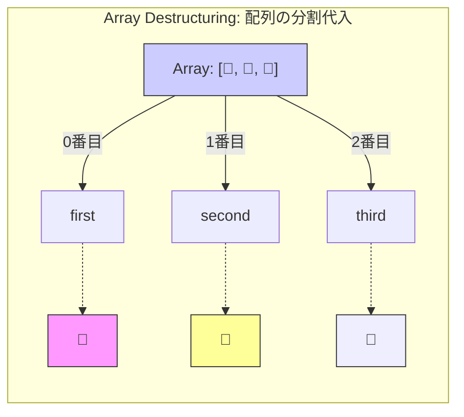

# 🐣 第2章　まずは「配列の分割代入」から！

---

## 🍬 分割代入ってなに？

むずかしく聞こえるけど、
かんたんに言えば「配列やオブジェクトの中身を、**まとめて取り出す方法**」です✨

まずは配列で見てみましょう。

---

## 🎁 例：ふつうに取り出すとこうなる

```javascript
const fruits = ["🍎りんご", "🍌バナナ", "🍇ぶどう"];

const first = fruits[0];
const second = fruits[1];
const third = fruits[2];

console.log(first, second, third);
```

出力結果：

```
🍎りんご 🍌バナナ 🍇ぶどう
```

うん、動くけど……
👀 **なんか行が長い！**

「同じようなことを何回も書いてるな～」って思いませんか？

---

## 🌸 分割代入を使うとこうなる！

```javascript
const fruits = ["🍎りんご", "🍌バナナ", "🍇ぶどう"];

// 配列の中身を一気に取り出す！
const [first, second, third] = fruits;

console.log(first, second, third);
```

出力結果：

```
🍎りんご 🍌バナナ 🍇ぶどう
```

たった1行で同じことができちゃいました🎉
これが **分割代入（Destructuring Assignment）** です。

---

## 🧩 どういう仕組み？

* `[` と `]` の形を見てください。これは **配列の形そのもの** です。
* JavaScriptは「左側と右側の形が同じなら、順番に中身を対応させる」というルールで動いています。

つまり：

```
左側: [first, second, third]
右側: ["🍎", "🍌", "🍇"]
```

👉 first に 🍎
👉 second に 🍌
👉 third に 🍇
が入ります。



---

## 🎯 スキップもできる！

「2番目だけいらないな～」というときは、カンマでスキップできます✨

```javascript
const fruits = ["🍎りんご", "🍌バナナ", "🍇ぶどう"];

// 2番目をスキップ
const [first, , third] = fruits;

console.log(first, third);
```

出力結果：

```
🍎りんご 🍇ぶどう
```

真ん中の要素は、**カンマ2つで飛ばすだけ**です！🍌はお休み🍌💤

---

## 🌀 「残りは全部まとめて！」（残余要素）

配列の最後に `...rest` と書くと、
**残りの全部**をまとめて1つの配列にしてくれます✨

```javascript
const fruits = ["🍎りんご", "🍌バナナ", "🍇ぶどう", "🍊みかん"];

// 最初の1つだけ取り出して、残りはまとめる
const [first, ...rest] = fruits;

console.log(first); // 🍎りんご
console.log(rest);  // ["🍌バナナ", "🍇ぶどう", "🍊みかん"]
```

まさに「**残り全部まとめて！**」という機能。
これを「**残余要素（rest element）**」といいます。

---

## ?? 配列でもデフォルト値をつけられる

要素が足りないと `undefined` になってしまうので、
「なかったらこの値にする」を決めておくと安全です。

```javascript
const colors = ["red"];

const [first = "red", second = "blue"] = colors;

console.log(first);  // "red"
console.log(second); // "blue"
```

> ?? 配列の分割代入でも `=` でデフォルト値を指定できます。

---

## ?? 変数の入れ替えにも使える

```javascript
let a = 1;
let b = 2;

// 分割代入でスワップ
[a, b] = [b, a];

console.log(a, b); // 2 1
```

> ?? 一時変数を使わずに入れ替えができます。

---

## 🧠 ここまでのまとめ

| やりたいこと  | 書き方                    | 結果          |
| ------- | ---------------------- | ----------- |
| 順番に取り出す | `[a, b] = array`       | 1番目→a、2番目→b |
| 間をスキップ  | `[a, , c] = array`     | 真ん中を飛ばす     |
| 残りをまとめる | `[a, ...rest] = array` | 残りが1つの配列になる |

---

## ⚓イカリちゃんの出航⚓


#### 💬「船で荷物をおろすときに、1個ずつ数えるのはもう古いのよ。<br>　 　“最初のひとつ”と、“残りはまとめて倉庫ね～”って感じで<br>　 　JavaScriptも港作業をスマートにしたの💨<br><br>　 　あ、出航の時間だわ！ また今度ね！⚓」

---

## 💬 よくあるミス

```javascript
const [a, b, c];
```

🚫 これ、右側の配列がありません！
正しくは：

```javascript
const [a, b, c] = [1, 2, 3];
```

分割代入では、**右側に配列やオブジェクトが必ず必要**です。

---

## 🌸 この章のゴール

* 配列の中身を **一気に変数へ取り出す方法** を覚えた
* `...rest` で **残りをまとめる** テクニックもマスターした

---

📘 **つぎの章 → [第3章　オブジェクトの分割代入🎁]**

> 名前のついたデータを「箱から取り出す」魔法を見てみよう！

