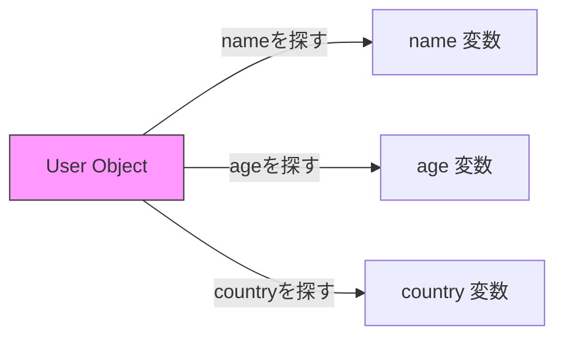
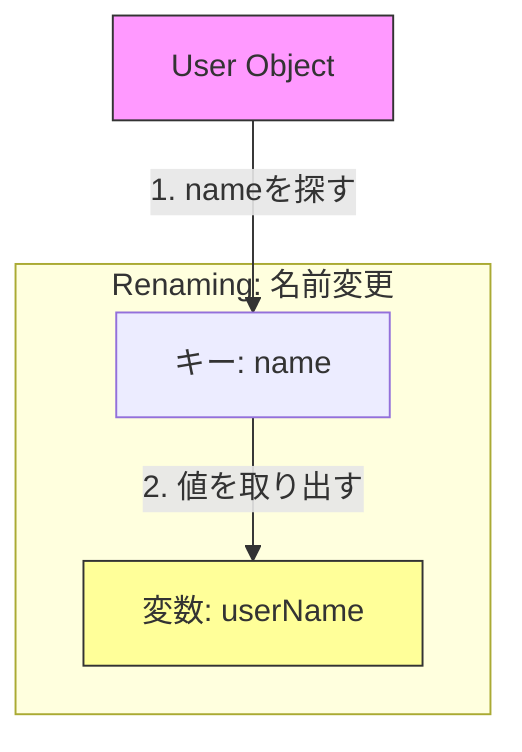

# 🎁 第3章　オブジェクトの分割代入

---

## 🧱 オブジェクトってなに？

オブジェクトとは、**名前つきの引き出しがいくつも入った箱**のようなものです📦

```javascript
const user = {
  name: "イチカ",
  age: 18,
  country: "Japan"
};
```

| 引き出し名（キー） | 中身（値）   |
| :-------- | :------ |
| name      | "イチカ"   |
| age       | 18      |
| country   | "Japan" |

---

## 💭 昔ながらの取り出し方

```javascript
const name = user.name;
const age = user.age;
const country = user.country;
```

これでも動きますが、似たような行がずらっと並んでしまいます。
**「箱をいちいち開けて取り出す」感じ**ですね。

---

## 🌸 分割代入を使うとスッキリ！

```javascript
const { name, age, country } = user;
```

これで一気に `user` の中身を取り出せます✨
たった1行で、3つの変数を作れるんです。

---

## 💡 仕組みのイメージ

左の `{ name, age, country }` は “抜き取りたい引き出し名” を表しています。
右の `user` の箱から、対応するラベルを見つけて中身を取り出すイメージです。

```
{ name, age, country }  ← user の中から
```




---

## 🧩 「変数名を変えつつ」取り出したいとき（最大の挫折ポイント）

---

### 🌟 よくある疑問

> 「`:` ってどっちがどっち？」「なんで逆に見えるの？」

そう。ここが初心者の**最初の壁**です。
分割代入では「:」の左右の意味が、オブジェクト作成時と**逆**になります！

---

### 💬 ふつうのオブジェクトを作るとき

```javascript
const userName = "イチカ";
const user = { name: userName }; // ← 「キー: 値」
```

> 「name という引き出しに userName を入れる」

---

### 💫 分割代入のとき

```javascript
const user = { name: "イチカ" };

// 「user の name を取り出して、userName に入れる」
const { name: userName } = user;

console.log(userName); // イチカ
```

> 今度は逆！「左が user のキー名」「右が作る変数名」

| 操作       | 左側の意味     | 右側の意味       |
| -------- | --------- | ----------- |
| オブジェクト作成 | 引き出し名（キー） | 中身（値）       |
| 分割代入     | 取り出すキー名   | 変数名（新しいラベル） |

---

### 🧠 図で覚えよう

```
user ──┐
       ↓
   name: "イチカ"
       │
       ↓
   userName ← 取り出したあとの変数
```




📦「箱の中の name を開けて userName に入れる」ということ！

---

### 💥 よくある間違いTOP3（名前変更編）

#### ❌ 間違い1：順番を逆にしてしまう

```javascript
// ❌ ダメ
const { userName: name } = user;
```

→ 「右側のuser変数から、userName というキーを探して、name に入れる」
そんなキーはないので `undefined` になります。

---

#### ❌ 間違い2：「:」のかわりに = を使ってしまう

```javascript
// ❌ これもダメ
const { name = userName } = user;
```

これは「name がなければ userName を使う（デフォルト値）」の意味になってしまいます。

✅ 「名前を変える」には `:`
✅ 「なかったときの代わりの値」をつけるには `=`
👉 用途がまったく違います！

---

#### ❌ 間違い3：`const` を忘れて {} だけ書く

```javascript
// ❌ 文法エラー！
{ name: userName } = user;
```

宣言の `const`（または `let` / `var`）が必要です。

✅ 正しい書き方：

```javascript
const { name: userName } = user;
```

---

## 🌼 デフォルト値もつけられる！（第2の挫折ポイント）

---

### 🌱 なぜ必要？

APIなどで値が欠けている場合、`undefined` のままだと困ります。
そんなときに “なかったら代わりにこれを使う” と決めておけるのがデフォルト値です。

---

### 🍎 基本形

```javascript
const user = { name: "イチカ" };

// country がなければ "Japan" にする
const { name, country = "Japan" } = user;

console.log(name);     // イチカ
console.log(country);  // Japan
```

読み方：
「user から name を取り出し、country がなければ “Japan” を代わりに使う」

---

### 💬 よくある「勘違い」ポイント

#### ❌ 間違い1：「:」と「=」の順番を逆にする

```javascript
// ❌ これは構文エラー！
const { name = "イチカ": userName } = user;
```

✅ 正しい順番：

```javascript
const { name: userName = "ゲスト" } = user;
```

**順番は「: → =」の順です！**

> 「どのキーから → どんな変数名で → もしなければ何を入れる」
> この順番で考えると理解しやすいです。

---

#### ❌ 間違い2：「デフォルト値を {} の外で書く」

```javascript
// ❌ これは「分割代入のデフォルト値」ではない
const { name, country } = {};
name = "ゲスト"; // ← これはただの別の代入
```

✅ 正しくは：

```javascript
const { name = "ゲスト", country = "日本" } = {};
```

> デフォルト値は、**分割代入の {} の中に書く**のがルール。
> 外で書くと、単なる再代入になってしまいます。

---

#### ❌ 間違い3：配列と混同する

```javascript
// ❌ NG：配列風に書いてしまう
const [name = "イチカ"] = user;
```

オブジェクトは `{}`、配列は `[]`。
ぜんぜん別の仕組みなので混ぜてはいけません⚠️

---

### 🧩 名前変更＋デフォルト値を同時に使う

```javascript
const user = {};

// nameがなければ「ゲスト」を userName に代入
const { name: userName = "ゲスト" } = user;

console.log(userName); // ゲスト
```

読み方：

> 「user の name を取り出して userName に代入。
> もし name がなければ 'ゲスト' を入れる」

---

## 🧠 まとめ表（暗記用）

| やりたいこと  | 書き方                          | 意味                          |
| ------- | ---------------------------- | --------------------------- |
| 普通に取り出す | `{ name }`                   | name の値を取り出す                |
| 名前を変える  | `{ name: userName }`         | name → userName             |
| デフォルト値  | `{ name = "ゲスト" }`           | name がなければゲスト               |
| 名前を変える +  デフォルト値   | `{ name: userName = "ゲスト" }` | name を userName に入れ、なければゲスト |

---

## 📦️ダンボ姉さんのひとこと📦️


#### 💬「オブジェクトの分割代入って、まるで**名前つきの引き出しを開ける**みたいでしょ📦<br>　 　でもね、コツは簡単！<br>　 　・『：』は“ラベルを貼り替える”<br>　 　・『＝』は“中身がなかったときのスペア”。<br>　 　この2つのルールを知ってれば、どんな箱でもきれいに仕分けできるわ✨」


---

## 🌸 この章のゴール

* 分割代入の基本構文を理解
* `:` の左右の意味の違いを正しく区別
* デフォルト値（`=`）の位置を正確に把握
* 名前変更＋デフォルト値の併用が理解できた

---

📘 **つぎの章 → [第4章　`...` は2つの顔を持つ!? 🐾（スプレッド構文）]**

> ばらす・くっつけるの両方をこなす “ドット3兄弟” に出会おう！

