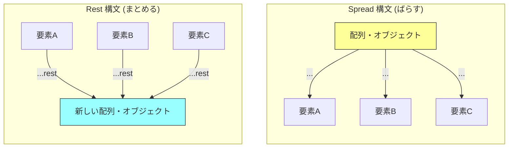
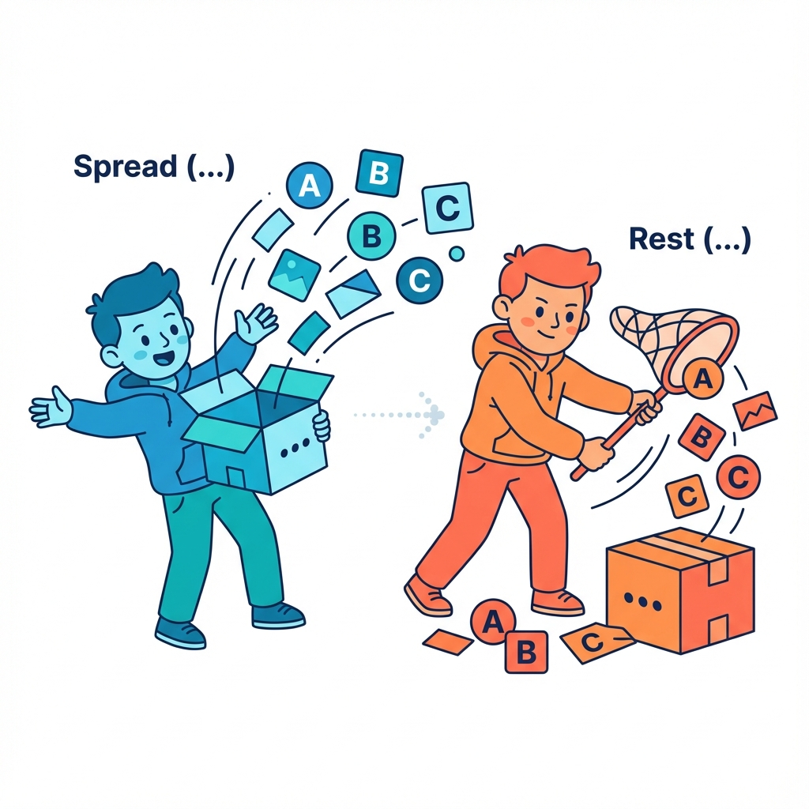

# 🌀 第4章　`...` は2つの顔を持つ!? 🐾

## ――スプレッド構文と残余（rest）構文の世界へようこそ！

---

## 🌟 はじめに：見た目が同じでも、意味がちがう！

JavaScriptでは `...`（ドット3つ）は **2種類のまったく違う役割** を持っています。

| 種類              | 呼び方    | 意味        | よく出る場所               |
| :-------------- | :----- | :-------- | :------------------- |
| **スプレッド構文**     | spread | 「中身をばらす」  | 配列やオブジェクトをコピー・結合するとき |
| **残余構文（レスト構文）** | rest   | 「残りをまとめる」 | 関数の引数や分割代入のとき        |

---

## 🧩 まずは「ばらす」側（スプレッド構文）

### 🍎 配列のスプレッド

```javascript
const fruits = ["🍎", "🍌"];
const moreFruits = ["🍇", ...fruits, "🍓"];

console.log(moreFruits);
// ["🍇", "🍎", "🍌", "🍓"]
```

💬 `"..."` の後ろにある配列の中身を「ばらして」別の配列の中に入れています。

> 🧠 イメージ：「箱の中のものを全部取り出して、別の箱に並べる」

---

### 🧠 よくある使い道：配列のコピー

```javascript
const numbers = [1, 2, 3];

// ✅ 正しいコピー（独立した配列になる）
const copy = [...numbers];

// ❌ 間違い（同じ箱を指す）
const alias = numbers;

numbers.push(4);
console.log(copy);  // [1, 2, 3]
console.log(alias); // [1, 2, 3, 4]
```

💡 `[...]` を使えば、同じ見た目の配列でも「まったく別の箱」が作れます。

---

### 🧩 オブジェクトでも使える！

```javascript
const base = { name: "イチカ", age: 18 };
const added = { ...base, country: "Japan" };

console.log(added);
// { name: "イチカ", age: 18, country: "Japan" }
```

📦 `...base` の中身を「ばらして」新しいオブジェクトに流し込んでいます。

---

### ⚠️ 注意：順番が大事！

```javascript
const base = { name: "イチカ", age: 18 };
const changed = { ...base, age: 20 }; // 後ろが上書き！

console.log(changed.age); // 20
```

> ✨ スプレッドは「展開したあとに、後の要素で上書きされる」。
> Reactの `setState({ ...state, count: count + 1 })` もこのルールです。

---

## 🌼 次に「まとめる」側（残余構文・rest）

---

### 🧺 配列での残りまとめ

```javascript
const colors = ["red", "green", "blue", "yellow"];
const [first, second, ...others] = colors;

console.log(first);  // red
console.log(second); // green
console.log(others); // ["blue", "yellow"]
```

💬 `...others` は「残り全部」をまとめてくれる便利なバケツ。

> 🧠 覚え方：「rest は“rest（残り）”！」

---

### 🎀 オブジェクトでも使える

```javascript
const user = {
  name: "イチカ",
  age: 18,
  country: "Japan",
  hobby: "Coding"
};

// nameだけ取り出して、残りをまとめる
const { name, ...info } = user;

console.log(name); // イチカ
console.log(info); // { age: 18, country: "Japan", hobby: "Coding" }
```

💡 `info` の中には「name 以外のすべて」が入ります。

これ、**Reactのprops処理**で毎日のように出てきます👇

```javascript
function Hello({ name, ...props }) {
  console.log(name); // メインの値
  console.log(props); // 残りのオプションたち
}
```

---

## 🧠 スプレッドとレストの違いを整理！

| 記法            | 意味       | 位置         | 使う目的        |
| ------------- | -------- | ---------- | ----------- |
| `...`（spread） | **ばらす**  | 右辺（代入される側） | コピー・結合・展開   |
| `...`（rest）   | **まとめる** | 左辺（代入される側） | 残りをひとまとめにする |






---

### 🔍 例で見比べ！

```javascript
// spread：ばらす
const all = ["🍎", ...["🍌", "🍇"]];
console.log(all); // ["🍎", "🍌", "🍇"]

// rest：まとめる
const [first, ...rest] = ["🍎", "🍌", "🍇"];
console.log(rest); // ["🍌", "🍇"]
```

🧩 同じ `...` でも「どっち側にあるか」で意味が真逆になります！

---

## 🧭 応用：ネストされたオブジェクトで使う

```javascript
const user = {
  name: "イチカ",
  address: {
    city: "Tokyo",
    zip: "100-0001"
  }
};

// ネストしたオブジェクトを展開
const {
  name,
  address: { city, zip }
} = user;

console.log(city); // Tokyo
```

💬 addressの中にあるキーを、さらに `{}` の中で展開できます。

> 「2階建ての箱を1階ごとに開けていく」イメージです。

---

## 🪶 Reactでの実用例（見え方の確認）

```jsx
function Hello({ name, ...props }) {
  return (
    <div>
      <h1>こんにちは、{name} さん！</h1>
      <pre>{JSON.stringify(props, null, 2)}</pre>
    </div>
  );
}

// 使用例
<Hello name="イチカ" age={18} country="Japan" />;
```

出力：

```
こんにちは、イチカ さん！
{
  "age": 18,
  "country": "Japan"
}
```

🧠 `props` の中には「name 以外のすべて」がまとめられています。

---

## 📦️ダンボ姉さんの豆知識📦️


#### 💬「プレッド（ばらす）とレスト（まとめる）は、あたしから見たら“開梱係と梱包係”ね📦💨<br>　 　ひとりが中身を広げて、もうひとりがきれいに詰めなおすの。<br>　 　同じ `...` ドット三兄弟でも、性格が正反対で面白いでしょ？😄」

---

## 🌸 この章のまとめ 🌸

| 構文           | 読み方       | 意味              | 例                      |
| ------------ | --------- | --------------- | ---------------------- |
| `...array`   | スプレッド構文   | 配列やオブジェクトの中身を展開 | `[...arr]`             |
| `...rest`    | 残余構文（レスト） | 残りの要素をまとめて受け取る  | `[a, ...rest]`         |
| `{ ...obj }` | オブジェクトの展開 | コピーやマージに使える     | `{ ...user, age: 20 }` |

---

## 📦️ダンボ姉さんのひとこと📦️


#### 💬「ドット3兄弟って、ほんと気まぐれなのよね～📦💦<br>　 　でもね、コツは簡単！<br>　 　左の箱（受け手）なら“まとめる”、右の箱（送り手）なら“ばらす”。<br>　 　これさえ覚えれば、もうダンボ姉さん級の仕分けマスターよ🎀」


---

📘 **次回予告：第5章 ―Reactを知らなくても理解できる「...props」と「名前付き引数」完全理解！**

---

<h1><a href="D05.md">第5章へ 🎀</a></h1>

