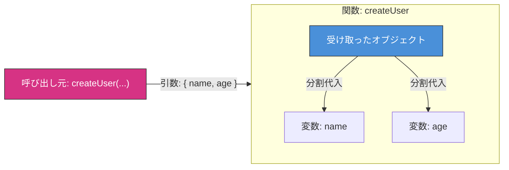

# 🎀 第5章　関数の引数で使う「分割代入」と「...rest」

### ―― Reactを知らなくても理解できる、JavaScriptの関数引数マスター編 💡

---

## 🌟 はじめに：関数の引数ってどうやって渡してる？

まずはおさらいから。

```javascript
function greet(name, age) {
  console.log(`こんにちは、${name}さん (${age}歳)`);
}

greet("イチカ", 22);
```

ここまでには普通の「引数の並び」ですね。<br>
でも実際のプログラムでは、**引数が多くなったり、順番を忘れたり** してしまうことがあります。

---

## 🍎 たとえばこうなると…

```javascript
function createUser(name, age, country, hobby, email, bloodType) {
  // …処理
}
```

💦 6個も引数があると、「どれがどれ？」ってなりますよね。

---

## 💡 ここでオブジェクト引数が登場！

複数の情報を「ひとまとめの箱（オブジェクト）」で渡すことができます。

```javascript
function createUser(user) {
  console.log(user.name);
  console.log(user.age);
}

createUser({ name: "イチカ", age: 22 });
```

> 🔹 これで「引数の順番」を気にしなくてよくなりました！<br>
> 🔹 ただし、`user.name` のように毎回ドットで書くのはちょっと面倒…。

---

## 🌸 そこで登場：関数の中で分割代入！

```javascript
function createUser({ name, age }) {
  console.log(`ようこそ ${name} さん (${age}歳)`);
}

createUser({ name: "イチカ", age: 22 });
```

💬 `function createUser({ name, age })`<br>
この `{ name, age }` は、第3章で学んだ「オブジェクトの分割代入」そのものです！

> ✨ オブジェクトをそのまま受け取って、すぐ中身を取り出す構文です。

---

## 📦 イメージ図

```
引数の箱 { name: "イチカ", age: 22 }
↓
{name, age} = user
```




関数が呼ばれた瞬間に、**引数オブジェクトをその場でバラしてくれる**んです🎁


---

## 🧠 よくある間違い①：{}を忘れる

```javascript
function createUser(name, age) {
  // ❌ これはオブジェクトじゃなく、2つの別引数を期待してる
}

createUser({ name: "イチカ", age: 22 }); // 意図通りには動作しない
```

✅ 正しいのは：

```javascript
function createUser({ name, age }) {
  console.log(name);
}
```

> 👇 関数の「引数」でも、オブジェクトを「分割代入」で受け取れる！

---

## 🧠 よくある間違い②：デフォルト値の位置

```javascript
function greet({ name = "ゲスト" }) {
  console.log(`こんにちは ${name} さん`);
}

greet({}); // こんにちは ゲスト さん
```

> ✅ 引数オブジェクトが「空のオブジェクト」でも動作する！

💬 `name = "ゲスト"` は「分割代入のデフォルト値」。<br>
`({ name = "ゲスト" })` と書く位置がポイントです！

---

## 🍋 よくある応用：引数が省略されたとき

もし呼び出し時にオブジェクトそのものが渡されなかったら？

```javascript
function greet({ name = "ゲスト" } = {}) {
  console.log(`こんにちは ${name} さん`);
}

greet(); // こんにちは ゲスト さん
```

> ⚠️ `= {}` の部分は「引数そのものが undefined の場合のデフォルト値」。

💡 但し、これは「空オブジェクト」すら「引数で渡ってこない」ことまでもを仕様として想定した場合限定です。<br>
　 普通は「引数を渡すことを縛る」場合がほとんどですので、この { } はあまり使いません。<br>
　 意図して「引数なし」すらも正式な記述として認める場合にだけこのようにします。

---

## 🧺 関数の残余引数は「配列として受け取る」

引数の数が決まっていないときは、`...` でまとめて受け取れます。

```javascript
function sum(...numbers) {
  return numbers.reduce((total, n) => total + n, 0);
}

console.log(sum(1, 2, 3)); // 6
```

> 🧠 `...numbers` は「残余引数（rest parameter）」で、必ず配列になります。<br>
> ⚠️ `arguments` は古い書き方で配列ではないため、普段は残余引数を使うのが安全です。

---

## 🧩 さらに便利：`...rest` で「残り」をまとめる

```javascript
function showUser({ name, ...rest }) {
  console.log("名前:", name);
  console.log("その他:", rest);
}

showUser({ name: "イチカ", age: 22, country: "Japan" });
```

出力：

```
名前: イチカ
その他: { age: 22, country: "Japan" }
```

> 🎀 `...rest` は「残りの引き出し」を全部まとめる。<br>
> この構文が **React の props に直結** しますが、まだ React を知らなくてもOKです！

---

## 🧠 さらに進むと… 名前変更もできる！

```javascript
function greet({ name: userName, age }) {
  console.log(`${userName} さん (${age}歳)`);
}

greet({ name: "イチカ", age: 22 });
```

💬 これは「オブジェクトの分割代入とまったく同じルール」です。

> 関数の引数で `{ name: userName }` とすれば、<br>
> 呼び出し側は `{ name: "..." }` のままでもOK。

---

## 🎀 まとめ

| パターン        | 書き方                               | 意味                          |
| ----------- | --------------------------------- | --------------------------- |
| 基本の分割代入     | `function({ name, age })`         | 引数オブジェクトから name と age を抜き出す |
| デフォルト値      | `function({ name = "ゲスト" })`      | name が無ければ「ゲスト」にする          |
| 引数そのものが無いとき | `function({ name = "ゲスト" } = {})` | オブジェクト自体が来なくてもOK。ただし基本的に使われない。本当に引数自体の省略を意図して認める時だけ使う。            |
| 名前を変えて受け取る  | `function({ name: userName })`    | name を userName として使う       |
| 残りをまとめる     | `function({ name, ...rest })`     | name 以外を rest にまとめる         |

---

## 📦️ダンボ姉さんのひとこと📦️


#### 💬「引数って、まるで荷物の山みたいでしょ？📦📦<br>　 　そのまま受け取るとぐっちゃぐちゃになるけど、<br>　 　`{ name, age }` で仕分けすればスッキリ！<br>　 　余った荷物は `...rest` の箱にポンっと入れとけばOKよ💨<br>　 　あたし？ もちろん<ruby>仕分け<rt>しわけ</rt></ruby><ruby>最速<rt>さいそく</rt></ruby>のダンボ姉さんよ🧤✨」

---

## 🌸 この章のゴール

* 関数の引数に `{}` が来る意味を理解
* 引数で分割代入する書き方を覚える
* デフォルト値・rest・名前変更も使いこなせる
* React を知らなくても `({ name, ...props })` の形が読める！

---

<h1><a href="D06.md">第6章へ 🌸</a></h1>

