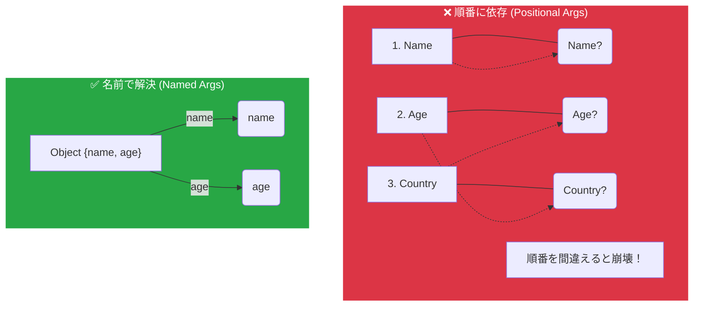

# 🌸 第6章　名前付き引数で迷子にならない！

> ― 「順番」じゃなく「名前」で渡すスタイルを身につけよう！

---

## 🌱 はじめに：引数が多いと大混乱！

次のような関数を見たことがありますか？

```javascript
function registerUser(name, age, country, email, hobby, bloodType) {
  // ...
}
```

💦 6個の引数があると、呼び出すときにこうなります：

```javascript
registerUser("イチカ", 22, "Japan", "ichika@example.com", "読書", "A");
```

もう「どれがどれ？」って感じですね😵‍💫
うっかり順番を間違えると、**動くけど結果がおかしい**ことも。



---

## 💡 解決法：オブジェクトで引数をまとめる！

そこで「引数を1つの"箱（オブジェクト）"にまとめる」という発想が生まれました。

```javascript
function registerUser(user) {
  console.log(`ようこそ、${user.name}さん！`);
  console.log(`年齢: ${user.age}`);
  console.log(`国: ${user.country}`);
}

registerUser({
  name: "イチカ",
  age: 22,
  country: "Japan"
});
```

🎀 このスタイルなら、**順番を気にしなくてOK！**

```javascript
registerUser({ country: "Japan", age: 22, name: "イチカ" });
```

> 「順番が違っても意味が通じる」
> ― これが名前付き引数（Named Parameters）の発想です✨

---

## 🪄 さらに短く書くには？ 分割代入を関数の中で使おう！

毎回 `user.name` や `user.age` と書くのは少し長いですよね。
ここで登場するのが「関数引数での分割代入」です！

```javascript
function registerUser({ name, age, country }) {
  console.log(`ようこそ、${name}さん (${age}歳, ${country})`);
}

registerUser({ name: "イチカ", age: 22, country: "Japan" });
```

💬 関数の引数で `{ name, age, country }` と書くことで、
オブジェクトから必要な値だけを **その場でバラして** 受け取ります！

---

## 🧩 もう一度イメージしてみよう

```
オブジェクト: { name: "イチカ", age: 22, country: "Japan" }
↓
{name, age, country} = user;
↓
それぞれが直接使える状態に！
```

---

## 🧠 デフォルト値をつけて省略可能に！

引数オブジェクトが大抵は規定値の場合、省略したくなります。
このような場合、 **デフォルト値** を設定しましょう。

```javascript
function registerUser({ name = "ゲスト", age = 18, country = "Japan" }) {
  console.log(`${name} さん (${age}歳, ${country})`);
}

registerUser({}); // → ゲスト さん (18歳, Japan)
```

> ✅ これで、もし省略されてもデフォルトが動作する！

---

## 🛟 さらに全部省略の延長線上：引数が「undefined」でもOKに！

関数が **何も引数を受け取らない** とき、次のようにするとエラーになります：

```javascript
function registerUser({ name = "ゲスト" }) {
  console.log(`ようこそ、${name}さん`);
}

registerUser(); // ❌ エラー: Cannot destructure property 'name' of 'undefined'
```

💡これを防ぐには「空のオブジェクト」をデフォルト値にします：
　 ただし、このようなことは、本当に「全省略」時には「引数自体渡さなくても良い」という「強い意図」が必要です。

```javascript
function registerUser({ name = "ゲスト" } = {}) {
  console.log(`ようこそ、${name}さん`);
}

registerUser(); // ✅ こんにちは ゲストさん
```

> 🧷 `= {}` は「引数そのものが来ないことを受け入れるための記述方法」です！

---

## 🧠 名前を変えて受け取りたいとき

オブジェクトのキー名が `name` だけど、
関数の中では `userName` として扱いたい場合：

```javascript
function registerUser({ name: userName, age }) {
  console.log(`${userName} さん (${age}歳)`);
}

registerUser({ name: "イチカ", age: 22 });
```

> 🎀 `name: userName` のように書くと、
> `userName` という変数に `name` の値が入ります！

---

## 🧺 残りのデータをまとめたいとき（`...rest`）

```javascript
function registerUser({ name, ...others }) {
  console.log("名前:", name);
  console.log("その他:", others);
}

registerUser({ name: "イチカ", age: 22, country: "Japan", hobby: "読書" });
```

出力：

```
名前: イチカ
その他: { age: 22, country: "Japan", hobby: "読書" }
```

> 🔹 `...others` は「残りのすべて」をまとめる。
> React の `({ name, ...props })` にもこの考え方が使われています！

---

## 🌼 ここまでの書き方のまとめ

| パターン        | 書き方例                              | 意味                      |
| ----------- | --------------------------------- | ----------------------- |
| 基本形         | `function({ name, age })`         | 必要な値だけ取り出す              |
| デフォルト値      | `function({ name = "ゲスト" })`      | 値が無いときの保険               |
| 引数そのものが無い場合 | `function({ name = "ゲスト" } = {})` | 呼び出し時にオブジェクトすら渡さなくてもOK |
| 名前変更        | `function({ name: userName })`    | 内部変数名を変えたいとき            |
| 残りをまとめる     | `function({ name, ...others })`   | 余った情報をまとめて扱う            |

---

## 💬 ここでちょっと比べてみよう！

| 呼び出し方         | 書き方                                      | 説明                 |
| ------------- | ---------------------------------------- | ------------------ |
| ✅ OK          | `registerUser({ name: "イチカ", age: 22 })` | オブジェクトで渡す（名前付き引数）  |
| ⚠️ 意図通りに動作しない | `registerUser("イチカ", 22)`                | 分割代入に合わない普通の引数渡し   |
| ✅ OK          | `registerUser()`                         | デフォルト値と `= {}` で完全な省略が可能 |

---

## 🧭 名前付き引数のメリットまとめ

🌸 **1. 順番を気にしなくていい！**
🌸 **2. 意味が読みやすくなる！**
🌸 **3. デフォルト値で省略可能にできる！**
🌸 **4. 残りのデータも柔軟に扱える！**

> つまり、「迷子にならない引数設計」ができるようになります✨

---

## 📦️ダンボ姉さんのひとこと📦️


#### 💬「ほら、荷物を運ぶときって"名前のシール"貼るでしょ？📦💨<br>　 　それが名前付き引数よ！<br>　 　ラベルがあれば、順番がバラバラでもちゃんと仕分けできるの。<br>　 　JavaScriptも物流と同じ、**宛先が大事**なのよ〜📮✨」


---

## 🌸 この章のゴール

* 「名前付き引数」がなぜ便利か理解できる
* 分割代入を使った関数引数の書き方を覚える
* デフォルト値・残りの引数も省略して使える
* React の `props` の仕組みの前提がもう分かる！

---

📘 **次章（第7章 予定）**
スプレッド構文（`...`）と分割代入の**合わせ技⚡**に進みます。
実際のコードでは、この2つが**ペアで登場**することが多いんです！

> `const { name, ...others } = user` と `{ ...user, age: 23 }` のような
> "上書き"と"残し"のテクニックを学んでいきましょう。

---

<h1><a href="D07.md">第7章へ ⚡</a></h1>
