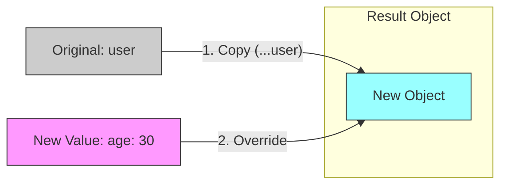

# ⚡ 第7章　スプレッドと分割代入の“合わせ技”⚡

> ― 実際のコードではこの2つがほぼセットで登場！

---

## 🌱 はじめに：ここまでのおさらい

ここまでの章で学んだのは…

| 構文                   | 役割                      |
| -------------------- | ----------------------- |
| `...`（スプレッド）         | 配列やオブジェクトを「ばらす」／「くっつける」 |
| 分割代入 `{ name, age }` | 必要なものだけを取り出す            |
| `...rest`            | 残りを「まとめて」受け取る           |

これらが **ひとつの文の中で組み合わさる** と、
「実戦的な書き方」が完成します✨

---

## 💎 スプレッドでコピー、分割代入で選別！

まずは例から👇

```javascript
const user = {
  name: "イチカ",
  age: 22,
  country: "Japan",
  hobby: "読書"
};
```

### ✨ 1️⃣ コピーして上書き！

```javascript
const updatedUser = { ...user, age: 23 };
```

💬 これは「コピーした上で `age` を23に書き換える」という意味です。

出力：

```javascript
console.log(updatedUser);
// { name: "イチカ", age: 23, country: "Japan", hobby: "読書" }
```

> 🎀 元の `user` は変更されません（非破壊的コピー）

---

### ✨ 2️⃣ 一部だけ取り出して残りをまとめる！

```javascript
const { name, ...others } = user;
```

出力：

```javascript
console.log(name);   // "イチカ"
console.log(others); // { age: 22, country: "Japan", hobby: "読書" }
```

💬 `name` だけ取り出して、残りを `others` という箱にまとめています。

> これが、**分割代入 + スプレッド（rest）** の組み合わせ！

---

## 🧠 スプレッドとrestの関係をイメージ！

```
const { name, ...others } = user;

 ↓  分ける！

name   ← 取り出す
others ← 残りをまとめる
```

🪄 ここで出てくる `...` は「残りをまとめる」という意味（＝rest構文）。
第4章の「スプレッド」と似ていますが、
**使う場所によって意味が変わります！**

| 構文    | 使う場所  | 意味       |
| ----- | ----- | -------- |
| スプレッド | 展開する側 | ばらす・合体する |
| rest  | 受け取る側 | 残りをまとめる  |

---

## 🍀 実戦パターン①：プロファイルの更新

```javascript
const profile = {
  name: "イチカ",
  age: 22,
  country: "Japan"
};

const updated = { ...profile, age: 23 };

console.log(updated);
// { name: "イチカ", age: 23, country: "Japan" }
```

> 💬 よく使われるパターン：
> 「既存データをコピーして、一部だけ上書き」

---

## 🍋 実戦パターン②：不要なキーを除外してコピー

```javascript
const { password, ...safeUser } = {
  name: "イチカ",
  age: 22,
  password: "secret123",
  email: "ichika@example.com"
};

console.log(safeUser);
// { name: "イチカ", age: 22, email: "ichika@example.com" }
```

> ✅ 「password」だけ除外して、残りをコピー。
> API通信や画面表示で非常によく使う書き方！

---

## 🎹 配列でも同じ合わせ技が使える

```javascript
const numbers = [1, 2, 3];

// 先頭に追加（コピーして追加）
const withZero = [0, ...numbers];

// 先頭だけ取り出して残りをまとめる
const [first, ...rest] = numbers;

console.log(withZero); // [0, 1, 2, 3]
console.log(first);   // 1
console.log(rest);    // [2, 3]
```

> 💡 配列でも「コピー」「取り出し」「残りまとめ」が自然に組み合わせられます。

---

## 🌸 実戦パターン③：Reactに近い例（だけどReact知らなくてもOK）

```javascript
function Button({ label, ...props }) {
  console.log(label);  // ボタンのラベル
  console.log(props);  // その他の設定
}

Button({ label: "送信", color: "blue", size: "large" });
```

出力：

```
送信
{ color: "blue", size: "large" }
```

> 💡 `...props` は、**「残りの設定」** を受け取る便利な仕組み。
> Reactコンポーネントの中では、まさにこれが日常的に使われます！

---

## 🧠 応用：2段階の組み合わせ！

```javascript
const base = { a: 1, b: 2, c: 3 };
const { a, ...rest1 } = base;
const { b, ...rest2 } = rest1;

console.log(a);     // 1
console.log(rest1); // { b: 2, c: 3 }
console.log(rest2); // { c: 3 }
```

> 🧩 「取り出す → さらに残りから取り出す」
> ネストしたオブジェクトにも応用できます。

---

## 💬 よくある間違い

### ❌ 「順番」が逆だと上書きされる！

```javascript
const user = { name: "イチカ", age: 22 };
const update = { age: 30 };

const merged = { ...update, ...user };
console.log(merged.age); // 22 になってしまう！
```

> 💥 スプレッド構文は「後ろに書いたものが優先」されます！

✅ 正しいのは：

```javascript
const merged = { ...user, ...update };
console.log(merged.age); // 30
```

---

## 🪶 イメージまとめ図



```mermaid
flowchart LR
    Source[Source: user] 
    Source -- "Extraction" --> Name[name]
    Source -- "...rest" --> Others[Others: { age, country... }]
    
    style Source fill:#ccc,stroke:#333
    style Others fill:#ff9,stroke:#333
```

---

## 📋 まとめ

| テクニック | 書き方                            | よく使う場面        |
| ----- | ------------------------------ | ------------- |
| コピー   | `{ ...obj }`                   | 元データを保ったまま加工  |
| 上書き   | `{ ...obj, key: value }`       | 一部の値を変更       |
| 除外    | `const { key, ...rest } = obj` | 特定の項目を除外して再利用 |
| 合体    | `{ ...a, ...b }`               | データをマージ（後ろ優先） |

---

## 📦️ダンボ姉さんのひとこと📦️


> 「`...` はね、段ボールの“魔法のテープ”なの📦✨
> はがせば中身をバラして整理できるし、
> 貼り直せば新しい箱としてきれいにまとめ直せるの。
> **分割代入** で必要なモノを **取り出し** て、
> **スプレッド** で新しい形に **詰め直す** ――
> それがモダンJavaScript流の**箱リフォーム術**よ🏗️💫」

---

## 🌸 この章のゴール

* `...` が「スプレッド」と「rest」で使い分けられることを理解
* 分割代入とスプレッドを組み合わせてコピー・除外・上書きができる
* Reactの `...props` の仕組みの下地ができる
* 「非破壊的更新」の考え方が自然に身につく

---

<h1><a href="D08.md">第8章へ 🪶</a></h1>
