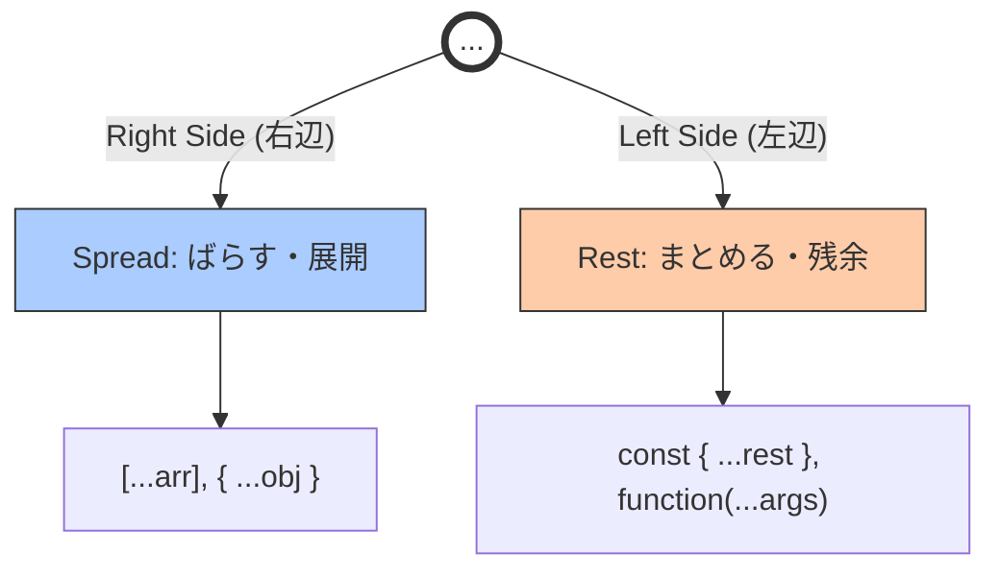

# 🪶 第8章　まとめと進化の背景

> ― 「箱をどう扱うか」がモダンJavaScriptの根っこ

---

## 🌱 昔のJavaScriptは「順番」に頼っていた

かつてのJavaScriptでは、関数にたくさんの引数を渡すとき、
**順番だけ**でデータを区別していました。

```javascript
function registerUser(name, age, country) {
  console.log(`${name} (${age}) from ${country}`);
}

registerUser("イチカ", 22, "Japan");
```

💦 引数が増えるたびに、どれが何の値なのか混乱……。
「この22って、年齢？それとも郵便番号？」みたいな事故がよくありました。

---

## 💡 「名前で渡せたらいいのに！」

そこで生まれたのが、**オブジェクトで渡す**という考え方。

```javascript
registerUser({
  name: "イチカ",
  age: 22,
  country: "Japan"
});
```

💬 これなら順番が変わっても大丈夫。

> 「名前」で意味が伝わるコードになったのです。

---

## 🧩 そこから生まれた“新しい構文たち”

この「箱（オブジェクトや配列）」の考え方を、
もっと**短く・安全に・読みやすく**使いたい――
そうして生まれたのが、ES2015（ES6）で追加されたモダン構文です。

| 構文       | できること       | 例                                   |
| -------- | ----------- | ----------------------------------- |
| 分割代入     | 必要なものだけ取り出す | `const { name } = user;`            |
| デフォルト値   | 無いときの保険     | `{ age = 18 } = user;`              |
| スプレッド    | コピー・合体      | `{ ...user, age: 23 }`              |
| 残余（rest） | 余りをまとめる     | `const { name, ...others } = user;` |
| 名前付き引数   | 意味で渡す       | `function({ name, age }) {}`        |

---

## 🌸 「ばらす」と「まとめる」の世界観



どちらも **ドット3つ** (`...`) で表しますが、
使う場所によって「意味」が変わります。

| 場所          | 役割        | 例                            |
| ----------- | --------- | ---------------------------- |
| 配列やオブジェクトの中 | ばらす（展開する） | `[...arr1, ...arr2]`         |
| 分割代入の中      | まとめる（残す）  | `const { a, ...rest } = obj` |

> 🌼 たった3つのドットで、「バラす」と「まとめる」両方できるってすごいですよね。

---

## 🧠 コードが“人間の言葉”に近づいた！

昔のコード：

```javascript
console.log(user[0], user[1], user[2]);
```

今のコード：

```javascript
const { name, age, country } = user;
console.log(name, age, country);
```

> ✅ **“何を扱っているか”が読んで分かる！**
> これが、モダンJavaScriptの「人にやさしい」進化です。

---

## ⚙️ Reactはこの構文に支えられている

Reactのコンポーネントは、
まさにこの「名前付き引数＋分割代入＋スプレッド」の文化の上に立っています。

```javascript
function Button({ label, ...props }) {
  console.log(label);
  console.log(props);
}

Button({ label: "送信", color: "blue", size: "large" });
```

💬 `label` は個別に取り出し、
`props` で残りをまとめる――この書き方そのものが、
React の日常構文なんです🌸

---

## 💬 モダンJavaScriptの核心メッセージ

> 「コードは人に読まれるために書くもの」

* どのデータを使っているかが明確になる
* 予期せぬ上書きやバグを防げる
* 部分的な変更が安全にできる

それを実現するのが、
**分割代入・スプレッド・rest・名前付き引数** なんです✨

---

## 🧭 まとめ ― “箱を開ける文化”の誕生

| キーワード  | 意味            |
| ------ | ------------- |
| 分割代入   | 必要なものだけ取り出す   |
| スプレッド  | データをばらして合体する  |
| 残余引数   | 残りをまとめて受け取る   |
| 名前付き引数 | 意味を持って渡す      |
| 非破壊的更新 | 元を壊さず新しいものを作る |

> これらすべてが、
> 「安全で読みやすいコードを書きたい」という
> JavaScript開発者たちの願いから生まれました。

---

## 📦️ダンボ姉さんのひとこと📦️


#### 💬「箱の中には、いろんなデータがギュッと詰まってるの。<br>　 　そのままだと探すのが大変だけど、`...` の魔法を使えば<br>　 　“中身をきれいに仕分けて取り出す”ことができるのよ📦✨<br>　 　・分割代入は、『開梱の技』。<br>　 　・スプレッドとrestは、『再梱包の技』。<br>　 　コードを整えるのは、まるでお片づけのようなものね🧹」

---

## 🌈 この章のゴール

* モダン構文が「人間にやさしい」書き方を目指して生まれたことを理解
* `...` と `{}` / `[]` の使い分けが自然にできる
* React や Vue などの“モダン開発”で出てくる構文の下地を習得

---

## 🎓 ここまでの8章をふりかえろう！

| 章  | テーマ         | 覚えるポイント                |
| -- | ----------- | ---------------------- |
| 1章 | なぜ新しい構文が必要？ | ES2015以前の不便さ           |
| 2章 | 配列の分割代入     | `[a, b] = [1, 2]`      |
| 3章 | オブジェクトの分割代入 | `{ name, age } = user` |
| 4章 | スプレッド構文     | `...` の2つの顔            |
| 5章 | 残余引数（rest）  | `function(...args)`    |
| 6章 | 名前付き引数      | オブジェクトで受け取る            |
| 7章 | スプレッド×分割代入  | コピー・除外・上書き             |
| 8章 | モダン構文の哲学    | “箱をどう扱うか”の進化           |

---

## 📝 ミニ課題（配信で一緒にやる用）

1. `const user = { name: "Ichika", age: 22, country: "Japan" };` から `name` と `rest` を取り出す。
2. `registerUser` を「名前付き引数」で受け取り、`country` のデフォルト値を "Japan" にする。
3. `const base = { a: 1, b: 2 };` をコピーして `b` だけ 99 に更新する。

> 🚀 解けたら「どこで spread / rest を使ったか」を言葉で説明してみよう。

---

<details>
<summary>📖 解答例（クリックで展開）</summary>

### 1. `name` と `rest` を取り出す

```javascript
const user = { name: "Ichika", age: 22, country: "Japan" };
const { name, ...rest } = user;

console.log(name); // "Ichika"
console.log(rest); // { age: 22, country: "Japan" }
```

> 🧠 **使った構文**: `...rest` は **rest構文**（残りをまとめる）

---

### 2. 名前付き引数 + デフォルト値

```javascript
function registerUser({ name, age, country = "Japan" }) {
  console.log(`${name} (${age}) from ${country}`);
}

registerUser({ name: "Ichika", age: 22 });
// → Ichika (22) from Japan
```

> 🧠 **使った構文**: 分割代入 + デフォルト値（`= "Japan"`）

---

### 3. コピーして `b` だけ更新

```javascript
const base = { a: 1, b: 2 };
const updated = { ...base, b: 99 };

console.log(updated); // { a: 1, b: 99 }
console.log(base);    // { a: 1, b: 2 } ← 元は変わらない！
```

> 🧠 **使った構文**: `...base` は **spread構文**（コピー＆展開）

</details>

---


## 🌸 最後に

> JavaScriptの進化は、「人が読めるコード」への進化でした。
> 分割代入もスプレッドも、ただの“テクニック”ではありません。
> それは「考え方」なんです。

あなたがいま覚えたこれらの構文は、
未来のコードを**もっとわかりやすく、美しくする力**です。

<br>
<br>
<br>
<br>

## ⭐️スター授与⭐️ スターちゃんのはげまし


<br>

### 💬 「おめでとう！<br>　 　 ここまで到達したあなたには星２つ ⭐️⭐️ ね！」

<br>
<br>

---

<h1><a href="D00.md">目次へ戻る 📚</a></h1>
