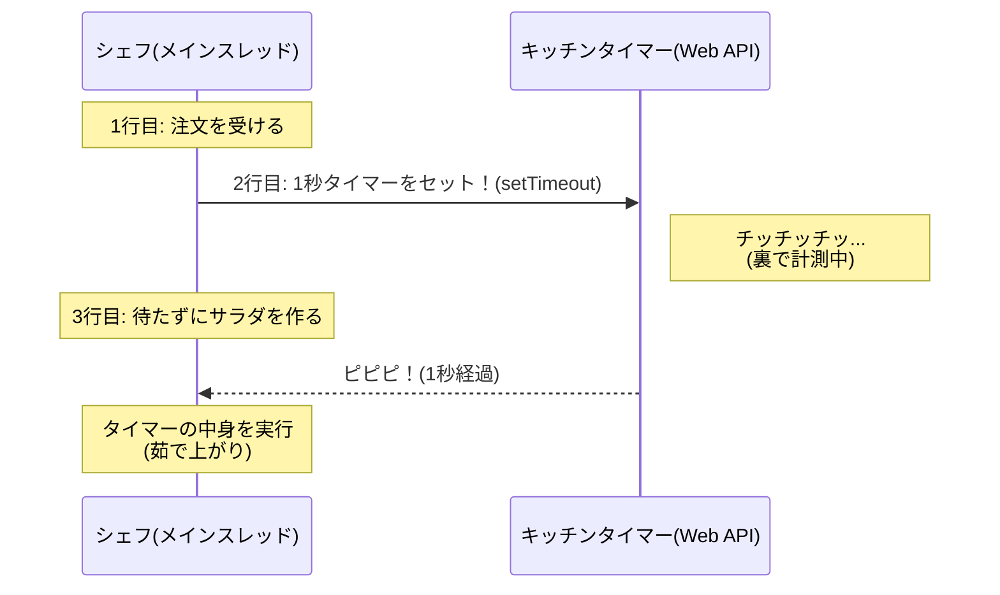
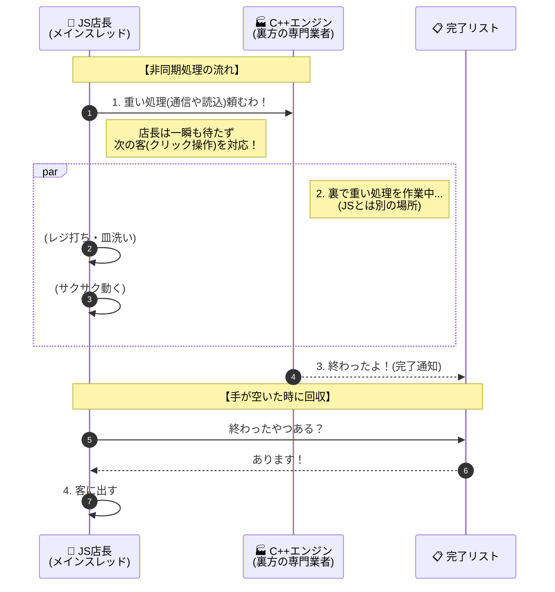
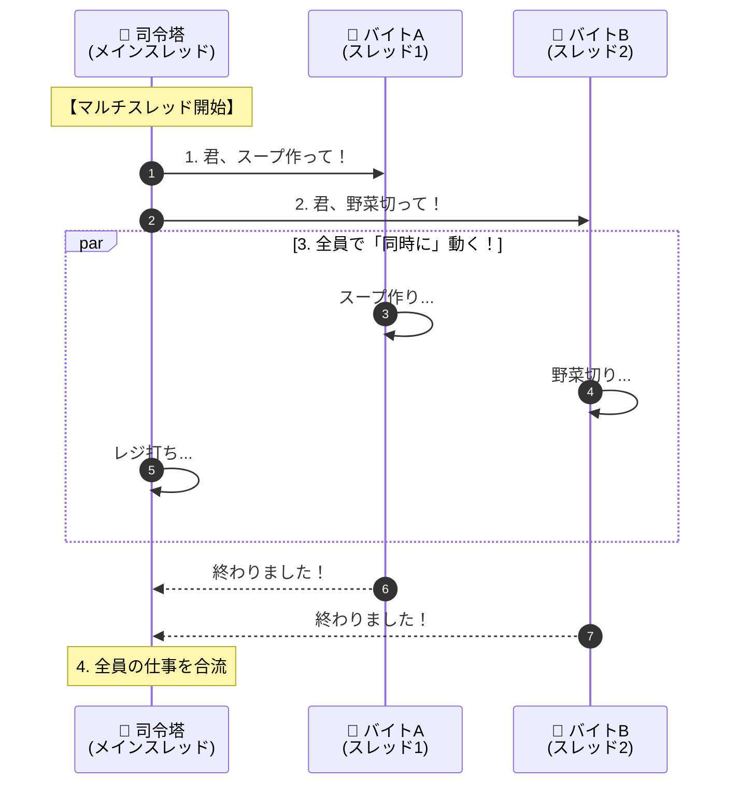
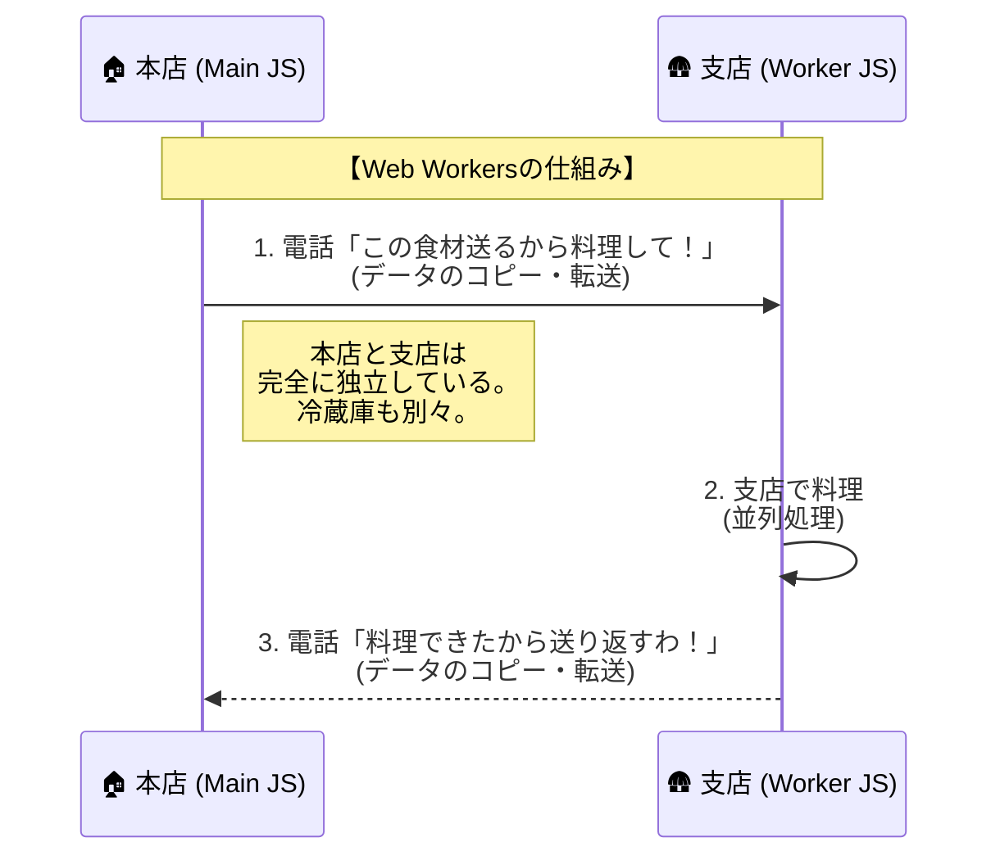

新シリーズ「JavaScriptの『時間』を操る！非同期処理・集中講座」の Day 1 です。


-----

# 🕰️ Day 1：JavaScriptは「ワンオペ」の達人

## 🏁 新しい冒険の始まり！


今日からは、プログラミングの世界で **「一番難しくて、でも一番面白い」** と言われる、 **「時間（非同期処理）」** という新しい魔法を学ぶ旅に出かけます。

「時間？ プログラムって一瞬で動くものじゃないの？」

そう思いますよね。でも、もしアプリが「通信中」にフリーズして動かなくなったら？ もし「3秒後にアラームを鳴らしたい」と思ったら？  
そう、**「待つこと」をコントロールする技術**こそが、初心者と中級者を分ける大きな壁なんです。

これから全15日間、焦らずゆっくり、この壁を乗り越えていきましょう！

-----


### 💬「****************************」

-----

## 🍳 1.1 JavaScriptは「孤独なシェフ」である

まず最初に、JavaScriptという言語の「性格」を知っておく必要があります。  
実はJavaScriptは、 **「一度に一つのことしかできない」** という、非常に不器用な性質を持っています。これを専門用語で **「シングルスレッド」** と言います。

イメージしてみてください。あなたのアプリは、 **「シェフが一人しかいない（ワンオペの）レストラン」** です。


  * **他の言語（C++やC\#やJavaなど）：**
      * 忙しくなったら、アルバイト（スレッド）を何人も雇って、「君は皿洗い」「君は注文取り」と、同時にいくつもの作業をこなせます（マルチスレッド）。
  * **JavaScript：**
      * **原則的に一人です。** どんなに忙しくても、シェフ一人でお店を回さないといけません。

### 🧠 初心者さんの、心の声

「えっ…それって、JavaScriptがショボいってこと？ 一人じゃすぐにお店が回らなくなっちゃうじゃん…」


そう思うかもしれません。でも、このシェフは **「段取りの天才」** なんです。  
今日は、このシェフが「ダメな働き方」をした場合と、「天才的な働き方」をした場合の違いを体験してみましょう。

-----

## 🛑 1.2 実験！お店が止まる恐怖（ブロッキング）

まずは、シェフが「ダメな働き方」をしてしまった例を見てみます。  
ブラウザのコンソールを開いて、以下のコードを実行してみてください。

```javascript
console.log('いらっしゃいませ！');
alert('ご注文をお伺いします！（OKを押すまで動きません）');
console.log('ありがとうございました！');
```

`alert()` というのは、ブラウザにメッセージを表示する命令です。  
このコードを実行したとき、画面はどうなりましたか？

1.  「いらっしゃいませ！」が表示される。
2.  **画面にポップアップが出て、そこで全てが止まる。**
3.  「OK」ボタンを押すまで、「ありがとうございました！」は表示されないし、**画面の他のボタンを押すこともできない。**

### 🍳 シェフの行動

1.  お客さんが来た（ログ出力）。
2.  お客さんとお喋りを始めてしまい、**その話が終わるまで（OKを押すまで）、手元の作業を完全に止めてしまった。**

このように、一つの処理が終わるまで次の処理に進めず、全体の時間が止まってしまうことを **「ブロッキング（同期処理）」** と言います。  
もしWebアプリで、データの読み込みに10秒かかるとき、画面が10秒間完全にフリーズしたら…ユーザーは「壊れてる！」と思って帰っちゃいますよね。


### 😵‍💫 言葉の落とし穴：「同期」と「シンクロ」

「同期（Synchronous）」と聞くと、シンクロナイズドスイミングのように「みんなで一斉に動く」イメージがありませんか？  
**でもＩＴの世界では意味が逆なんです！**

*   **同期 (Sync=シンク):** 「前の人のペースに合わせる」＝ **順番待ちして、前の人が終わるまで動かない（直列）。**
*   **非同期 (Async=エイシンク):** 「周りのペースに合わせない（空気を読まない）」＝ **自分だけ勝手に別の動きをする（並列）。**

「同期＝待たされる（遅い）」「非同期＝待たなくていい（速い）」と、直感と逆で覚えてくださいね！

-----

## ⏱️ 1.3 解決策！キッチンタイマーを使おう（ノンブロッキング）

ワンオペのシェフが、お店を止めずに回すにはどうすればいいでしょう？  
例えば、「パスタを茹でる（3分かかる）」という注文が入ったとき、鍋の前で3分間じーっとお湯を見つめていたら、その間レジも打てないし、他のお客さんの水も出せません。

そこで登場するのが、**「キッチンタイマー」** です！

JavaScriptの世界には、**`setTimeout`（セット・タイムアウト）** という便利なタイマーがあります。これを使うと、シェフの働き方はこう変わります。

### 🍳 タイマーを使った行動

1.  パスタを鍋に入れて、**タイマーを3分にセットする。**
2.  **タイマーが鳴るまでの間、すぐ次の仕事（レジ打ちやサラダ作り）に取り掛かる。**
3.  ピピピ！と鳴ったら、湯切りをする。

これなら、一人でもお店は止まりませんよね！ これを **「ノンブロッキング（非同期処理）」** と言います。


### ⏱️タイム・スティック⏱️りんりんの「<ruby>時<rt>とき</rt></ruby>のスティック」

「手に持った時のスティック」で頭を殴れば、「目が覚める」ことについて


### 💬「****************************」


-----

## 🧪 1.4 実験！時間がずれる不思議

では、実際にタイマーを使ったコードを動かしてみましょう。  
心の準備はいいですか？ 結果はあなたの直感と少し違うかもしれません。

```javascript
console.log('1. パスタを注文しました');

// キッチンタイマーをセット！ (1000ミリ秒 = 1秒後に実行)
setTimeout(() => {
    console.log('3. パスタが茹で上がりました！');
}, 1000);

console.log('2. サラダを作ります');
```

### 🧠 初心者さんの、心の旅

  * 「えっと、プログラムは上から順に動くんだよね？」
  * 「だから、『1. 注文』→ 1秒待って『3. 茹で上がり』→ 最後に『2. サラダ』…かな？」

**実行結果：**

```
1. パスタを注文しました
2. サラダを作ります
3. パスタが茹で上がりました！  <-- ※1秒後に遅れて表示される
```

「あれっ！？ 『2. サラダ』が先に出た！？」

### 解説：何が起きたの？

これこそが、ワンオペシェフの「段取り術」なんです。

1.  **注文:** 「パスタ注文」をログに出す。
2.  **タイマーセット:** `setTimeout` を見て、シェフは「よし、1秒後ね。**タイマーセットしたから、今は待たなくていいや！**」と判断して、**すぐに次の行へ進みます。**
3.  **次の仕事:** 待たずに「サラダ」をログに出します。
4.  **完了:** 1秒経ってタイマーが鳴ったので、手元の作業を中断して「茹で上がり」をログに出します。

### ⏳ 処理の流れ（シーケンス図）




-----

### 🚁ライトウェイト・フライ🚁JS店長はひとり店長

一人店長だから「パスタ」と「サラダ」を２人で同時に運べないことについて

ライトウェイト店長<br>
  

### 💬「****************************」

ライトウェイト店長<br>


### 💬「****************************」

---

# 🧐 2. 【図解】なぜJavaScriptは「ワンオペ」なのか？

> ⚠️ **ここから少し難しくなります…でも大丈夫！**
>
> この先では「CPU」「マルチスレッド」「C++」など、ハードウェアやシステム寄りの話が出てきます。  
> 「私、アプリ作りたいだけなのに…」と思うかもしれません。
>
> **今すぐ完璧に理解しなくてOKです！** 以下の2点だけ覚えておいてください：
>
> 1. **JavaScriptの非同期は「特殊なやり方」**  
>    　→ 他の言語（C++、Java、C#など）とは仕組みが違う
> 2. **この知識は将来役立つ**  
>    　→ 情報処理試験、対象が多いモノへの高速ツール作成、システム開発の現場で意識する話題
>
> 「ふーん、JSって変わってるんだな」くらいの感覚で読み進めてください。  
> Day 2 以降はまたコードを書く楽しい時間に戻りますよ！

## 2.0 ～JSの非同期、C++のマルチスレッド、そしてCPUの真実～

プログラミングをしていると必ずぶつかる「非同期処理」という壁。特にJavaScriptと、C++やC\#のような伝統的な言語では、そのアプローチが根本的に異なります。

この記事では、**Ryzen 5 7600X（6コア12スレッド）** という具体的なCPUを例に、それぞれの言語がどう動いているのかを「飲食店の経営」に例えて解説します。

-----

## 🍳 2.1 JavaScriptの基本：最強の「ワンオペ店長」

JavaScript（ブラウザ）の世界は、**店長（JS）が一人しかいないお店**です。これを「シングルスレッド」と呼びます。

### 🏃 仕組み：人に任せて自分は止まらない

店長は一人しかいないので、**一度に一つの作業しかできません**。  
しかし、「スープを煮込んでいる1時間、店長が鍋の前で立ち尽くす」と、お店（ブラウザの画面）がフリーズしてしまいます。

そこでJS店長は、重い仕事を **「外部の専門業者（C++製のブラウザエンジン）」** に丸投げします。  
JS店長は、１ラインの作業しか出来ないため、**「店長の手があいたら、完了リストをチェックして、終わった仕事を回収する」** スタイルを取ります。  
(最重要：**よって、JavaScriptの層で２つの関数が並列して動作することはありません**)




  * **特徴：** 店長（JavaScript）の体は常に一つ。
  * **メリット：** 「レジのお金」のような大事なデータを一人で管理するので、計算ミス（競合）が起きない。

-----

## 👨‍👩‍👧‍👦 2.2 C++ / C# の基本：スタッフ無限増員「巨大レストラン」

C++、C\#、Javaなどの言語は、**スタッフを自由に雇える巨大レストラン**です。これを「マルチスレッド」と呼びます。

### 🥷 仕組み：分身の術

「重い処理が必要だ」となったら、即座に新しいスタッフ（スレッド）を雇い、**完全に同時進行**で作業をさせます。




  * **特徴：** 本当に人が増える。
  * **メリット：** パワーごり押しで計算できる。
  * **デメリット：** 複数のスタッフが「同じ冷蔵庫」を一斉に使うため、食材の取り合い（データの競合）や衝突事故が起きやすく、管理が難しい。

-----


## ⚙️ 2.3 ハードウェア（例えば Ryzen 7600X）から見た違い

ここでCPUの話をしましょう。**Ryzen 5 7600X は「12個の作業机（スレッド）」を持つ工場**です。

### 👤 JavaScript実行時のCPU

JSはワンオペなので、どんなに高性能なCPUを積んでいても、基本的には**1つの机**しか使いません。残りの11個はヒマをしています。


### 👥 C++ / C# / Java 実行時のCPU

プログラム側が「全スレッドを使え」と命じれば、**12個の机すべて**がフル稼働します。  
C++やC#で作成したアプリの実行速度が速い傾向があるのはこのためです。  
(「プログラムが直接理解できる命令」に出来るか、それとも「かなり遠い間接命令(=JS)」のままかの違いも非常に大きいです)


### 2025年のコア/スレッド感覚（ざっくり平均）

2025年発売の一般的なコア/スレッド帯を表にまとめると、次のようなイメージです。

| ゾーン/用途 | 代表的なコア/スレッド構成 | 想定CPU例 (2025) | 立ち位置 |
| :--- | :--- | :--- | :--- |
| 安め〜事務用 | 4〜6コア / 8〜12スレッド | Core i3〜初期i5、Ryzen 5 5500/5600G など | 省コスト・ライト用途 |
| ミドルレンジ（コスパ枠） | Ryzen系: 6コア / 12スレッド（Ryzen 5 7600系）<br>Intel系: 14コア / 20スレッド（i5-14600系: 6P+8E） | Ryzen 5 / Core i5 主流帯 | ゲームも作業もこなすメインストリーム |
| ゲーミング上位〜クリエイティブ | 8〜16コア / 16〜32スレッド以上 | Ryzen 7/9、Core i7/i9 クラス | 高負荷処理・配信・制作向け |
| 平均的ゾーン（ならした感覚） | 6〜14コア / 12〜20スレッド<br>感覚的“ど真ん中”: 8〜10コア / 16スレッド前後 | Core i5 後半〜i7 序盤、Ryzen 5 後半〜Ryzen 7 序盤 | 「2025年デスクトップPCで平均的」と言える帯 |

-----

### 🎓 コラム：なぜ構造を知る必要があるの？（他言語への布石）

「私にCPUの話なんて関係ない…」  
そう思うかもしれません。でも、もしあなたが将来 **「Java」** や **「C#」** などの言語を学ぶことになったら、この話は避けて通れません。

それらの言語では、プログラマが自分で「スレッド（シェフ）」を増やしたり管理したりできるからです。  
**「JavaScriptはワンオペ（シングルスレッド）である」** という特徴を深く理解しておくことは、逆に **「マルチスレッドの言語」を学ぶ時の強力な武器** になります。

今は「へぇ〜」で大丈夫。でも、頭の片隅に置いておくと、数ヶ月後に「あ！これあそこでやったやつだ！」となる日が必ず来ますよ！

-----

<br>
<h3> 💬「初っ端からハードで難しいー😱」</h3>


---

<br>  
<br>  
<br>

## ライトウェイトとネイティブC/C++

ライトウェイト店長  


### 💬「****************************」

エンジンのカリプラさん  


### 💬「****************************」

<br>  
<br>  
<br>

-----

## 👷 2.4 進化形：JSでも分身したい！「Web Workers」

「JSでもRyzenの全コアを使って計算させたい！」  
そんな要望に応えるのが **Web Workers** です。しかし、これはC++の「マルチスレッド」とは少し事情が異なります。

> 💡 **予告：Day 14-15（ボーナスステージ）で詳しく学びます！**  
> ここでは「こんな機能もあるんだ」程度の理解でOK。深追いしなくて大丈夫です。  
> Day 13 までの非同期処理をマスターしてから、余力があれば戻ってきてください。

### 🏢 C++のスレッド ＝ 「同じ厨房に人を増やす」

C++では、増やしたスタッフ全員が **同じ冷蔵庫（メモリ）** を共有します。

  * メリット：食材の受け渡しが一瞬。
  * デメリット：ぶつかる。

### 🛖 JSのWeb Workers ＝ 「隣に支店を作る」

JavaScriptは頑なに「ワンオペの店」というルールを守ります。そのため、スレッドを増やす場合、**「完全に別の店（Worker）」をもう一軒建てます**。





Ryzenの机で言えば、Web Workersを使えば確かに別の机（コア）を使えます。  
しかし、 **「本店」と「支店」の間で食材（データ）を郵送し合うコスト（通信コスト）** がかかるため、  
C++ほどの超高速な連携は苦手です。


### 一人店長と２機のワーカー

　ボディとは別だから、制限も大きいけど、  
　使い方次第ではうまくハマることもあることを店長が自慢

一人店長のライトウェイト  
  

### 💬「****************************」

ワーカー２個付きのライトウェイト店長  
  

### 💬「****************************」


### 📝 2.5 まとめ

| | JavaScript (基本) | C++ / C\# (マルチスレッド) | JavaScript (Web Workers) |
| :--- | :--- | :--- | :--- |
| **お店の形** | **ワンオペ** + 外注 | **スタッフ多数**の巨大厨房 | **本店**と**支店** (別店舗) |
| **Ryzen 7600X** | 1コア使用 | 全12コア使用可能 | 複数コア使用可能 |
| **メモリ(冷蔵庫)** | 自分専用 | 全員で共有 (速い/危険) | 店舗ごとに別々 (安全/受渡が遅い) |
| **得意なこと** | UI操作、Web通信 | 物理演算、画像処理、AI | 重い計算を裏で回す |

JavaScriptは「難解な競合エラーを起こさない」ために、あえてワンオペや別店舗方式を採用しているのです。

> 📌 **将来のための種まき**
>
> 今日学んだ「シングルスレッド」「マルチスレッド」という言葉は、**情報処理試験**や**システム開発の現場**で必ず登場します。
>
> | 今日の言葉 | 試験・実務での表現 |
> |:---|:---|
> | ワンオペ（1人で働く） | シングルスレッド、同期処理 |
> | スタッフ増員（同時に働く） | マルチスレッド、並列処理 |
> | 裏方に任せて待つ | 非同期処理、イベント駆動 |
> | 順番待ちの行列 | タスクキュー、イベントループ |
>
> **「JSは特殊なやり方で非同期を実現している」**  
> この感覚を持っておくと、将来 C# や Java を学ぶときに「あ、こっちが本来のマルチスレッドか」と納得できますよ！

-----

<br>
Zzz...
<br><br>
 (ハ!?)<br>


　ふぅ、初日からなかなか大変だったけど、  
　「このあたりで許しといてあげなくもないわ」的なセリフ

### 💬「****************************」

---

## ✅ Day 1 のまとめ

今日は、コードをたくさん書くよりも、 **「JavaScriptの世界観」** を掴むことが大事な一日でした。

1.  **JavaScriptはワンオペ（シングルスレッド）** ：
      * 一度に一つのことしかできない。
2.  **待っちゃダメ（ブロッキング回避）** ：
      * `alert` のようにお客さんを待たせると、お店（ブラウザ）全体が止まってしまう。
3.  **タイマーを使おう（非同期処理）** ：
      * `setTimeout` を使うと、「予約」だけしてすぐに次の仕事に取り掛かれる。これならお店は止まらない！

「プログラムは上から下に、書いた順に動く」という今までの常識が、少しだけ崩れましたね。  
でも、これができるようになると、通信待ちの間に「読み込み中くるくる」を表示したり、ユーザーを待たせない快適なアプリが作れるようになるんです。

明日は、この **「キッチンタイマー（setTimeout）」** をもっと使いこなして、アプリにデジタル時計を表示する実験をしてみましょう！


-----

## 🍚本日のイチカ丼のごはん🍚

### 「スカート・パン」と「スカート・焼き芋」


---

<h1><a href="D02.md">Day2 へ</a></h1>
