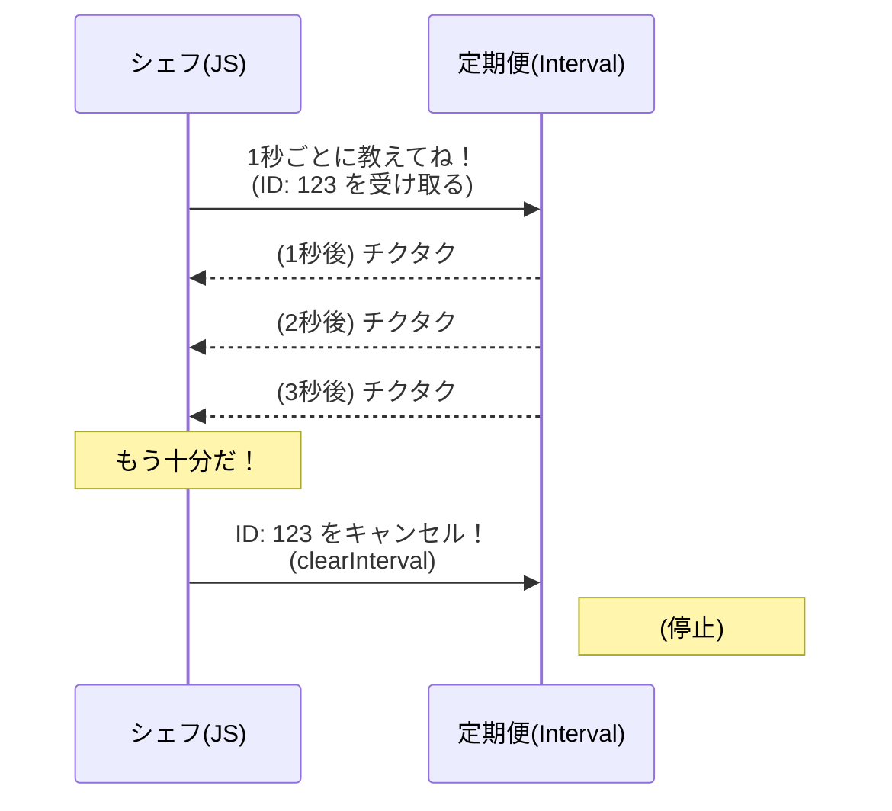

シリーズ第2回、**Day 2** のコンテンツです。  
前回（Day 1）で学んだ「ワンオペ・シェフ」という概念をベースに、実際に時間を操るための具体的な「道具」の使い方を学びます。

-----

# 🕰️ Day 2：キッチンタイマーで遊ぼう ～setTimeout & setInterval～

## 🏁 2.1 シェフの必須アイテム「キッチンタイマー」

昨日は、JavaScriptが「一度に一つのことしかできない（ワンオペ）」だということを学びました。でも、 **「タイマー」** を使って仕事を予約すれば、待ち時間を有効活用できるんでしたよね。

今日は、そのタイマーを実際にコードで書いて、時間を操る練習をしましょう！  
JavaScriptには、2種類の便利なタイマーが用意されています。

1.  **`setTimeout`（セット・タイムアウト）：** 「〇〇秒後に、1回だけこれやって！」（パスタの茹で上がりなど）
2.  **`setInterval`（セット・インターバル）：** 「〇〇秒ごとに、繰り返しこれやって！」（時計の秒針など）

「あ、これ知ってる！ 以前何度か使ったことがあるよ！」  
という人もいるかもしれませんね。

でも、**「セットしたタイマーを、途中で強制停止する方法」** は知っていますか？  
今日はそこが重要なレベルアップポイントです！

まずは、この2つの道具の使い方を（復習も兼ねて）マスターしましょう。

-----

## 🍝 2.2 「3秒後に教えて！」 ～setTimeout～

### 💣️ドカン・リミット💣️バックンの生は一度きり


setTimeoutと同じ、私にとって、チャンスはいちどきり、というセリフ

### 💬「****************************」

---

まずは基本の「キッチンタイマー」です。  
開発者ツールのコンソールに、以下のコードを書いてみてください。

```javascript
console.log('🍝 パスタを茹で始めます（3秒待ちます）');

// setTimeout(やってほしいこと, 待ち時間ミリ秒)
setTimeout(() => {
    console.log('🛎️ ピピピ！ 3秒経ちました！ 茹で上がりです！');
}, 3000);

console.log('🥗 待ってる間にサラダを作ります');
```

> **💡 ミリ秒って？**
> プログラムの世界では、時間の単位に「ミリ秒（ms）」を使います。
> **1000ミリ秒 ＝ 1秒** です。
> だから、3秒待ちたいときは `3000` と書くんですね。ちょっとゼロが多いけど、慣れましょう！

### 🧠 初心者さんの、心の旅

  * 「よし、実行！ …あれ？ やっぱり『🥗 サラダ』が先に出た。」
  * 「でも、ちゃんと3秒後に『🛎️ ピピピ！』って出たぞ！ おお〜、本当にタイマーだ。」
  * 「これを使えば、ユーザーがボタンを押した後に『3秒待ってから正解発表！』みたいな演出ができそう！」


-----


<br>  
<br>  
<br>

## ⏰️タック・ファーザー⏰️タックパパに二言なし


setTimeoutと同じ、男に二言なし、というセリフ

### 💬「****************************」

<br>  
<br>  
<br>

-----

## ⏱️ 2.3 「1秒ごとに教えて！」 ～setInterval～

次は、ストップウォッチのように「繰り返し」合図をくれるタイマーです。  
これもコンソールで試してみましょう。

```javascript
console.log('⏱️ ストップウォッチ、スタート！');

// setInterval(やってほしいこと, 間隔ミリ秒)
setInterval(() => {
    console.log('チクタク… 1秒経過');
}, 1000);
```

実行すると…どうなりましたか？  
1秒ごとに勝手に「チクタク…」と表示され続けますよね。


### 😱 大変！ 止まらない！

「わわっ、これ、どうやって止めるの！？ ずっとチクタク言ってる！」


そうなんです。`setInterval` は、こちらから「止まれ！」と命令しない限り、**永遠に動き続けます**。  
ブラウザのタブを閉じれば止まりますが、プログラムで止める方法も知っておかないと大変ですね。

-----

## 🛑 2.4 タイマーの止め方 ～IDとclear～

タイマーを止めるには、 **「予約票（ID）」** が必要です。  
タイマーをセットしたとき、実は「これはNo.1のタイマーですよ」という番号（ID）が返ってきていたんです。

### 予約票を受け取って、キャンセルする流れ

```javascript
// 1. タイマーをセットして、「予約票（ID）」を変数にしまっておく
const timerId = setInterval(() => {
    console.log('まだ動いてますよ〜');
}, 1000);

// 2. 止めたいときは、その予約票を渡して「キャンセル！」と叫ぶ
// 試しに、5秒後にキャンセルしてみよう
setTimeout(() => {
    console.log('🛑 もう止まって！');
    clearInterval(timerId); // これで止まる！
}, 5000);
```

  * **`setTimeout` を止めたいとき：** `clearTimeout(ID)`
  * **`setInterval` を止めたいとき：** `clearInterval(ID)`

これで、暴走するタイマーを制御できるようになりました！

### ⏳ タイマー制御のフロー（シーケンス図）




-----

<br>  
<br>  
<br>

## ⏰️チック・マザー⏰️チックママのキス・ブレット


setIntervalはclearIntervalで止まるということと、チックママの終わらぬキスを掛けて一言

### 💬「****************************」


### 💬「****************************」

-----

## 👩‍💻 2.5 実践！簡易デジタル時計を作ってみよう

コンソールだけじゃ地味なので、画面に時間を表示する「デジタル時計」を作ってみましょう。  
HTMLファイル（`index.html`など）を用意して、以下のコードを書いてみてください。

### HTML

```html
<h1>ただ今の時刻：<span id="clock-display">--:--:--</span></h1>
```

### JavaScript

```javascript
// 1. 時間を表示する要素（場所）を取得
const displayElement = document.getElementById('clock-display');

// 2. 画面の時間を更新する関数を作る
function updateClock() {
    const now = new Date(); // 今の時間
    const timeString = now.toLocaleTimeString(); // "10:23:45" みたいな文字にする
    displayElement.textContent = timeString; // 画面書き換え
}

// 3. 1秒ごとに updateClock を呼び出す
setInterval(updateClock, 1000);

// ※最初に一回呼んでおくと、1秒待たずにすぐ表示されるよ
updateClock();
```

### 🧠 初心者さんの、心の旅

  * 「おおー！ 画面の時間が動いてる！ 本物の時計みたい！」
  * 「これって、裏で『1秒ごとに画面を書き換えろ』って命令し続けてるってことだよね？」
  * 「ワンオペのシェフが、他の仕事（スクロールとか）をしながら、1秒ごとにチラッと時計を見て書き換えてる…すごい働き者だなぁ。」


これで、 **「時間とともに画面が変化する」** という、動的なアプリの第一歩を踏み出しました！

-----

<br>  
<br>  
<br>

## ⏰️ チクタク・サム⏰️チクタクのペアレント評価


チクタクがパパ（タック）とママ（チック）についてひとこと

### 💬「****************************」

<br>  
<br>  
<br>

-----

## 🍚️本日のイチカ丼のごはん🍚️

### 焼き芋・ベビー

  

---

## ✅ Day 2 のまとめ

今日は、JavaScriptで時間を操るための「2つの道具」を手に入れました。

1.  **`setTimeout`** ： 「〇〇秒後に1回だけ」実行する（キッチンタイマー）。
2.  **`setInterval`** ： 「〇〇秒ごとに繰り返し」実行する（時計やストップウォッチ）。
3.  **止める方法** ： セットした時の「ID」を使って `clear...` する。

「なんだ、ただのタイマーか」と思うかもしれませんが、これは **「非同期処理」の基礎中の基礎** です。  
シェフ（JavaScript）は、これらのタイマーをセットした後、**待ち時間の間に何をしているのでしょうか？**

実は明日は、この **「待ち時間のミステリー」** に迫ります。  
「0秒後に実行」と書いたら、すぐに実行されると思いますか？ …ふふふ、実はそうじゃないんです。

明日は、シェフの裏側の「整理術（イベントループ）」の秘密を暴きます！お楽しみに！

-----

<h1><a href="D03.md">Day3 へ</a></h1>


