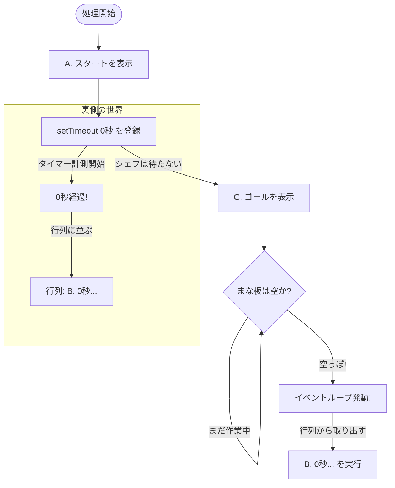

シリーズ第3回、**Day 3** のコンテンツです。  
Day 1 の「ワンオペシェフ」、Day 2 の「キッチンタイマー」に続き、今日はシェフが止まらずに働き続けるための**「裏側のルール」**を解き明かします。

直感に反する動きをする「0秒タイマー」のミステリーを通じて、非同期処理の核心に迫ります。

> 📝 **今日のポイント**  
> - 「0秒なのに後回し」のなぞを解く  
> - キッチンの「3つのエリア」を覚える  
> - 途中でクイズが3つ出てくるよ！ 🧠

-----

# 🕰️ Day 3：イベントループという「魔法の整理術」

## ⏱️ 3.1 「0秒」なのに、すぐ実行されない！？

昨日は `setTimeout` で「3秒待つ」ことができました。  
では、もし**「0秒待つ（＝待ち時間なし）」**と設定したら、どうなると思いますか？

「待ち時間がないんだから、すぐに実行されるはず！」


そう思いますよね。では、シェフ（JavaScript）の動きを実験してみましょう。  
以下のコードをコンソールで実行してみてください。

```javascript
console.log('A. スタート！');

// 0秒後に実行してね！（つまり今すぐ！？）
setTimeout(() => {
    console.log('B. 0秒経ったよ！');
}, 0);

console.log('C. ゴール！');
```

### 🧠 初心者さんの、心の旅

  * 「えーっと、上から順番だから…」
  * 「『A. スタート』が出て…」
  * 「その次は『0秒』だから、すぐ『B. 0秒経ったよ』が出て…」
  * 「最後に『C. ゴール』かな？」

**実行結果：**

```
A. スタート！
C. ゴール！
B. 0秒経ったよ！  <-- ！？！？
```

「ええっ！？ なんで『C. ゴール』が先に出るの？ 0秒待機ってことは、一瞬でしょ？ なんで後回しにされたの？」


このミステリーを解く鍵こそが、ワンオペシェフが過労死せずに働き続けるための **「鉄の掟（イベントループ）」** なんです。

### 0秒タイマーと行列


### 💬「０秒後っていうのは『今すぐ』っていう意味じゃないよ⏰<br>　 『何もやることがなければ、すぐ⭐️』っていうことなの️<br><br>　　要は『※ただし、イケメンに限る』と同じね⏰️」

-----

## 🔪 3.2 シェフのキッチンの「3つのエリア」

この謎を解くために、シェフのキッチン（JavaScriptの裏側）を覗いてみましょう。  
キッチンには、大きく分けて3つのエリアがあります。

| エリア | 役割 | ポイント |
|:---:|:---|:---|
| 🔪 **まな板** | 今まさにシェフが作業中の場所 | **1つの仕事しか置けない！** |
| ⏲️ **タイマー置き場** | 時間がかかる仕事を預ける場所 | ブラウザが面倒を見てくれる |
| 📋 **行列** | 終わった仕事が「次お願い！」と並ぶ場所 | 先に並んだ順に処理される |

> 💡 **用語メモ**（教科書で見たら思い出してね）
> - まな板 → 「コールスタック」とも呼ばれる
> - 行列 → 「タスクキュー」とも呼ばれる
> - 全体の仕組み → 「イベントループ」と呼ばれる


-----

## 🔄 3.3 絶対ルール「手元が空くまで、次は呼ばない」

ここで一番大切なルールがあります。  
それを管理しているのが、現場監督の **「イベントループ」** さんです。

> **👮 イベントループの鉄の掟**  
> **「まな板（コールスタック）の上で作業している間は、絶対に行列（タスクキュー）から新しい仕事を入れちゃダメ！」**

つまり、**「今やっている行のコード」が完全に終わるまでは、たとえ0秒で終わったタイマーがあっても、割り込み禁止**なんです。

### 🕵️ ミステリーの解説

さっきのコードで何が起きていたのか、スローモーションで見てみましょう。

1.  **`console.log('A. スタート')`**
      * まな板に乗る → 実行（表示） → まな板から消える。
2.  **`setTimeout(..., 0)`**
      * まな板に乗る → シェフ「あ、これはタイマーだね。Web APIさん、0秒よろしく！」と依頼 → まな板から消える（次の行へ！）。
3.  **Web API（裏側）**
      * 「0秒ですね、はい終わりました！」 → `console.log('B. ...')` を**行列（タスクキュー）の最後尾に並ばせる。**
4.  **`console.log('C. ゴール')`**
      * **ここが重要！** シェフはまだコードの続き（3行目）を処理中で、まな板は埋まっています。
      * だから、行列に並んでいる『B. ...』は、**まだ呼ばれません！**
      * まな板に乗る → 実行（表示） → まな板から消える。
5.  **イベントループ（現場監督）**
      * 「お、まな板が空っぽになったな？ コードも全部終わったな？」
      * 「よし、行列の先頭の人（『B. ...』）、入っていいよー！」
6.  **`console.log('B. 0秒経ったよ')`**
      * ようやくまな板に乗る → 実行（表示）。

### 🖼️ 0秒タイマーの動き（フローチャート）




-----

### 🧠 クイズ①：穴埋めに挑戦！

以下の文章の【　】に入る言葉を考えてみよう！

> 「`setTimeout` で0秒を指定しても、その処理はすぐ実行されない。  
> なぜなら、シェフ（JavaScript）は【　①　】の上の仕事が終わるまで、  
> 【　②　】に並んでいる仕事を取りに行かないから。」

<details>
<summary>答えを見る（クリック）</summary>

- ① **まな板**（コールスタック）
- ② **行列**（タスクキュー）

この2つが言えれば、仕組みは理解できています！ 🎉
</details>

-----

### 🧠 クイズ②：どっちが先？

理解度チェックです！ 以下のコードを実行すると、「B」と「C」どちらが先に表示されるでしょうか？

```javascript
console.log('A. 受付開始');

setTimeout(() => {
    console.log('B. 呼び出し');
}, 0); // 0秒待ち

console.log('C. 受付終了');
```

<details>  
<summary>答えを見る（クリック）</summary>

**正解は...**

1.  **A. 受付開始**
2.  **C. 受付終了**
3.  **B. 呼び出し**

**解説：**  
「0秒待ち」でも、`setTimeout` を使った時点で、その処理は**一度行列（タスクキュー）の最後尾に並ばされます。**  
その間に、シェフ（JavaScript）は手元の仕事（AとCの表示）を全部終わらせてしまいます。  
手元が空っぽになって初めて、行列の先頭にある「B」が呼ばれるのです。

これが分かれば、イベントループは免許皆伝です！  
</details>

-----

### 🔬 実験タイム：自分で確かめてみよう！

以下のコードをコンソールで実行して、予想と結果を比べてみよう！

**実験1：タイマーの入れ子**
```javascript
console.log('1. 開始');

setTimeout(() => {
    console.log('2. 外側のタイマー');
    
    setTimeout(() => {
        console.log('3. 内側のタイマー');
    }, 0);
    
    console.log('4. 外側の続き');
}, 0);

console.log('5. 終了');
```

<details>
<summary>予想してから開く！</summary>

**結果：** `1 → 5 → 2 → 4 → 3`

**解説：**
- まず「まな板」の仕事（1, 5）が全部終わる
- 次に「行列」から外側タイマー（2, 4）が実行される
- 内側タイマーはこの時点で「行列」に並んだばかり
- 最後に内側（3）が実行される
</details>

<br>

**実験2：どっちが先に行列に並ぶ？**
```javascript
setTimeout(() => console.log('A'), 100);
setTimeout(() => console.log('B'), 50);
setTimeout(() => console.log('C'), 0);
```

<details>
<summary>予想してから開く！</summary>

**結果：** `C → B → A`

**解説：** 待ち時間が短い順に「行列」に並ぶから、C(0秒) → B(50ms) → A(100ms) の順で実行される！
</details>

<br>  
<br>  

## 🚦ノー・インタラプト🚦アカネ・ミドリコは割り込ませない


### 💬 「割り込みは許さないの🚦<br>　 　たとえ０秒で終わろうが、社長の命令だろうが、<br>　 　待たせるの。<br>　 　今の作業が終わるまで、私は青にならないわ🚦」


<br>  
<br>  
<br>

-----

## 🧠 3.4 なぜこんなルールがあるの？

「0秒なら、ちょっとくらい割り込ませてくれても良くない？」

もし割り込みOKだったら、どうなるでしょう？  
例えば、「計算をして、結果を表示する」という作業の途中に、突然「クリックされた！」とか「通信が終わった！」という別の仕事が割り込んでくると、計算中の数字がおかしくなったり、画面がカクカクしたりしてしまいます。


JavaScriptは、**「今やっていること（同期処理）」を最優先で終わらせる**ことで、プログラムの整合性を守っているんです。

  * **同期処理（A, C）：** 王様。最優先。
  * **非同期処理（B）：** 家来。王様の仕事が全部終わるまで、行列で待機。

この優先順位があるから、JavaScriptはワンオペでもパニックにならずに動けるんですね。

-----

### 🧠 クイズ③：○か×か？

以下の文章は正しい？ 間違っている？

1. 「`setTimeout` で0秒を指定すれば、確実にすぐ実行される」
2. 「行列に並んだ仕事は、まな板が空くまで絶対に実行されない」
3. 「JavaScriptは同時に2つの関数を実行できる」

<details>
<summary>答えを見る</summary>

1. ❌ 間違い → 0秒でも「行列に並ぶ」ので、まな板の仕事が終わるまで待つ
2. ⭕ 正しい → これがイベントループの鉄の掟！
3. ❌ 間違い → JavaScriptはワンオペ（シングルスレッド）なので、同時に1つだけ
</details>

-----


- ２つのJavaScriptの関数は絶対同時には実行されない  
- 関数実行の予約がされたら、JavaScriptが「何も実行してない時だけ」予約からとりにいく

以上を踏まえたセリフ

### 💬「****************************」

---

## ✅ Day 3 のまとめ

今日は、JavaScriptの裏側で動いている「イベントループ」という仕組みを覗き見しました。

### 📋 覚えておく3つのこと

| No. | キーワード | 一言で言うと |
|:---:|:---|:---|
| 1 | **3つのエリア** | まな板🔪 / タイマー置き場⏲️ / 行列📋 |
| 2 | **鉄の掟** | まな板が空っぽになるまで、行列の仕事は呼ばれない |
| 3 | **0秒の正体** | 「0秒後に実行」ではなく「0秒後に**行列に並ぶ**」 |

### 💬 今日のひとこと

> **「`setTimeout` の時間は、実行される時間じゃなくて、行列に並ぶまでの最短時間」**

だから、`setTimeout` を使うときは、 **「指定した時間に必ず実行されるわけじゃなくて、最低でもその時間は待つ（そして今の作業が終わるのを待つ）」** という感覚を持つのが正解です。

-----

さて、これで「タイマー」を使った実験は終わりです。  
明日は、このタイマーをたくさん使って、 **「昔のプログラマーがいかに苦労していたか」** を体験します。

「Aが終わったらB、Bが終わったらC…」  
これをタイマーで書こうとすると、コードの形がとんでもないことになります。通称 **「波動拳」** と呼ばれるそのコードとは…！？

明日は地獄の入り口へご案内します。お楽しみに！

---

## 🍚️本日のイチカ丼のごはん🍚️

### ペロペロ綿飴＋桜の和菓子


-----

<h1><a href="D04.md">Day4 へ</a></h1>
