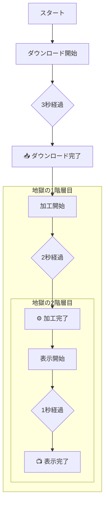

シリーズ第4回、**Day 4** のコンテンツです。  
Day 1〜3で、タイマーとイベントループの仕組みを学びました。  
今日は、その知識を使って「Aの次にB、Bの次にC…」という **順番のある処理** を作ろうとした時、昔のプログラマーたちが直面した **「絶望」** を体験します。

通称 **「コールバック地獄（Callback Hell）」**。  
この辛さを知ることで、次回登場する救世主「Promise」がどれほど素晴らしいか、骨の髄まで理解できるようになります。

-----

# 🕰️ Day 4：昔の苦労を知る ～コールバック地獄～

## 🏁 4.1 順番通りに実行したいだけなのに…

昨日の実験で、`setTimeout` を使うと「処理を後回し」にできることが分かりました。  
では、実際のアプリ開発でよくある、こんなシーンを想像してみてください。

1.  **データダウンロード（3秒かかる）**
2.  **データを加工する（2秒かかる）**
3.  **画面に表示する（1秒かかる）**

これを順番通りに実行したいです。  
ダウンロードが終わっていないのに、加工を始めたらエラーになっちゃいますよね。

### ❌ 失敗例：並べて書いてみる

まずは、直感的にそのまま並べて書いてみましょう。

```javascript
console.log('🚀 スタート！');

// 1. ダウンロード（3秒）
setTimeout(() => {
    console.log('📥 1. ダウンロード完了！');
}, 3000);

// 2. 加工（2秒）
setTimeout(() => {
    console.log('⚙️ 2. データ加工完了！');
}, 2000);

// 3. 表示（1秒）
setTimeout(() => {
    console.log('📺 3. 画面に表示完了！');
}, 1000);
```

### 🧠 初心者さんの、心の旅

  * 「えーっと、3秒タイマー、2秒タイマー、1秒タイマーをセットした。」
  * 「3秒の方が長いから、順番通りになる…のかな？」

**実行結果：**

```
🚀 スタート！
📺 3. 画面に表示完了！       <-- 1秒後に表示！？ 早すぎ！
⚙️ 2. データ加工完了！       <-- 2秒後
📥 1. ダウンロード完了！     <-- 3秒後
```

「逆じゃん！！ ダウンロードが終わる前に表示しちゃったよ！」


### 解説：ヨーイドンでスタートしている

シェフ（JavaScript）は、3つのタイマーを**ほぼ同時**にセットしました。  
100m走で、足の速い人（1秒で終わる仕事）が先にゴールするのは当たり前ですよね。  
これでは「順番」を守れません。


-----

## 😈 4.2 これが「コールバック地獄」だ！

順番を守るためには、どうすればいいでしょう？  
答えは一つ。 **「ダウンロードが終わった瞬間（コールバック関数の中）で、次のタイマーをセットする」** しかありません。

これを実践すると、コードはこうなります。

```javascript
console.log('🚀 スタート！');

// 1. ダウンロード（3秒）
setTimeout(() => {
    console.log('📥 1. ダウンロード完了！');

    // ダウンロードが終わったから、加工を開始！
    setTimeout(() => {
        console.log('⚙️ 2. データ加工完了！');

        // 加工が終わったから、表示を開始！
        setTimeout(() => {
            console.log('📺 3. 画面に表示完了！');
            console.log('🎉 すべての作業が終了しました！');
        }, 1000);

    }, 2000);

}, 3000);
```

### 🧠 初心者さんの、心の旅

  * 「うわっ…何これ…。」
  * 「コードがどんどん右にズレていく…。」
  * 「閉じカッコ `}, 1000);` とか `}, 2000);` が最後に固まってて、どれがどれだか分からないよ…。」


**実行結果：**

```
🚀 スタート！
(3秒後...)
📥 1. ダウンロード完了！
(さらに2秒後...)
⚙️ 2. データ加工完了！
(さらに1秒後...)
📺 3. 画面に表示完了！
🎉 すべての作業が終了しました！
```

動きは正しくなりました。でも、コードの形を見てください。  
どんどん右に深くなっていくこの形、ゲームの技に似ていることから **「波動拳（Hadoken）コード」「破滅のピラミッド（Pyramid of Doom）」** とも呼ばれ、世界中のプログラマーに恐れられています。※波動拳＝格闘ゲーム「ストリートファイター」シリーズの飛び道具の必殺技。


### ⛓️ 地獄の３階層





-----

## 😭 4.3 何がそんなにダメなの？

「見た目が悪いだけでしょ？ 動くならいいじゃん」

そう思うかもしれません。でも、もしこのように、**「注文」と「その後の処理」を切り離せる**おかげで、コードがスッキリ整理できるようになったんです！

  
ここで **「エラー処理」** が必要になったらどうでしょう？

  * 「ダウンロードに失敗したら『失敗！』と出す」
  * 「加工に失敗したら『失敗！』と出す」

これを書き足そうとすると…

```javascript
setTimeout(() => {
    // ダウンロード成功？
    const downloadSuccess = true; // 例なので仮に成功とする
    if (downloadSuccess) {
        setTimeout(() => {
            // 加工成功？
            const processSuccess = true; // 例なので仮に成功とする
            if (processSuccess) {
                setTimeout(() => {
                    // ...
                }, 1000);
            } else {
                console.log('加工失敗...'); // エラー処理
            }
        }, 2000);
    } else {
        console.log('ダウンロード失敗...'); // エラー処理
    }
}, 3000);
```

### 絶望ポイント

1.  **読みづらい：** どこで何をしているのか、パッと見て分からない。
2.  **直しづらい：** 「加工の前に、もう一つ処理を追加したい」と思った時、パズルのようにコードを分解しないといけない。
3.  **エラー処理が面倒：** エラー処理をそれぞれの階層で書かないといけない。

これが、JavaScriptが長年抱えていた闇、 **「コールバック地獄」** の正体です。

-----

<br>  
<br>  
<br>

## 📦️ネスト・ボックス📦️ダンボール三姉妹


箱の中に箱、その中に更に箱、といったようにネストしてる様を自虐的にいうセリフ

### 💬「****************************」

<br>  
<br>  
<br>

-----


## ✅ Day 4 のまとめ

今日は、あえて「悪い書き方」を体験することで、非同期処理の難しさを肌で感じてもらいました。

1.  **順番を守るには** ：「終わったとき（コールバック）」の中に「次の処理」を書くしかない。
2.  **ネスト（入れ子）地獄** ：処理が増えれば増えるほど、コードが右へ右へと深くなる。
3.  **波動拳** ：この三角形のコードは、読みやすさとメンテナンス性の敵である（「ストリートファイター」の必殺技になぞらえた呼び名）。

「こんな書き方、絶対にしたくない！」

そう思いましたよね？ その気持ちこそが、次のステップへのパスポートです。  
この「地獄」を解決するために、天才たちが発明した **「未来の予約チケット」**。それが **Promise（プロミス）** です。

明日は、コードを一切書かずに、この「Promise」という概念が一体どういうものなのか、物語として理解していきましょう。  
約束チケット姉さんが、あなたを待っています🎟️

-----
<br>  
<br>  
<br>

## 🎟️ 約束チケット姉さん


### 💬 「ネストに疲れたかしら？<br>　 　明日は『約束のチケット』を配るわよ。<br>　 　受け取ったら落とさないように、<br>　 　夜のうちにナイナイしときなさいね🎟️」

<br>  
<br>  
<br>

-----

## 🍚️本日のイチカ丼のごはん🍚️

### 桜かんざしの桜餅＋抹茶セット


---

<h1><a href="D05.md">Day5 へ</a></h1>


