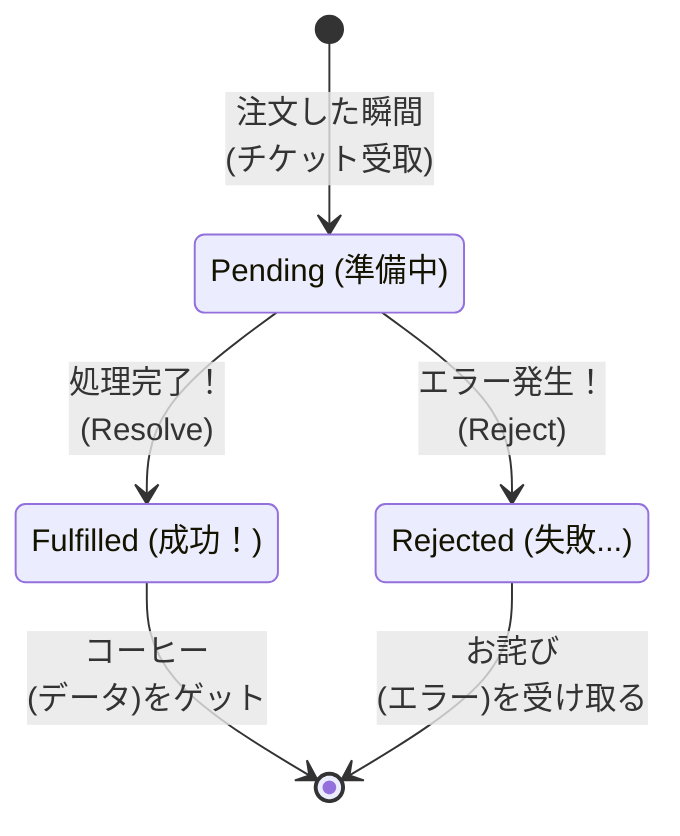

シリーズ第5回、**Day 5** のコンテンツです。  
昨日の「コールバック地獄（波動拳）」で、私たちは深く傷つきました。  
今日は、その地獄から私たちを救い出してくれる **「Promise（プロミス）」** という概念について学びます。

ただし！ **今日はほとんどコードを書きません。**  
いきなり難しい書き方を覚える前に、まずは「Promiseって要するに何？」というイメージを、 **「予約チケット」** のメタファーを使って完全に腹落ちさせましょう。

-----

# 🕰️ Day 5：約束チケット姉さんの「予約チケット（Promise）」


## 🎫 5.1 コーヒーは「今」渡せない

昨日の「コールバック地獄」、大変でしたよね。  
「終わったらこれやって、その次あれやって…」とお願いばかりしていると、コードがどんどん複雑になってしまいます。

そこで、JavaScriptの世界に新しいキャラクターが登場しました。  
**「未来のことは約束（Promise）しよう」** が口癖の、 **チケット姉さん** です。

彼女のカフェでの注文方法は、今までの「ワンオペシェフ」とは少し違います。

### ☕ 今までの注文（コールバック）

1.  あなた「コーヒーください」
2.  シェフ「あいよ！ 淹れるから、**できるまでレジの前で待ってて！**（出来上がったら渡すから！）」
3.  あなた「（じーっ…待つ）」
4.  シェフ「はいどうぞ！」

### 🎫 チケット姉さんの注文受け取り方法（Promise）

1.  あなた「コーヒーください」
2.  チケット姉さん「わかったわ。淹れるのに時間がかかるから、**この『予約チケット』をお持っておいて**」
3.  あなた「（チケットを受け取って、席でスマホを見たりして待つ）」
4.  チケット姉さん「チケット番号の方、出来ましたよ」
5.  あなた「チケットと交換でコーヒーをもらう」

この **「予約チケット」** こそが、`Promise`（プロミス）の正体なんです！


-----

<br>  
<br>  
<br>

## コーヒー


久しぶりにあったイチカ丼に挨拶をして、コーヒーが出来た旨を伝える

### 💬「****************************」

<br>  
<br>  
<br>

-----

## 🎫 5.2 チケットの「3つの状態」


チケット姉さんから渡された「予約チケット（Promiseオブジェクト）」は、時間とともに **3つの状態** に変化します。  
この3つの言葉は、これから毎日使うので覚えてあげてください。

### 1\. `Pending`（ペンディング）：準備中

  * **意味：** まだコーヒーが出来ていない状態。
  * **状況：** あなたはチケットを握りしめて待っています。
  * **イメージ：** 「調理中…」

### 2\. `Fulfilled`（フルフィルド）：成功！

  * **意味：** 無事にコーヒーが出来上がった状態！
  * **状況：** チケットが **「コーヒー（成功データ）」** に変わります。
  * **イメージ：** 「お待たせしました！（データ到着）」
  * ※専門用語で「解決（Resolve）」とも言います。

### 3\. `Rejected`（リジェクテッド）：失敗…

  * **意味：** 何らかのトラブルで、コーヒーが作れなかった状態。
  * **状況：** チケットが **「お詫びの手紙（エラー理由）」** に変わります。
  * **イメージ：** 「申し訳ありません、豆が切れました…（エラー発生）」

-----

## 🖼️ 図解：チケットの運命

チケット（Promise）は、必ず「成功」か「失敗」のどちらかに変化します。  
一度変化したら、もう元には戻りません  
（コーヒーを受け取った後に、豆切れにはなりませんよね）。




### 🚥 コラム：チケットの状態を変えるのは誰？

「チケットが勝手に変わるの？ それとも私が変えるの？」

ここが混乱ポイントですが、チケットの状態を変えるのは、**あなた（JavaScriptコード）ではありません。**  
裏で働いている **「店員さん（ブラウザやWeb API）」** です。

*   **あなた（Main Thread）:** チケットを持って待っているだけ。「まだかな～」
*   **店員さん（Background）:** コーヒーを入れたり、豆を切らしたりして、**チケットの状態を書き換える権限を持っている人。**

だから、あなたはチケットを無理やり書き換えることはできません。  
店員さんからの「出来たよ！」または「ダメだった…」という合図（通知）を待つことしかできない、という主従関係を覚えておいてくださいね。


### 🧠 初心者さんの、心の旅

「なるほど、ちょっと分かってきたかも……」

*   **昔（自販機）：** ボタンを押したら、その場で「ガチャン！」と商品が出てきた。
*   **今（カフェ）：** 注文しても、その場では「はい、チケット（Promise）」と紙を渡されるだけ。
*   **結論：** ということは、**私の手元（変数）にあるのは、飲み物じゃなくて「紙切れ（チケット）」なんだ！**

「...ってことは、そのチケットをゴクゴク飲もうとしても（データをすぐ使おうとしても）、『紙なんて飲めないよ！』ってなるハズ！」


-----

## 📜 5.3 なぜ「地獄」が消えるの？

「チケット制になっただけで、何が嬉しいの？」

いい質問です。チケット制の最大のメリットは、**「次に何をするか」を、チケットを受け取った「後」で決められる**ことです。

### 昔（コールバック）

注文するときに、全ての指示をしないといけません。  
「コーヒーください。**できたらミルクを入れて、そのあと砂糖を入れて、そのあと席に運んで…**」  
（これが、あの「波動拳コード」の原因でした）

### 今（Promise）

とりあえずチケットだけもらって、席につきます。  
「コーヒーください。（チケット受け取り）」  
席についてから、ゆっくり考えます。  
**「よし、このチケット（Promise）が『成功（Fulfilled）』に変わったら、そのときミルクを入れよう」**

このように、**「注文」と「その後の処理」を切り離せる**おかげで、コードがスッキリ整理できるようになったんです！


### ⚠️ 勘違いしやすいポイント！

`const coffee = orderCoffee();`

こう書いたとき、変数 `coffee` の中に入っているのは、**「アツアツのコーヒー（データ）」ではありません。**  
あくまで **「引換券（Promiseオブジェクト）」** です。


*   × 間違い： `console.log(coffee);` → 「☕」が出るはず！
*   ○ 正解　： `console.log(coffee);` → **「🎫（Promise）」** が出るだけ！

「じゃあどうやって中身飲むの？」  
それは明日の `.then()` で学びます。今は **「手元にあるのは紙切れ（チケット）だけ」** と強く意識してください！


-----

<br>  
<br>  
<br>

## 🎫プロミス🎫約束チケット姉さん


### 💬 「焦りは禁物よ🎫<br>　 　 私が渡しすのは現物じゃないわ<br>　 　 『未来への約束（Promise）』よ<br>　 　 約束が果たされるその時までまっててね🎫」

<br>  
<br>  
<br>

-----

## ✅ Day 5 のまとめ

今日はコードを書かずに、概念だけをしっかりインストールしました。

1.  **Promiseは「予約チケット」** ：
      * データそのものではなく、「未来に結果を渡す」という約束のオブジェクト。
2.  **3つの状態** ：
      * `Pending`（準備中）
      * `Fulfilled`（成功！）
      * `Rejected`（失敗…）
3.  **嬉しいポイント** ：
      * とりあえずチケットだけもらえるから、**「結果が出たあとのこと」を後から書ける**（これがコールバック地獄を解消する鍵！）。

「じゃあ、そのチケットをどうやってコーヒー（データ）と交換するの？」


気になりますよね。  
明日は、いよいよこのチケットを使って、**「チケットが成功に変わったら、これをやって！」** というコード（`.then()`）を書いてみます。

地獄のコードが、魔法のように一本の線に変わる瞬間をお見せしますよ！

-----

## 🔬 5.4 【予告実験】Promiseを目で見てみよう！

「今日はコードを書かない」と言いましたが、**1つだけ実験**させてください！  
Promiseが本当に「チケット」であることを、自分の目で確かめましょう。

コンソールで以下を実行してみてください：

```javascript
// すぐに成功するPromiseを作る（おまじない）
const ticket = Promise.resolve('☕ コーヒー');

// チケットの中身を見てみる
console.log(ticket);
```

**結果：**
```
Promise {<fulfilled>: '☕ コーヒー'}
```

「あれ？ コーヒーが見えるけど…直接取り出せないの？」

```javascript
// 直接取り出そうとすると…
console.log(ticket + 'おいしい！');
// → [object Promise]おいしい！  ← 💥 チケットのまま！
```

ほらね！ **チケット（Promise）のままでは使えない**んです。  
明日は、このチケットを「交換」する方法を学びます！

> 💡 **Point**  
> `Promise.resolve('値')` は「すでに成功しているチケット」を作るショートカット。  
> 明日以降、たくさん使うので覚えておいてね！

<br>  
<br>  
<br>

-----

## 🍚️本日のイチカ丼のごはん🍚️

### ビッグ肉まん


---

<h1><a href="D06.md">Day6 へ</a></h1>


