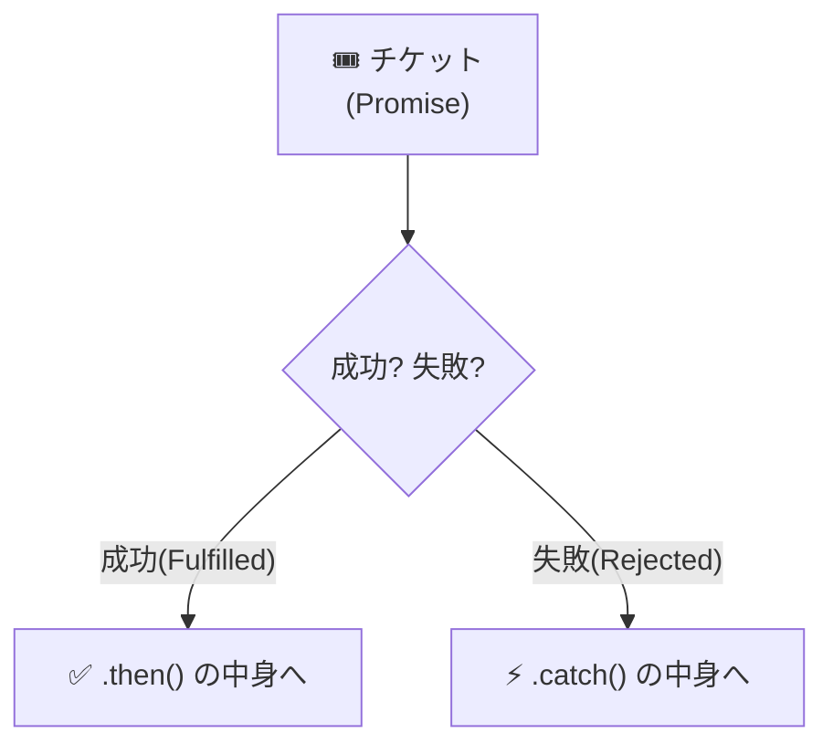
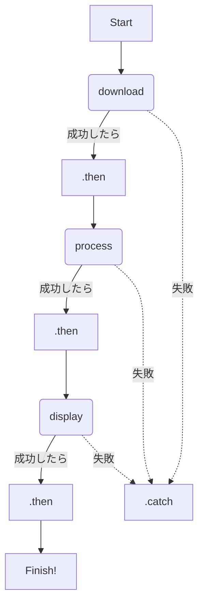
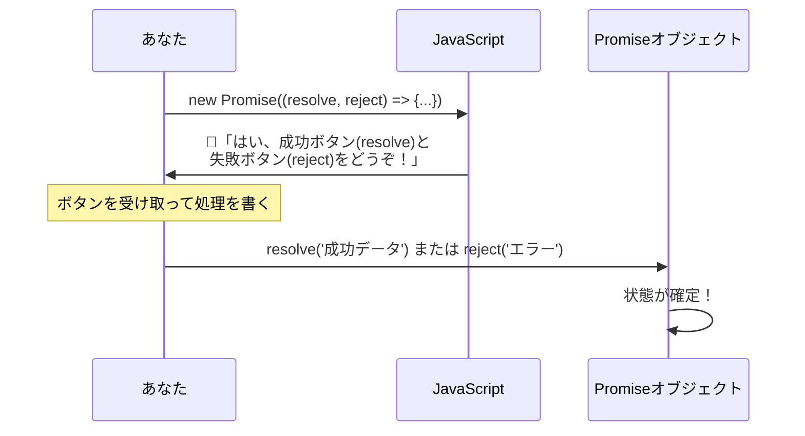
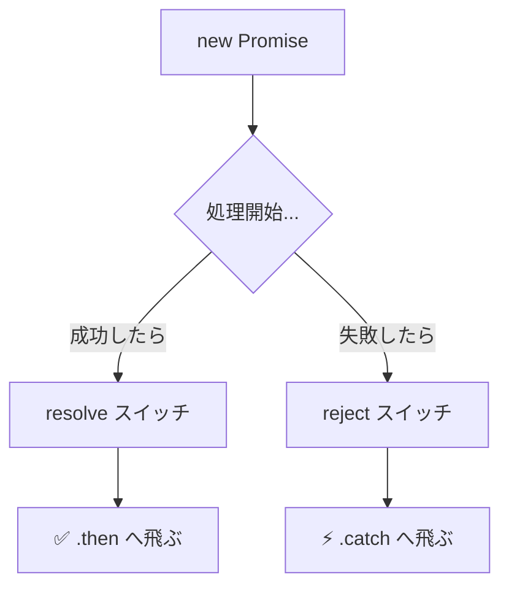

シリーズ第6回、**Day 6** のコンテンツです。  
昨日は約束チケット姉さんから「予約チケット（Promise）」をもらいました。  
でも、チケットを握りしめているだけではコーヒーは飲めませんよね。

今日は、このチケットを使って実際に **「処理をつなげる（チェーンする）」** 書き方を学びます。  
Day 4で見たあの恐ろしい「波動拳コード」が、魔法のように一本の線に変わる瞬間を目撃してください！

-----

# 🕰️ Day 6：チケットの交換 ～.then()チェーン～

## 📝 6.0 Day 5の復習クイズ！

昨日のPromiseの概念、覚えていますか？  
コードを書き始める前に、3問だけ確認しましょう！

**Q1. Promiseを一言で言うと何でしょう？**
<details>
<summary>答えを見る</summary>

**「予約チケット」** または **「未来の結果を渡す約束」**  
データそのものではなく、「あとで結果を渡すよ」という約束のオブジェクトです。
</details>

**Q2. Promiseの3つの状態を言えますか？**
<details>
<summary>答えを見る</summary>

1. **Pending**（準備中）- まだ結果が出ていない
2. **Fulfilled**（成功）- 無事にデータが届いた
3. **Rejected**（失敗）- エラーが発生した
</details>

**Q3. 以下のコードで `ticket` の中身は何？**
```javascript
const ticket = Promise.resolve('🍕 ピザ');
console.log(ticket);
```
<details>
<summary>答えを見る</summary>

**`Promise {<fulfilled>: '🍕 ピザ'}`**  
「🍕 ピザ」ではなく、**Promiseオブジェクト（チケット）** が入っています！  
直接取り出すことはできません。
</details>

全問正解できたら、今日のレッスンに進みましょう！ 🎉

-----

## 🎫 6.1 チケットを「窓口」に出そう

昨日は概念だけでしたが、今日はいよいよコードを書きます。  
約束チケット姉さんから受け取った「予約チケット（Promiseオブジェクト）」には、ある **特別な窓口（メソッド）** がついています。

それが、**`.then()`（ドット・ゼン）** です。

日本語に訳すと **「～そしてその後（then）」** という意味ですね。  
使い方はとってもシンプルです。

```javascript
// 1. 注文して、チケット(Promise)をもらう
const ticket = orderCoffee(); 

// 2. チケットに「窓口」をつける
ticket.then((coffee) => {
    // 3. 成功(Fulfilled)したら、ここが実行される！
    console.log('☕ 受け取りました:', coffee);
    drink(coffee);
});
```

<details open>
<summary>🛠️ 実験用のダミー関数（コピペ用）</summary>
上記コードを動かすには、(ダミーとして)以下の関数を先にコンソールで実行しておいてください。

```javascript
// orderCoffee: 1秒後に「☕ ホットコーヒー」を返す
function orderCoffee() { 
    return new Promise(resolve => {
        setTimeout(() => resolve('☕ ホットコーヒー'), 1000);
    });
}

// drink: 飲む動作
function drink(coffee) { 
    console.log(coffee + ' を飲みました。おいしい！'); 
}
```
</details>

### 🧠 初心者さんの、心の旅

  * 「なるほど！ `ticket.then(...)` っていうのは、 **『チケットが成功に変わったら、このカッコの中の関数を実行してね』** っていう予約なんだ。」
  * 「これなら、コーヒーができる前に飲もうとしてエラーになることもないね！」


-----

## 🎯 6.1.5 `.then()` の書き方を段階的に見てみよう

「カッコが多すぎて分からない…」という人のために、段階的に見ていきましょう！

### Step 1：一番シンプルな形

```javascript
// チケットを作る
const ticket = Promise.resolve('☕ コーヒー');

// 成功したら関数を実行
ticket.then(受け取ったデータを処理する関数);
```

### Step 2：普通の関数で書くと

```javascript
// 普通の関数を定義
function showCoffee(coffee) {
    console.log('受け取った:', coffee);
}

// それを .then() に渡す
ticket.then(showCoffee);
```

### Step 3：アロー関数で書くと（よく見る形）

```javascript
ticket.then((coffee) => {
    console.log('受け取った:', coffee);
});
```

### Step 4：1行なら省略形も使える

```javascript
// { } と return を省略できる！
ticket.then(coffee => console.log('受け取った:', coffee));
```

### 💡 **アロー関数おさらい**

 | 書き方 | 省略ルール |
 |:---|:---|
 | `(x) => { return x * 2; }` | フル版 |
 | `x => { return x * 2; }` | 引数1つなら `()` 省略可 |
 | `x => x * 2` | 1行なら `{}` と `return` 省略可 |

### 🔬 実験してみよう！

コンソールで実行して、動きを確認してください：

```javascript
Promise.resolve('🍕 ピザ')
    .then(food => {
        console.log('1. 受け取った:', food);
        return food + ' 🧀 チーズ追加';
    })
    .then(food => {
        console.log('2. 加工した:', food);
    });
```

**結果：**
```
1. 受け取った: 🍕 ピザ
2. 加工した: 🍕 ピザ 🧀 チーズ追加
```

-----

## 💥 6.2 失敗した時の窓口 ～.catch()～

でも、もしコーヒー豆が切れて作れなかったら？  
チケットは「失敗（Rejected）」に変わります。  
その時に備えて、 **「トラブル相談窓口」** も用意しておきましょう。

それが、**`.catch()`（ドット・キャッチ）** です。

```javascript
ticket
    .then((coffee) => {
        console.log('☕ 成功！:', coffee);
    })
    .catch((error) => {
        // 失敗(Rejected)したら、ここが実行される！
        console.log('😢 失敗...:', error);
    });
```

### 🖼️ チケットの分岐（フローチャート）




成功なら `.then()` へ、失敗なら `.catch()` へ。  
まるで線路のポイント切り替えみたいに、自動的にルートを選んでくれるんです。便利ですよね！

-----

## ⛓️ 6.3 必殺！ Promiseチェーン

さて、ここからが今日の本番です。  
Day 4の「コールバック地獄」を覚えていますか？  
「ダウンロード → 加工 → 表示」を順番にやろうとして、コードが `}}}}` だらけになったアレです。

Promiseを使うと、この地獄を **「チェーン（鎖）」** のように真っ直ぐつなぐことができます。  
これを **「Promiseチェーン」** と呼びます。

### 👿 昔の書き方（コールバック地獄）

```javascript
download((data) => {
    process(data, (processed) => {
        display(processed, () => {
            console.log('完了！');
        });
    });
});
```


### 💬「うっ…頭が痛くなりそう…」

---

### ✨ 今の書き方（Promiseチェーン）


<details open>
<summary>🛠️ 実験用のダミー関数（コピペ用）</summary>
このコードを動かすには、以下の関数を先にコンソールで実行しておいてください。

```javascript
// download: データをダウンロードするフリ
function download() {
    return new Promise(resolve => setTimeout(() => resolve('ダウンロードデータ'), 1000));
}

// process: データを加工するフリ
function process(data) {
    return new Promise(resolve => setTimeout(() => resolve(data + 'を加工しました'), 1000));
}

// display: 表示するフリ
function display(data) {
    console.log('画面に表示:', data);
    return Promise.resolve();
}
```
</details>

### 本体ソースコード

```javascript
download()
    .then((data) => {
        console.log('1. ダウンロード完了！');
        // 次の処理（加工）を返す
        return process(data); 
    })
    .then((processed) => {
        console.log('2. 加工完了！');
        // 次の処理（表示）を返す
        return display(processed);
    })
    .then(() => {
        console.log('3. 表示完了！');
        console.log('🎉 すべて完了！');
    })
    .catch((error) => {
        console.log('⚠️ どこかでエラーが起きました:', error);
    });
```

> **⚠️ 重要：バトン（return）を落とさないで！**
> 
> `return process(data);` の `return` を忘れると、チェーンが切れてしまいます！
> **「return = バトンパス」** です。
> これを書かないと、次の `.then` が「前の仕事が終わったこと」に気づけず、勝手にスタートしてしまいます（フライング）。
> 必ず **「return」** を書いて、バトンをつなぎましょう！

### 💥 【体験】return を忘れるとどうなる？

百聞は一見にしかず！ 実際に試してみましょう。

**❌ ダメな例（return を忘れた）**
```javascript
Promise.resolve(100)
    .then(num => {
        console.log('1. 受け取った:', num);
        num * 2;  // ← return がない！
    })
    .then(num => {
        console.log('2. 受け取った:', num);  // 何が出る？
    });
```

**結果：**
```
1. 受け取った: 100
2. 受け取った: undefined  ← 💥 バトンが届いてない！
```

**✅ 正しい例（return を書いた）**
```javascript
Promise.resolve(100)
    .then(num => {
        console.log('1. 受け取った:', num);
        return num * 2;  // ← return あり！
    })
    .then(num => {
        console.log('2. 受け取った:', num);
    });
```

**結果：**
```
1. 受け取った: 100
2. 受け取った: 200  ← ✅ バトンが届いた！
```

> 🎯 **覚えておこう**  
> `.then()` の中で **次に渡したいデータがあるなら、必ず `return` する！**  
> 書き忘れると `undefined` が渡されて、謎のバグに悩むことになります。

### 🧠 初心者さんの、心の旅

  * 「うわぁっ！ 三角形が消えた！」
  * 「上から下に、 **『.then（そして）』→『.then（そして）』→『.then（そして）』** って読んでいける！」
  * 「しかも、`.catch` は最後に一個書くだけで、途中のどこで失敗しても拾ってくれるの？ すごすぎる！」


そうなんです。Promiseチェーンは、 **「前の作業が終わったら、その結果を持って次の作業へ」** というバトンリレーを、ネスト（入れ子）せずに書ける画期的な発明なんです。

### ⛓️ チェーンの仕組み（イメージ図）





-----

<br>  
<br>  
<br>

## 🏐マキマキ・モコモコ🏐モコ・マフラーの「<ruby>毛糸玉式<rt>けいとだましき</rt></ruby>いっぽん<ruby>巻<rt>まき</rt></ruby>」

<br>
Promiseと.then()も一本道で書ける。  
マフラーも一本に編んでいく、似てるわね、というセリフ。

### 💬「****************************」


### 💬「****************************」

<br>  
<br>  
<br>

-----

## 🧪 6.4 チケットを自分で作ってみよう（new Promise）

「チケットを使う方法は分かったけど、そもそも約束チケット姉さんはどうやってチケットを作ってるの？」

気になりますよね。  
実は、裏側では **`new Promise`** という魔法を使って、手作業でチケットを発行しているのです。

> ⚠️ **この節は必修です！**  
> Day 8 以降で `new Promise` を使ったコードが出てきます。  
> 「読める」レベルまで理解しておきましょう！

### 🎯 まずは一番シンプルな例から

```javascript
// 1秒後に成功するチケットを作る
const ticket = new Promise((resolve, reject) => {
    setTimeout(() => {
        resolve('☕ 完成！');  // ← 成功スイッチを押す
    }, 1000);
});

// チケットを使う
ticket.then(result => console.log(result));
// → 1秒後に「☕ 完成！」と表示される
```

### 📖 読み方ガイド

```javascript
new Promise((resolve, reject) => {
    // ここに「時間がかかる処理」を書く
    // 成功したら → resolve(結果データ)
    // 失敗したら → reject(エラー理由)
});
```

| 用語 | 意味 | いつ使う？ |
|:---|:---|:---|
| `resolve` | 「成功！」スイッチ | 処理がうまくいった時 |
| `reject` | 「失敗…」スイッチ | エラーが起きた時 |

### 🎁 「resolve と reject」はどこから来るの？

「ちょっと待って、`resolve` と `reject` って急に出てきたけど、どこで定義したの？」

良い質問です！ 実は、**JavaScriptが自動で渡してくれる** んです。




つまり、こういうことです：

> 📦 **Promiseを `new` で作ると、JavaScript が自動的に  
> 「成功ボタン（resolve）」と「失敗ボタン（reject）」の2つを、あなたに渡してくれる。**  
> あなたはそれを受け取って、適切なタイミングでどちらかのボタンを押すだけ！

ちなみに、`resolve` や `reject` という名前は **慣例** であって、実は自由に変えられます。

```javascript
// こう書いても動く（でも読みにくいのでオススメしません！）
new Promise((成功, 失敗) => {
    成功('☕ できた！');
});
```

みんなが「resolve / reject」と書いているのは、**世界中のプログラマーが同じ名前を使うことで、コードを読みやすくしている** からです。  
「暗黙のお約束」だと思っておきましょう！

### 🔬 実験：成功と失敗を切り替えてみよう

```javascript
function luckyDice() {
    return new Promise((resolve, reject) => {
        const dice = Math.floor(Math.random() * 6) + 1;
        console.log('🎲 サイコロの目:', dice);
        
        setTimeout(() => {
            if (dice >= 4) {
                resolve('🎉 大当たり！');  // 4以上なら成功
            } else {
                reject('💀 ハズレ…');      // 3以下なら失敗
            }
        }, 1000);
    });
}

// 使ってみる
luckyDice()
    .then(msg => console.log(msg))
    .catch(err => console.log(err));
```

何度か実行して、成功と失敗の両方を体験してみてください！

### 🏭 チケット製造のコード

```javascript
// 約束チケット姉さんの仕事場（関数の中身）
function orderCoffee() {
    // 1. 「新しいチケット(Promise)」を作る
    // 引数には、成功(resolve)と失敗(reject)のスイッチが渡される
    return new Promise((resolve, reject) => {

        console.log('約束チケット姉さん「今からコーヒーを淹れますよ...」');

        // 2. 何か時間がかかる処理（ここでは3秒待つ）
        setTimeout(() => {
            
            const isSuccess = true; // 今回は成功したとする！

            if (isSuccess) {
                // 3. 成功したら resolve(成功データ) を呼ぶ！
                // → 運命のレバーを「成功（Resolve）」側に倒す
                resolve('☕ ホットコーヒー'); 

            } else {
                // 4. 失敗したら reject(エラー理由) を呼ぶ！
                // → 運命のレバーを「失敗（Reject）」側に倒す
                reject('💥 豆がない！');
            }

        }, 3000);
    });
}

// 実際に注文してみよう！（コピペして実行できます）
console.log('🛎️ すみませーん、コーヒーください');

orderCoffee()
    .then((coffee) => {
        console.log('✨ 受け取りました:', coffee);
    })
    .catch((error) => {
        console.log('😭 エラーです:', error);
    });
```

### 🔑 運命の分岐レバー

この工場には、一つの大きなレバーがあります。  
約束チケット姉さんは状況（if文）を見て、このレバーをどちらかに倒します。

*   **`resolve(データ)`** （リゾルブ）：
    *   **レバーを「上（成功側）」に倒す！**
    *   チケットは「成功（Fulfilled）」に確定し、`.then()` のルートが開通します。
*   **`reject(エラー)`** （リジェクト）：
    *   **レバーを「下（失敗側）」に倒す！**
    *   チケットは「失敗（Rejected）」に確定し、`.catch()` のルートが開通します。

※一度倒すとロックされて、もう動かせません（Promiseは一度結果が出たら変化しない）。  
こうやって約束チケット姉さんがレバー操作をしてくれたおかげで、適切なルートに案内されていたんですね。

### 🏭 工場の仕組み（イメージ図）




### 🆚 どっちを使う？ `new` あり vs `new` なし

「あれ？ さっき `Promise.resolve` を使ったときは `new` がなかったような…？」  
と気づいた勘の鋭い方のために、使い分け表を用意しました。

| | `new Promise(...)` | `Promise.resolve(...)` |
|:---|:---|:---|
| **new** | **必要** | **不要**（そのまま書く） |
| **処理の時間** | **時間がかかる処理**<br>（通信・タイマー待ちなど） | **一瞬で終わる処理**<br>（すでにデータがあるなど） |
| **使いどき** | 成功・失敗を自分で細かく決めたい時 | すぐに「成功チケット」だけ欲しい時（おまじない） |
| **イメージ** | 🛠️ 工場で手作り | 🏪 レジ横の完成品 |

### 🛀 コラム：自分で書く機会は少ないけど…

「`new Promise` を毎回書くの？」と心配になったかもしれませんが、**安心してください。**  
実際のアプリ開発では、`new Promise` を自分で書く機会はそれほど多くありません。

*   **ライブラリを作る人：** `new Promise` を書く。
*   **アプリを作る人：** 誰かが作ってくれたPromise（fetchなど）を **「使う（.then / await）」が中心！**

ただし！ **「読める」ことは必須です。**  
Day 8 で出てくる実験コードや、他の人のコードを読むときに必要になります。

> 📌 **今日のゴール**  
> `new Promise((resolve, reject) => { ... })` を見て  
> 「あ、resolveが成功、rejectが失敗ね」と分かればOK！

-----

### 🏃‍♀️ 伝言ゲーム（バケツリレー）

最後に、チェーンのイメージをもう一度確認しましょう。

*   Aさんが走り終わったら、**結果（水）をバケツに入れて、次のBさんに渡す（return）。**
*   Bさんは、その水を受け取って次の仕事をする。
*   もし誰かが転んだら（エラー）、**全員のバケツを置いて、救護班（catch）を呼ぶ！**

この「バトン（水）をつなぐ」感覚を忘れないでくださいね。

-----

### 🎩 コラム：優先される「VIPレーン」

ちょっと不思議な現象を紹介します。  
Day 3で「行列に並ぶ（タスクキュー）」という話をしましたよね。

```javascript
console.log('1. スタート');

setTimeout(() => {
    console.log('2. タイムアウト');
}, 0);

Promise.resolve().then(() => {
    console.log('3. プロミス');
});

console.log('4. ゴール');
```

これを実行すると、どういう順番になると思いますか？  
普通に見ると「1 → 2 → 3 → 4」か、「1 → 4 → 2 → 3（早い順）」に見えますよね。

**正解は：「1 → 4 → 3 → 2」です！**

実は、**「Promise（.then）」は特別待遇のVIP** なんです。

*   **一般レーン（タスクキュー）：** `setTimeout` などが並ぶ。
*   **VIPレーン（マイクロタスク）：** `Promise` などが並ぶ。

お店（イベントループ）は、普通の行列を見る前に、**「VIPの方はいらっしゃいませんか～？」** と必ず確認します。  
だから、0秒で待ち構えていた `setTimeout` よりも、後から来た `Promise` の方が先に実行される（割り込む）のです。

「Promiseはちょっと偉い」。これを知っていると、謎の順番入れ替わり現象に悩まずに済みますよ！


-----


<br>  
<br>  
<br>

## ⏰️ポーズ＆アウェイト⏰️りんりんの「<ruby>時<rt>とき</rt></ruby>のスティック」


### 💬 「次は時間を止める呪文ね⏰️<br>　　『await🪄』と唱えるだけで<br>　 　ソコで静止するからみてて⭐️」

<br>  
<br>  
<br>

-----

## ✅ Day 6 のまとめ

今日は、チケット（Promise）の使い方と、必殺技「Promiseチェーン」を学びました。

1.  **`.then()`** ： 成功した時の処理を書く場所。「チケットを商品と交換！」
2.  **`.catch()`** ： 失敗した時の処理を書く場所。「トラブル対応！」
3.  **Promiseチェーン** ： `.then()` をつなげて書くことで、**コールバック地獄（波動拳）をまっすぐな一本道にする魔法**。

「すごい！ これでもう完璧ね！」


<br>
<br>

…と思いますよね？  

でも、実は人の欲望にはキリがありません。  
プログラマーたちは、このチェーンを見てこう思ってしまったのです。

**「`.then` とかカッコ `() => {}` を書くのすら、面倒くさくない？」**  
**「もっとこう…普通な感じに書きたいんだけど…」**

明日は、そんなワガママを叶えるために生まれた、 **現代JavaScript最強の魔法「async/await」** が登場します。  
今日のコードが、さらに劇的に、信じられないほど短くなりますよ！

-----

## 🍚️本日のイチカ丼のごはん🍚️

### デキたて・ピザ


-----

<h1><a href="D07.md">Day7 へ</a></h1>


