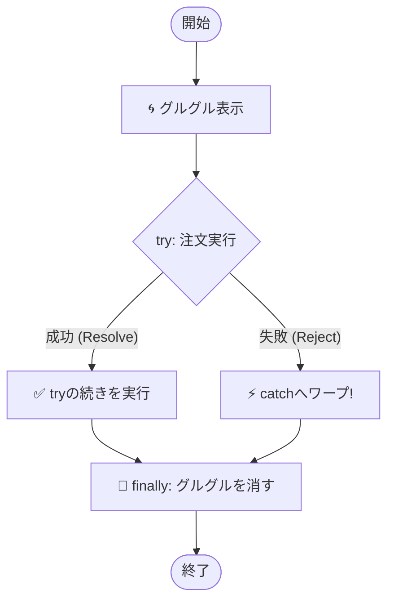

シリーズ第8回、**Day 8** のコンテンツです。  
昨日の「async/await」で、非同期処理をスラスラ書けるようになりました。  
でも、もし「通信中にWi-Fiが切れたら」？ 「サーバーがダウンしていたら」？

今日は、そんな **「もしものトラブル」** が起きても、アプリをクラッシュさせずに優しく守るための **「保険（エラーハンドリング）」** について学びます。

-----

# 🕰️ Day 8：失敗した時の「保険」 ～try...catch 再訪～

## ⛈️ 8.1 魔法にも「失敗」はある

Day 7で覚えた魔法 `await`。  
「待て！」と言えば、チケット（Promise）が商品（データ）に変わるまで待ってくれましたね。

でも、Day 5で約束チケット姉さんが言っていたことを思い出してください。  
チケットは、成功（Fulfilled）するとは限りません。  
**失敗（Rejected）** することもあるんでしたよね？

  * **成功：** コーヒーを受け取る ☕
  * **失敗：** 「豆が切れました…」というお詫びの手紙を受け取る ✉️

もし、`await` している最中に「失敗」が起きたら、どうなるでしょう？

<details open>
<summary>🛠️ 実験用のダミー関数（コピペ用）</summary>
このコードを動かすには、タネも仕掛けも（定義も）必要です！

```javascript
// orderCoffee: ランダムで失敗する関数
function orderCoffee() {
    return new Promise((resolve, reject) => {
        setTimeout(() => {
            // 50%の確率で失敗させる
            if (Math.random() > 0.5) resolve('☕ ホットコーヒー');
            else reject('豆切れエラー');
        }, 1000);
    });
}
```
</details>

### 本体ソースコード

```javascript
async function main() {
    // もしここでエラー（失敗）が起きたら…？
    const coffee = await orderCoffee();
    
    // ここから下の行は実行されず、画面が真っ赤（エラー）になって止まります！
    console.log('いただきまーす！'); 
}
```


**ブッブー！🚨**  
何の対策もしていないと、アプリはそこで **クラッシュ（強制終了）** してしまいます。  
お店でお客さんに「豆がない！」と叫んで、そのまま店長が逃亡するようなものです。最悪ですよね。

---

## 🛡️キープ・シールド🛡️シールド・ナイトは受けて立つ


防御には自信をもつ、シールドがひとこと

### 💬「****************************」

-----

## 🛡️ 8.2 転ばぬ先の杖 `try...catch`

そこで登場するのが、以前（Day 13）少しだけ触れた **`try...catch`（トライ・キャッチ）** 構文です。  
これを使うと、 **「失敗した時専用のルート」** を作ることができます。


### 構文のイメージ

  * **`try` { ... }** ： 「とりあえず、やってみる場所」。成功する前提のコードを書く。
  * **`catch` (error) { ... }** ： 「失敗した時に逃げ込む場所」。エラー対応を書く。

これを `async/await` と組み合わせると、最強の防御壁になります！

```javascript
async function main() {
    try {
        // -----------------------
        // 🟢 成功ルート（try）
        // -----------------------
        console.log('🙏 注文してみます...');
        const coffee = await orderCoffee();
        
        // 成功しないと、この行には来ない！
        console.log('☕ コーヒーゲット！:', coffee);
        
    } catch (error) {
        // -----------------------
        // 🔴 失敗ルート（catch）
        // -----------------------
        // orderCoffeeが「失敗（Reject）」したら、
        // すぐにここにワープしてきます！
        console.log('😢 トラブル発生！ 店員さんの言い訳:', error);
        alert('申し訳ありません、ただいまコーヒーが出せません。');
    }
}
```

### 🧠 初心者さんの、心の旅

  * 「なるほど！ `try` のブロックは『結界』みたいなものかな？」
  * 「この中でエラーが起きても、アプリ全体がクラッシュするんじゃなくて、`catch` の部屋に移動するだけなんだ。」
  * 「これなら、店長が逃亡せずに『ごめんなさい』って言えるね！」

<!-- img src="./images/Gemini_Generated_Image_6jf8h06jf8h06jf8.png" width="300"/ -->

-----

### 桜を持つ桜餅の店員


### 💬「お客様、もうしわけございません、<br>　 　コーヒーが品切れでしたので<br>　 　おわびにこの「お花🌺」を...<br><br>　 　── え？ 『花より団子』でございますか？」


### 💬「それでしたら、こちらの甘みを<br>　 　お召し上がりくださいませ🍡」


### 💬「...昨日何も食べてないから、<br>　 　これっぽっちじゃ足りないよ...💧」

---

## 🧹 8.3 最後に必ずお掃除 ～finally～

実は、もう一つ便利なブロックがあります。  
それが **`finally`（ファイナリー）** です。

  * **成功しても、失敗しても、最後に絶対やってほしいこと**

これを書く場所です。  
例えば、Webアプリでよく見る **「読み込み中…（グルグル）」** の表示。  
成功しても失敗しても、処理が終わったら「グルグル」は消さないといけませんよね？

<details open>
<summary>🛠️ 実験用のダミー関数（コピペ用）</summary>
本体ソースコードを動かすには、以下の関数を先にコンソールで実行しておいてください。

```javascript
// 各種ダミー関数
const showLoadingSpinner = () => console.log('🌀 グルグル表示');
const hideLoadingSpinner = () => console.log('🧹 グルグル消去');
const downloadData = () => new Promise((resolve, reject) => {
    setTimeout(() => {
        Math.random() > 0.5 ? resolve('成功データ') : reject('通信エラー');
    }, 1000);
});
const showData = (d) => console.log('✅ データ表示:', d);
const showError = (e) => console.log('❌ エラー表示:', e);
```
</details>

### 本体ソースコード

```javascript
async function main() {
    // 1. グルグルを表示する
    showLoadingSpinner();

    try {
        const data = await downloadData();
        showData(data); // 成功！

    } catch (e) {
        showError(e);   // 失敗！

    } finally {
        // 3. 成功でも失敗でも、最後にグルグルを消す！
        // これを書かないと、エラーの時にグルグルが回りっぱなしになっちゃう！
        hideLoadingSpinner();
    }
}
```

### 🖼️ 処理の流れ（フローチャート）




### 🎓 コラム：どんなエラーも逃さない！

「`try...catch` って、Promiseの失敗だけじゃなくて、普通のバグも捕まえるの？」

その通り！ `async/await` のすごいところは、以下の **「2種類のエラー」を区別せずにまとめて `catch` できる** 点です。

1.  **Promiseの失敗（Reject）：** 通信エラー、サーバーダウンなど（非同期の失敗）。
2.  **プログラムのミス（Exception）：** `consoel.log` って書いちゃった、未定義の変数を使ったなど（同期の失敗）。

どちらが起きても、アプリを落とさずに `catch` ブロックが受け止めてくれます。

-----

### ✅ `finally` はいつ使う？（チェックリスト）

「便利そうだけど、具体的にいつ書くの？」と思ったら、このリストを思い出してください。

- [ ] **ローディング画面を消す時**（`isLoading = false`）
- [ ] **連打防止で無効化したボタンを、また押せるように戻す時**（`button.disabled = false`）
- [ ] **開いたファイルやカメラを閉じる時**（後始末）

「成功しても失敗しても、**最後は元の状態に戻したい！**」という時は `finally` の出番です。

-----

### 🛜WIFI・トラブル🛜「ルーたん」はいつも多重送受信


データの送受信には様々なエラーが付き物だということを、  
とくとくと語るセリフ

### 💬「****************************」


---

## 🧪 8.4 実験！運命の50%

では、ランダムで成功したり失敗したりする「気まぐれなカフェ」を作って、`try...catch` の動きを確認してみましょう。  
以下のコードをコンソールで実行してみてください。

```javascript
// 気まぐれな注文関数（半分失敗する）
function luckyOrder() {
    return new Promise((resolve, reject) => {
        // 0.5秒待ってから...
        setTimeout(() => {
            const isLucky = Math.random() > 0.5; // 50%の確率
            if (isLucky) {
                resolve('✨ 最高級マンデリン'); // 成功！
            } else {
                reject('💥 カップを割ってしまいました...'); // 失敗！
            }
        }, 500);
    });
}

// 注文を実行する関数
async function order() {
    console.log('📢 注文します！');
    
    try {
        const coffee = await luckyOrder();
        // 成功したらここが動く
        console.log('😊 やったー！ 届いたのは:', coffee);
        
    } catch (error) {
        // 失敗したらここが動く
        console.log('😭 残念...', error);
        
    } finally {
        // どっちでも動く
        console.log('🔚 お店を出ます（処理終了）');
    }
}

// 何回か実行してみよう！
order();
```

何度か実行すると、「😊 やったー！」の日と、「😭 残念...」の日があるはずです。  
でも、**どちらの場合も必ず「🔚 お店を出ます」が表示される**こと（アプリが止まっていないこと）を確認してください。

これが「堅牢なコード」への第一歩です！

-----

<br>  
<br>  
<br>

## 🛡️ガード・アンド・クリーン🛡️シールド・ナイトは隙がない


### 💬 「エラーは敵ではなく、予期せぬ来客だわね<br>　 　 玄関（try）を開けておき<br>　 　 私（catch）が丁重にお帰り願う🛡️<br>　 　 そうそう、帰り際のお土産（finally）も忘れずにね」

<br>  
<br>  
<br>

-----

## ✅ Day 8 のまとめ

今日は、非同期処理につきものの「エラー」と仲良くする方法を学びました。

1.  **`try { ... }`** ：
      * `await` を含む、エラーが起きるかもしれない処理をこの中に書く。
2.  **`catch (e) { ... }`** ：
      * Promiseが「失敗（Reject）」した時だけ実行される場所。
      * ここで `alert` を出したり、リカバリーしたりする。
3.  **`finally { ... }`** ：
      * 成功失敗に関わらず、最後に必ず実行される場所。
      * 「読み込み中」を消す処理などはここに書くのが鉄則。

これで、あなたの書く非同期処理は、**成功したらデータを使い、失敗しても優しくメッセージを出す**ことができるようになりました。もう「画面が真っ白」になる恐怖とはサヨナラです！

さて、ここまでは「一つの処理」を待つ方法でした。  
でも、「コーヒー」と「パン」と「サラダ」を頼んだ時、一つずつ順番に待っていたら日が暮れちゃいますよね？

明日は、複数の注文を **「同時に」** さばくテクニック、 **`Promise.all`** について学びます。  
シェフの分身の術…！？ お楽しみに！


---

<br>
<br>
<br>
<br>
<br>
<br>
<br>
<br>
<br>
<br>
<br>
<br>

# 時の星 時計ツリー塔 周辺


<br>
<br>
<br>

<ruby>今日<rt>きょう</rt></ruby>も<ruby>時<rt>とき<rt></ruby>の<ruby>星<rt>ほし</rt></ruby>は、  
<ruby>悠久<rt>ゆうきゅう</rt></ruby>なる調べと共に時を刻む――  
  
その<ruby>旋律<rt>せんりつ</rt></ruby>に導かれるように、  
<ruby>今宵<rt>こよい</rt></ruby>、空腹という名の孤独を抱えた影が、  
あてどなく<ruby>彷徨<rt>さまよ</rt></ruby>っていた。

<br>
<br>
<br>

## 腹ペコ・イチカ丼


### 💬「おなかが空いてもう動けない～～😩」

<br><br>

そのとき――  眼前に、二つの気配が立ち上がる。  
<br>
現れたのは、二人の知人。  
「<b>ライト・ベル</b>」と「<b>ダーク・マクラー</b>」。
<br>

光が差せば、影も生まれる。   
相反する宿命を背負い、決して交わらぬ二人――   
だがその因縁は、切っても切れないほど深いのであろう。

<br><br>
## ライト・ベル vs ダーク・マクラー<br>　 　  ～ラウンド２～ Fight!!

<br><br>

### ライト・ベルの<ruby>敬虔<rt>けいけん</rt></ruby>なお食事

<br>

### 💬「さぁ、イチカ丼。<br>　 　この🥕で栄養を補うのです👼<br>　 　大丈夫、あなたなら出来ますよ」

<h3>ライト・ベルのメニュー</h3>

<b>　スカート・ニンジン</b><br>　


---


### 💬「...あ...どうも...<br>　　 ありがとうございま...ス😵‍💫」

<br>
<br>
<br>

## ダーク・マクラーの<ruby>贅沢<rt>ぜいたく</rt></ruby>なお食事

  

### 💬「ぷーッ、くすくすッ……ww 👿<br>　　……🥕ですって？<br>　　あはっ、ナイわ～ww<br><br>　　この子は“丼”なのよ？<br>　　<ruby>器<rt>うつわ</rt></ruby>に見合った、<br>　　豪華な中身を詰め込まなきゃ👿<br><br>　　さぁ、こっちにいらっしゃい。<br>　　マクラー姉さんが、<br>　　とびきり美味しいのを用意してるわ👿<br><br>　　 ──さぁ、召し上がれ♪」<br><br><br>

<h3>ダーク・マクラーのメニュー<ruby>３選<rt>さんせん</rt></ruby></h3>
<h3>メニュー①</h3>
<h4>　ほおばってる大きい肉　 　デザート中の謎のデザート<br>　</h4>　　　 　ハムハムッ ・おいしいわぁ～<br>
　　　 　...ん？ あなたも一緒に食べる？


<h3>メニュー②</h3>
<h4>　トゥルー・タコ焼き 　 　 　ぐびぐび紙カップオレンジ<br>　</h4>
　　　 　たこ焼きにオレンジジュース<br>　　　 　これが庶民の味！


<h3>メニュー③</h3>
<h4>　フォーク持ちの苺ケーキ 　 苺ミルクシェイク<br>　</h4>　　　 　イチゴ・イチゴ・イチゴ!!<br>　　　 　イチゴこそ至高✨️<br>

<br>

<h3> 　　　 　 　　＋ </h3>

<br>

## ダーク・マクラの食事後ベッド

<h4>　ふっくら安眠贅沢ベッド<br>　
</h4>

---

### イチカ丼の究極の選択


### 💬「ま・まぶちー!!<br>　 　イチゴがまぶちー😫<br><br>　 　だ、駄目……<br>　 　誘惑に負けちゃ駄目イチカ!!<br><br>　 　わたし、このままじゃ――<br>　 　暗黒面に堕ちちゃうわ😫」
<h3>
<br>
　 👉️ ▢ライト・ベルの敬虔な食事<br>
　 👉️ ▢ダーク・マクラーの贅沢な食事<br>
<br>

### 😫「****************************」

-----

<h1><a href="D09.md">Day9 へ</a></h1>


