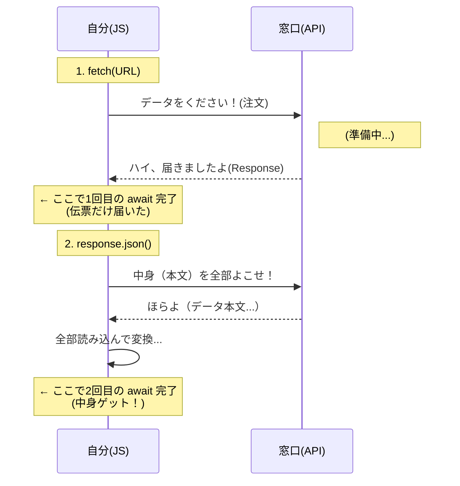
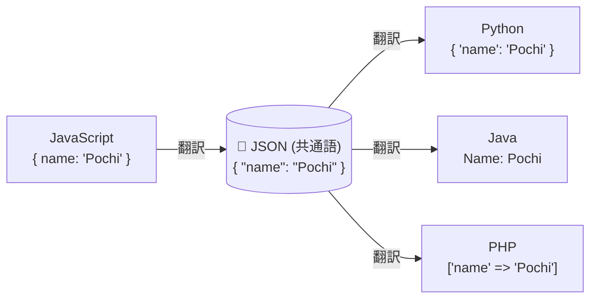

シリーズ第10回、**Day 10** のコンテンツです。  
いよいよ **Part 3** に突入です。ここからは、自分のPC（ブラウザ）を飛び出して、**インターネットの向こう側**にあるデータを取ってくる冒険が始まります。

今日のテーマは、Webアプリ開発で最もワクワクする瞬間の一つ、 **「API通信（GETリクエスト）」** です。  
世界中の天気、株価、地図、画像…あらゆるデータにアクセスするための「魔法の鍵」を手に入れましょう！

-----

# 🕰️ Day 10：世界への扉を開く ～GETリクエスト～

## 🌍 10.1 アプリが「世界」とつながる日

今まで作ってきたアプリは、データ（運動記録）を `localStorage` に保存していましたね。  
これは、いわば **「自分の机の引き出し」** に日記をしまっている状態です。自分しか見れないし、他の人が書いたデータも見れません。

でも、世の中のアプリは違います。  
「今日の天気は？」「最新のニュースは？」「カワイイ犬の画像は？」  
これらは全部、 **インターネットの向こう側にある「サーバー」** という巨大な倉庫から、データを取ってきて表示しています。

この「倉庫からデータを取ってくる」行為を、 **「通信（Fetch：フェッチ）」** と呼びます。

-----

## 💁‍♂️ 10.2 APIってなに？ ～注文の窓口～

データを取ってくると言っても、勝手にGoogleのサーバーに入り込んでデータを盗むわけにはいきません（それはハッキングです👮）。  
データを配っているサイトは、必ず **「ここから注文してね」という専用の窓口** を用意しています。

それが **API（エー・ピー・アイ）** です。

  * **正式名称：** Application Programming Interface
  * **イメージ：** レストランの「注文カウンター」や「メニュー表」

私たちは、このAPIという窓口に向かって、  
「すいません（GET）、犬の画像を一枚ください（リクエスト）！」  
とお願いするだけでいいんです。


-----

### 🖋️ヨロシク・サイン🖋️マンネン・フミは依頼する


「よろしく」と書いて依頼すれば、みんなちゃんと動いてくれる  
　このお姫モード扱いを自慢げにいうセリフ

### 💬「****************************」

---

## 🛠️ 10.3 準備：実験室を作ろう

ここからの実験は、コンソールだけでは少し窮屈です。  
専用の実験ファイルを用意して、ブラウザで動かしてみましょう！

### フォルダ構成（例）

適当な場所に `fetch_study` というフォルダを作って、中にファイルを作ってください。

```text
fetch_study/
  ├─ index.html   (HTMLファイル)
  └─ main.js      (JavaScriptファイル)
```

### index.html（貼り付け用）

```html
<!DOCTYPE html>
<html lang="ja">
<head>
    <meta charset="UTF-8">
    <title>Fetch API実験</title>
</head>
<body>
    <h1>API実験室 🧪</h1>
    <!-- 結果を出す場所 -->
    <div id="result">ここに結果が出ます</div>

    <!-- JSを読み込む -->
    <script src="main.js"></script>
</body>
</html>
```

### 💡 開き方の注意（Live Server）

これから先（特にDay 14など）は、セキュリティの都合上、HTMLファイルをダブルクリックで開く（`file://...`）とうまく動かないことがあります。

いつも通り、VS Codeの **「Go Live（Live Server）」** ボタンを押して、`http://127.0.0.1:5500/...` というアドレスで開くようにしてくださいね！  
これが **「サーバー経由で開く」** ということになり、セキュリティのエラーを回避できます。

-----

## 🐶 10.4 魔法の道具 `fetch()`


JavaScriptには、この「お願い」をするための専用の関数が用意されています。  
その名もズバリ、**`fetch()`（取ってくる）** です。  
（犬にボールを投げると「Fetch!（取ってこい！）」と言いますよね。あれと同じです🐶）


では、世界で一番有名な「犬の画像API（Dog CEO API）」を使って、実験してみましょう。  
このURLにアクセスすると、ランダムな犬の画像データがもらえます。  
`https://dog.ceo/api/breeds/image/random`

### 実験コード（コンソールで実行！）

Day 7で覚えた `async/await` を使って書きますよ！

> 👀 **先に注目！**  
> 下のコードをよく見てください。`await` が **2回** 出てきます。  
> 「なんで2回も待つの？」と思うかもしれませんが、今は **おまじない** として覚えてください。  
> 理由は「10.5 なぜ `await` が2回あるの？」で詳しく解説します！

```javascript
async function getDog() {
    console.log('🐶 犬の画像を取りに行きます...');

    // 1. 窓口（URL）に行って、データを取ってくる
    // 「await」を忘れずに！（通信には時間がかかるからね）
    const response = await fetch('https://dog.ceo/api/breeds/image/random');

    // 2. 届いた箱を開けて、中身（JSON）を取り出す
    // あれ？ ここにも「await」があるぞ…？（後で解説！）
    const data = await response.json();

    console.log('📦 届いたデータ:', data);
    console.log('📷 画像のURL:', data.message);
}

getDog();
```

### 🧠 初心者さんの、心の旅

  * 「おおっ！ コンソールに `{ message: "https://...", status: "success" }` って出た！」
  * 「この `https://...` ってURLをブラウザの新しいタブで開いたら…わぁ！ 本当にワンちゃんの写真が出た！」

<br>
<br>

  * 「自分のPCには画像なんて入ってないのに、ネットから取ってきたんだ。感動…！」
  * 「これが『API』かぁ…！」

<br>


-----

## 📦 10.5 なぜ `await` が2回あるの？

さて、ここで鋭い人は気づいたはずです。  
「なんで `fetch` で待ったのに、`response.json()` でもっかい待たされるの？」

```javascript
const response = await fetch(...); // 1回目の待て
const data = await response.json(); // 2回目の待て
```

これは、 **「ネットショッピングの宅配便」** を想像すると完璧に理解できます。

### 🚚 1回目の await： `fetch()`

  * **状況：** ピンポーン！「お届けものでーす！」と配達員さんが玄関に来た。
  * **意味：** サーバーとつながって、**「不在票（ヘッダー）だけ届いた」** という状態。
  * **中身：** まだ「伝票」だけです。肝心の「ダンボール（中身）」は、まだトラックの中か、玄関に運び込まれている途中です。

### ✂️ 2回目の await： `response.json()`

  * **状況：** 実際にダンボールを受け取って、ガムテープを切って、**中身を取り出す作業**。
  * **意味：** 届いた荷物を、JavaScriptの言葉（オブジェクト）に **「翻訳」する** 時間。
  * **理由：** 1回目では「伝票」しか見ていません。ここでようやく「中身（本文）」を全部受け取って、使える状態にするので、もう一度 `await` が必要なんです。

> **💡 ポイント**  
> 「難しい理屈はさておき、**`fetch` と `response.json()` は必ずセットで書く！**」と覚えてしまってOKです。
> （玄関で受け取って、部屋で開ける。この2ステップはセットですよね？）

### 🖼️ 2段階認証の図（シーケンス図）




だから、`fetch` を使うときは、**「伝票を確認する（1回目）」→「荷物を受け取って開ける（2回目）」という2段構え**が基本セットだと覚えてしまってください！

### 🔍 「チケット交換」の連鎖（リレー）

この「2段階で待つ」という形、どこかで見たことがありませんか？
そう、この章まで学んできた **「Promiseで引換券（チケット）だけもらう」→「そのチケットで（後で）実体を取得する」** というのと似た流れが踏襲され、  
 **「全体としても大きなチケット交換」** になっています。
1回目の `await` で手に入れた `Response`（伝票）は、それ自体が **「中身（データ）」と引き換えるための大きなチケット** でもあるのです。


-----

### 🎓 コラム：なぜ2回なの？（技術的な理由）

「宅配便のメタファーは分かったけど、本当の理由も知りたい！」という人向けに、もう少し詳しく説明します。

**理由：データは「少しずつ」届くから**

インターネットで大きなデータ（動画や画像など）を送るとき、一度に全部送るのではなく、**小さな塊（チャンク）に分けて少しずつ送ります**。これを「ストリーミング」と言います。

```
サーバー → [塊1] → [塊2] → [塊3] → ... → [最後] → ブラウザ
```

1. **1回目の `await fetch()`**：「最初の塊」が届いた時点で完了。  
   → この時点で「ヘッダー（伝票情報）」は読めるけど、本文はまだ全部届いていない可能性がある。

2. **2回目の `await response.json()`**：「全部の塊」を受け取って、それを繋げてJSONに変換するまで待つ。  
   → だから時間がかかる。だから `await` が必要。

> 💡 **つまり…**  
> 「fetch()は通信の開始を待つ」「.json()は全データの受信完了を待つ」という2段階なんです。  
> 大きなファイルをダウンロードするときに「ダウンロード中...」と表示されるのと同じ仕組みです！

-----

### 📦 コラム：`json()` 以外の開け方もある！

`response.json()` はデータを「JSONオブジェクト」に変換しますが、届いた荷物の中身がJSONとは限りません。  
中身によって **「開け方（メソッド）」を変える** 必要があります。

| メソッド | 何に変換？ | どんな時に使う？ |
|:---|:---|:---|
| `response.json()` | JavaScriptオブジェクト | APIからのデータ（一番よく使う） |
| `response.text()` | 文字列（テキスト） | HTMLやプレーンテキストを取得したい時 |
| `response.blob()` | Blob（生データ） | 画像や動画ファイルをダウンロードしたい時 |
| `response.arrayBuffer()` | バイナリデータ | 音声ファイルなど低レベル処理をしたい時 |

**実験してみよう！**

```javascript
// テキストとして受け取る例
async function getAsText() {
    const response = await fetch('https://dog.ceo/api/breeds/image/random');
    const text = await response.text();  // JSONではなくテキストで受け取る
    console.log(text);  // {"message":"https://...","status":"success"}
    console.log(typeof text);  // "string" ← 文字列のまま！
}
```

> 💡 **よく使うのは `json()` と `text()` の2つ！**
> 
> | メソッド | 使用頻度 | 主な用途 |
> |:---|:---|:---|
> | `json()` | ⭐⭐⭐ 最頻出 | APIからデータを取得するとき |
> | `text()` | ⭐⭐ よく使う | HTMLページを取得、デバッグ、JSONじゃないレスポンス |
> | `blob()` | ⭐ たまに | 画像ダウンロード機能を作るとき |
> 
> 特に `text()` は、**「なんかエラーになる…中身を見たい！」** というデバッグ時にも便利です。  
> `json()` でエラーになったら、`text()` に変えて中身を確認してみましょう！

-----

### 🚑 コラム：失敗しても自分のせいにしないで！

API通信は、コードが合っていても **「環境のせい」** で失敗することがよくあります。  
エラーが出た時、どこでコケたか分かれば怖くありません！

| エラーの種類 | どこで起きる？ | 原因の例 |
| :--- | :--- | :--- |
| **1. ネットワークエラー** | `await fetch()` の行 | Wi-Fi切れ、ドメイン間違い |
| **2. CORSエラー** | `await fetch()` の行 | サーバー側が許可していない（**あなたのせいじゃない！**） |
| **3. HTTPエラー** | `fetch` は成功するが、中身がエラー | 404 (URL間違い)、500 (サーバー故障) |
| **4. 翻訳エラー** | `await response.json()` の行 | データがJSONじゃない (HTMLが返ってきた等) |

> ⚠️ **CORSエラーとは？**  
> 「Cross-Origin Resource Sharing」の略で、**他人のサーバーが「このサイトからのアクセスはお断り！」と拒否している**状態です。  
> これは**サーバー側の設定の問題**なので、あなたのコードが悪いわけではありません！  
> コンソールに `Access to fetch at '...' has been blocked by CORS policy` と出たら、そのAPIは使えないか、別の方法が必要です。

「成功（200 OK）」はこの3つの関門をすべて突破した時だけ。  
赤い文字が出ても「おっ、どのパターンかな？」と観察する余裕を持ちましょう！

-----

## 📝 コラム：JSONってなに？なぜ文字にするの？

「なんでわざわざ `response.json()` なんて翻訳作業が必要なの？ そのままオブジェクトで送ってくれればいいのに！」

そう思いますよね。でも、実はインターネットには、JavaScriptじゃない言語（Python, Java, PHPなど）で動いているサーバーがたくさんあるんです。  
「JavaScriptのオブジェクト」は、JavaScriptにしか通じない言葉です。

そこで、世界中のコンピュータが会話するために作られた **「共通語」** が **JSON（ジェイソン）** なのです。

*   **ルール:** 「データは全部、文字（テキスト）で書くこと！」
*   **メリット:** 文字なら、どんなプログラミング言語でも読み書きできる！

だから、ネットの海を渡るときは「文字（JSON）」に変身して、届いたら「自分の言語のオブジェクト」に戻す。このひと手間が、世界とつながるためのパスポートなんですね。



-----

<br>  
<br>  
<br>

## 👜デリバリー・サービス👜ウーバッグは届けるだけ


### 💬 「お届けものです！ ハンコください！<br>　 　 え？ 中身？ それは開けてからのお楽しみ<br>　 　 私は『届ける』までが仕事ですから👜」

<br>  
<br>  
<br>

-----

## ✅ Day 10 のまとめ

ついに、アプリがインターネットとつながりました！

1.  **API（窓口）** ： データを配ってくれる場所。URLで指定する。
2.  **`fetch()`** ： データを取ってくる関数。時間がかかるから `await` する。
3.  **2回待つ** ：
      * 1回目：`await fetch(...)` ＝ 荷物が届くのを待つ。
      * 2回目：`await response.json()` ＝ 箱を開けてデータを読むのを待つ。

「データは取れたけど、コンソールに出してもユーザーには見えないよね？」

その通り！  
明日は、この取ってきたデータを、Day 9までで作った「DOM操作」の技術と組み合わせて、 **「画面にワンちゃんの画像を表示するアプリ」** を作ります。

さらに、データが届くまでの間に **「読み込み中…（グルグル）」** を表示して、ユーザーを安心させるテクニックも伝授しますよ！

-----

<br>
<br>
<br>
<br>
<br>
<br>
<br>
<br>
<br>
<br>
<br>
<br>

# 時の星 時計ツリー塔 周辺


<br>
<br>
<br>

<ruby>今日<rt>きょう</rt></ruby>も<ruby>時<rt>とき</rt></ruby>の<ruby>星<rt>ほし</rt></ruby>は、  
<ruby>悠久<rt>ゆうきゅう</rt></ruby>なる<ruby>調<rt>しら</rt></ruby>べと<ruby>共<rt>とも</rt></ruby>に<ruby>時<rt>とき</rt></ruby>を<ruby>刻<rt>きざ</rt></ruby>む――  
  
けれど<ruby>今宵<rt>こよい</rt></ruby>は、いつもと少し違う。  
<ruby>街<rt>まち</rt></ruby>は<ruby>温<rt>あたた</rt></ruby>かな<ruby>光<rt>ひかり</rt></ruby>に<ruby>包<rt>つつ</rt></ruby>まれ、  
<ruby>冬<rt>ふゆ</rt></ruby>の<ruby>祝祭<rt>しゅくさい</rt></ruby>の<ruby>気配<rt>けはい</rt></ruby>が<ruby>空気<rt>くうき</rt></ruby>に<ruby>満<rt>み</rt></ruby>ちている。  
  
<ruby>鈴<rt>すず</rt></ruby>の<ruby>音<rt>ね</rt></ruby>が<ruby>風<rt>かぜ</rt></ruby>に<ruby>舞<rt>ま</rt></ruby>い、  
<ruby>常緑<rt>じょうりょく</rt></ruby>の<ruby>樹<rt>き</rt></ruby>には<ruby>煌<rt>きら</rt></ruby>めきが<ruby>宿<rt>やど</rt></ruby>り、  
<ruby>誰<rt>だれ</rt></ruby>もが<ruby>心<rt>こころ</rt></ruby>に<ruby>小<rt>ちい</rt></ruby>さな<ruby>温<rt>ぬく</rt></ruby>もりを<ruby>抱<rt>いだ</rt></ruby>く<ruby>夜<rt>よる</rt></ruby>――  
  
<br>
<br>
<br>

## 👢どっさり色々入ってる靴👢


### 💬「祝祭の夜に、ひもじい思いは<br>　 　させませんよ。<br>　 　私の中には、溢れんばかりの<br>　 　『夢』と『ご馳走』が<br>　 　詰まっていますから🎁」

<br>
<br>
<br>

-----

## 🍚️本日のイチカ丼のごはん🍚️

### ゴージャス・パフェ


-----

<h1><a href="D11.md">Day11 へ</a></h1>


