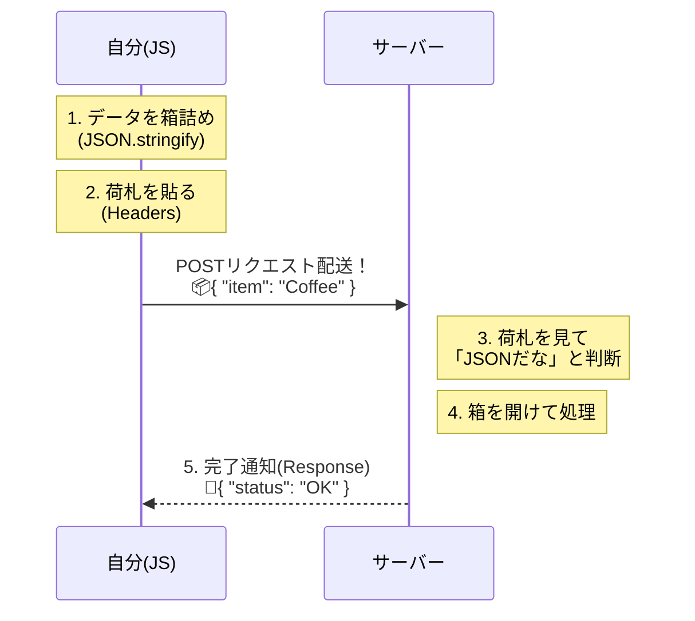
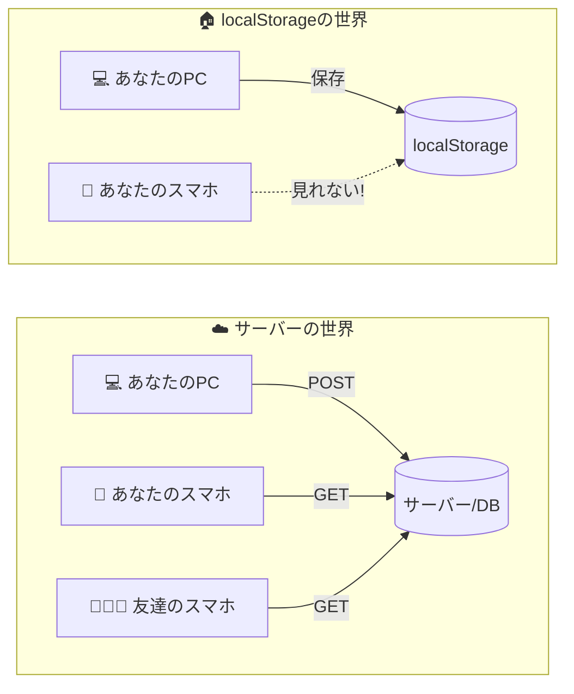

シリーズ第12回、**Day 12** のコンテンツです。  
これまではAPIからデータを「もらう（GET）」ばかりでしたが、今日はついにあなたのアプリからサーバーへデータを **「送る（POST）」** ことに挑戦します。

「注文用紙を提出する」「SNSに投稿する」  
Webアプリがただの「情報掲示板」から、本当の意味での「双方向ツール」に変わる瞬間です。  
少しだけコードが長くなりますが、 **「荷造りの作法」** さえ覚えれば怖くありません！

-----

# 🕰️ Day 12：こちらの想いを届ける ～POSTリクエスト～

## 📮 12.1 「見る」と「送る」は違う

Day 10で、APIは「レストランの注文カウンター」だという話をしました。

  * **GET（ゲット）：** メニューを見る、料理を受け取る。
  * **POST（ポスト）：** **記入済みの注文用紙を渡す。**

今まで使っていた `fetch(URL)` は、実は「GET（これちょうだい）」という省略形の書き方でした。  
でも、データを送る（POST）ときは、URLだけでは足りません。 **「中身（データ）」** を渡さないといけないからです。

-----


---

## 📦 12.2 荷造りの3つのステップ


データを送る作業は、 **「宅配便を送る」** のと全く同じです。  
以下の3つを指定する必要があります。

1.  **送り方（Method）：** 「これはPOST（送る荷物）ですよ」と指定する。
2.  **荷札（Headers）：** 「中身はJSONデータですよ（取扱注意）」と書く。
3.  **中身（Body）：** データを箱詰めする。


### コードで見てみよう

いきなり完成形を見ると怖いので、**ステップバイステップで組み立てていきましょう！**

### 📝 Step 1：まずはGETのおさらい（シンプル版）

```javascript
// GETはURLだけでOKだった
const response = await fetch('https://example.com/api/data');
```

### 📝 Step 2：POSTは「2つ目の引数」が必要！

```javascript
// POSTはURLの後に「設定オブジェクト」を追加する
const response = await fetch('https://example.com/api/order', {
    // ここに設定を書く
});
```

### 📝 Step 3：設定オブジェクトの中身（3つだけ！）

```javascript
const response = await fetch('https://example.com/api/order', {
    method: 'POST',                              // ① 送り方
    headers: { 'Content-Type': 'application/json' }, // ② 荷札
    body: JSON.stringify(myOrder)                // ③ 中身
});
```

> 💡 **覚え方：「メ・ヘ・ボ」（method, headers, body）の3点セット！**

### 🚚 完成コード（宅急便の伝票）

「え、めっちゃ長い…」  
そう思いましたか？ でもこれ、**宅急便の伝票を書くのと同じ** なんです。

*   **`fetch(宛先, { 依頼書 })`** ： カッコの中に「依頼書（オプション）」を挟みます。
*   **依頼書の中身** ：
    1.  **`method`** ： 「送ります（POST）」にマル！
    2.  **`headers`** ： 「ワレモノ（JSON）」にマル！
    3.  **`body`** ： 「ダンボール（中身）」そのもの。

そう考えると、一つでも欠けると送れない理由（宛先不明、種別不明、中身ナシ）が分かりますよね。

```javascript
// 送りたいデータ（JavaScriptのオブジェクト）
const myOrder = {
    item: 'Hot Coffee',
    sugar: 2,
    milk: true
};
```

<details open>
<summary>💡 このコードを動かすためのヒント</summary>
`https://example.com/api/order` は架空のURLです（実際には404やエラーになります）。
もし実際にPOST送信を試してみたい場合は、後に出てくる **「12.4 実践！偽のサーバーに送ってみよう」** のコードを使ってください。
あちらでは `https://jsonplaceholder.typicode.com/posts` という、練習用にPOSTを受け付けてくれる本物のAPIを使っています！
</details>

```
async function sendOrder() {
    console.log('📮 注文を送ります...');

    // fetchの2つ目の引数に「設定（伝票）」を書く！
    const response = await fetch('https://example.com/api/order', {
        
        // 1. 送り方（メソッド）
        method: 'POST',

        // 2. 荷札（ヘッダー）
        // 「中身はJSON形式の文字データですよ」とサーバーに教える
        headers: {
            'Content-Type': 'application/json'
        },

        // 3. 中身（ボディ）
        // オブジェクトのままでは送れないので、JSON文字列に変換（箱詰め）する
        body: JSON.stringify(myOrder)
    });


    // 送った結果（レシート）を受け取る
    const result = await response.json();
    console.log('✅ 注文完了！ ID:', result.id);
}
```

### 🧠 初心者さんの、心の旅

  * 「うわっ、`fetch` のカッコの中身がいきなり増えた！」
  * 「でも、よく見ると… `method`、`headers`、`body` って、役割分担してるだけなんだ。」
  * 「Day 2で習った `JSON.stringify` がここで出てきた！ そうか、ネットの線を通るには、オブジェクトを『文字列』に変身させなきゃいけないんだった！」


-----

## 🏷️ 12.3 なぜ「荷札（ヘッダー）」が必要なの？


「中身がJSONなんだから、見れば分かるでしょ？ いちいち `headers` なんて書かなくても…」

そう思うかもしれません。でも、サーバー（受け取り手）は毎日大量の荷物を受け取っています。  
画像なのか、音声なのか、ただのテキストなのか、箱を開けるまで分からないと、 **仕分けに困って捨てられてしまう（エラーになる）** ことがあるんです。

  * **`Content-Type: application/json`**
      * 意味：**「この箱の中身はJSONデータです！ 文字列として読んでください！」**

この荷札をしっかり貼るのが、Webの世界のマナーなんですね。


-----

### 🧊 コラム：どうして文字列にするの？

「`JSON.stringify` とか面倒！ そのままオブジェクトで送らせてよ！」

気持ちは分かりますが、想像してみてください。  
**インターネットの回線は、細い「ホース」のようなものです。**

*   **JavaScriptのオブジェクト:** 複雑な立体パズル（そのままではホースを通らない）。
*   **JSON文字列:** そのパズルをバラバラにして、一直線に並べたもの（ホースを通る！）。

だから、送る前に**「一直線の文字（String）」** に変換しないといけないんですね。  

（届いた先で `JSON.parse` して、またパズルに戻すわけです！）

-----

## 🖼️ POSTの仕組み（シーケンス図）




-----

<br>  
<br>  
<br>

## 🆚 コラム：localStorage と サーバー保存、どっちがいいの？

以前の学習教材で作った「運動トラッカー」では、データを **`localStorage`** に保存していましたね。  
「別にサーバーに送らなくても、localStorageでよくない？」と思ったあなた。  
実は、それぞれ得意・不得意があるんです！

| | 🏠 localStorage (日記帳) | ☁️ サーバー/DB (SNS/クラウド) |
| :--- | :--- | :--- |
| **データの場所** | あなたのブラウザの中だけ | インターネットの向こう側 |
| **他の人と共有** | **できない** (自分専用) | **できる** (みんなで見れる) |
| **スマホで見ると** | PCのデータは見れない | **同期されて見れる！** |
| **消えるリスク** | ブラウザの履歴を消すと消える | サーバーが守ってくれる |
| **主な用途** | 一時的な設定、下書き、自分だけのメモ | 投稿データ、会員情報、商品データ |

今回の `POST` リクエストを使えば、あなたの作った「運動データ」を、スマホでもPCでも見られるようにしたり、友達とランキングを競ったりする機能が作れるようになるんですよ！夢が広がりますね！



-----

## 🧳アンノウン・ケース🧳「トランク・モモコ」の確認事項


### 💬 「中身は何かしら？<br>　 　 ── イチゴかしら？<br>　 　 ─── さつまいもかしら？<br>　 　 ──── JSONかしら？<br>　 　 『荷札（ヘッダー）』が無い荷物は運べないわよ<br>　 　 ちゃんとしてれば、きっと届くわ🧳」

<br>  
<br>  
<br>

-----

## 🧪 12.4 実践！偽のサーバーに送ってみよう

実際にPOSTを試したくても、勝手にデータを送っていいサーバーなんてあるの？  
あります！ **「JSONPlaceholder」** という、練習用の無料APIを使いましょう。

ここでは「新しい記事を投稿する」というフリをして、POSTリクエストを送ってみます。

```javascript
async function postData() {
    const newData = {
        title: 'イチカの冒険',
        body: '非同期処理をマスターしたよ！',
        userId: 1
    };

    try {
        const response = await fetch('https://jsonplaceholder.typicode.com/posts', {
            method: 'POST',
            headers: {
                'Content-Type': 'application/json; charset=UTF-8',
            },
            body: JSON.stringify(newData),
        });

        // サーバーから「受け付けましたよ」という返事が来る
        const json = await response.json();
        console.log('🎉 投稿成功！ サーバーからの返事:', json);

    } catch (error) {
        console.log('😭 送信失敗...', error);
    }
}

postData();
```

コンソールに `🎉 投稿成功！` と表示され、送ったデータに `id: 101` などの番号がついて返ってきたら成功です！  
（※練習用サーバーなので、本当にネット上に記事が公開されるわけではありません。安心してくださいね）

-----

## 🎯 12.5 穴埋めチャレンジ！POSTの構造を覚えよう

> 💡 下のコードの `【①】`〜`【⑤】` に入る言葉を考えてみましょう！

```javascript
const userData = {
    name: 'イチカ',
    score: 100
};

async function sendScore() {
    const response = await fetch('https://api.example.com/scores', {
        
        // 送り方を指定（GETじゃなくて…）
        【①】: 'POST',

        // 荷札（中身の種類を教える）
        【②】: {
            '【③】': 'application/json'
        },

        // 中身（オブジェクトを文字列に変換して送る）
        【④】: 【⑤】(userData)
    });

    const result = await response.json();
    console.log('送信完了:', result);
}
```

<details>
<summary>🔍 答えを見る</summary>

| 番号 | 答え | 解説 |
|:---:|:---|:---|
| ① | `method` | HTTPメソッドを指定するプロパティ。POSTで「送る」を意味する |
| ② | `headers` | 荷札（ヘッダー）を書くプロパティ |
| ③ | `Content-Type` | 「中身の種類」を示すヘッダー名 |
| ④ | `body` | 実際に送るデータ（中身）を書くプロパティ |
| ⑤ | `JSON.stringify` | オブジェクトをJSON文字列に変換する関数 |

**覚え方のおさらい：**
- **メ・ヘ・ボ**（method, headers, body）の3点セット！
- `JSON.stringify` は「箱詰め」のイメージ 📦

</details>

-----

## 🔄 おさらい：JSON変換の双子

POSTで使う `JSON.stringify` と、GETで使う `JSON.parse` を混同しやすいので整理！

| メソッド | 方向 | やること | 使う場面 |
|:---|:---:|:---|:---|
| `JSON.stringify(obj)` | JS → 文字列 | オブジェクトを文字列に**箱詰め** | POST送信時（body） |
| `JSON.parse(str)` | 文字列 → JS | 文字列をオブジェクトに**開封** | localStorage読み込み時 |

```javascript
// 📦 箱詰め（POST用）
const str = JSON.stringify({ name: 'イチカ' });
// → '{"name":"イチカ"}'

// 📬 開封（localStorage用）
const obj = JSON.parse('{"name":"イチカ"}');
// → { name: 'イチカ' }
```

### 🤔 あれ？ `response.json()` と `JSON.parse` って何が違うの？

Day 10 で `fetch` した後に `response.json()` を使いましたよね。  
「さっき `JSON.parse` が開封って言ったのに、なんで別のものを使ってたの？」

実は、**`response.json()` は `JSON.parse` を自動でやってくれるショートカット** なんです！

```javascript
// 🔧 もし response.json() がなかったら、こう書く必要があった
const text = await response.text();        // まずテキストで受け取る
const data = JSON.parse(text);             // 手動で変換

// ✨ でも response.json() があるから、これ1行でOK！
const data = await response.json();        // テキスト受け取り + 変換を自動でやる
```

> 📝 **つまり…**  
> `response.json()` ≒ `JSON.parse(await response.text())`  
> 中でやってることは同じ！ fetch 専用の便利メソッドです。

-----

<br>  
<br>  
<br>

### 🛜WIFI・センド🛜「ルーたん」の忠告


  

情報を送るのはいいけど、しっかりと中身を構成して送り、  
返ってくるものがどんな形なのか確認する必要がある  
ということをいう。

### 💬「****************************」

<br>  
<br>  
<br>

-----

## ✅ Day 12 のまとめ

今日は、自分のアプリからデータを「発信」する方法を学びました。

1.  **POSTリクエスト** ： データを送るときに使うメソッド。
2.  **3点セット** ：
      * `method: 'POST'` （送ります！）
      * `headers: { 'Content-Type': 'application/json' }` （中身はJSONです！）
      * `body: JSON.stringify(data)` （文字列に箱詰め！）
3.  **JSON化** ： ネットの線を通すために、オブジェクトを文字列にする必要がある。

これで、あなたのアプリは「読み込み専用」から、 **「読み書きできる」** 一人前のWebアプリに進化しました！

さて、明日は、
もし通信中にユーザーが「やっぱりやめた！」と画面を閉じてしまったら？  
サーバーが「500エラー」でダウンしていたら？

そんなトラブルにも動じない、 **「プロ級の堅牢性（けんろうせい）」** を身につけるための、最後の仕上げを行います。  
キャンセル処理（AbortController）という、ちょっとカッコいい技も登場しますよ！

-----

## 🍚️本日のイチカ丼のごはん🍚️

### ランニング・モモ


-----

<h1><a href="D13.md">Day13 へ</a></h1>


