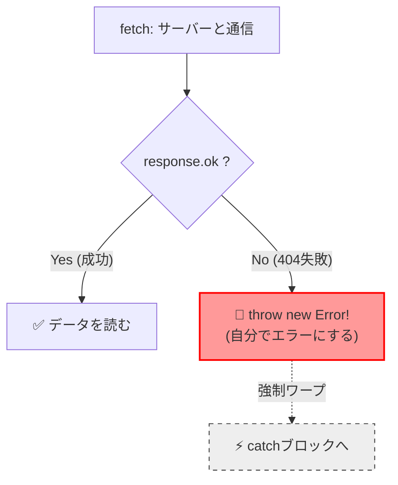
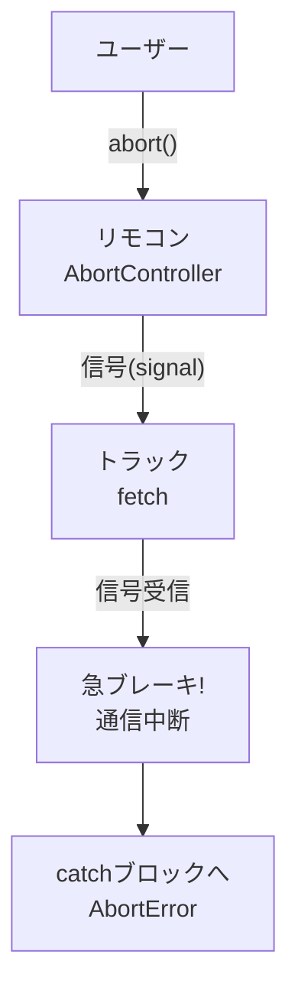
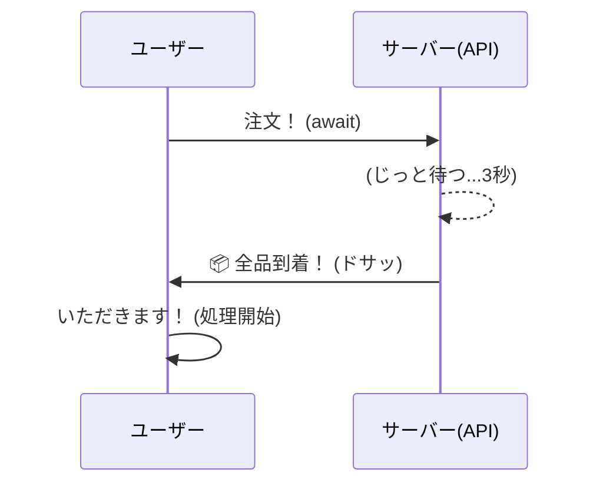
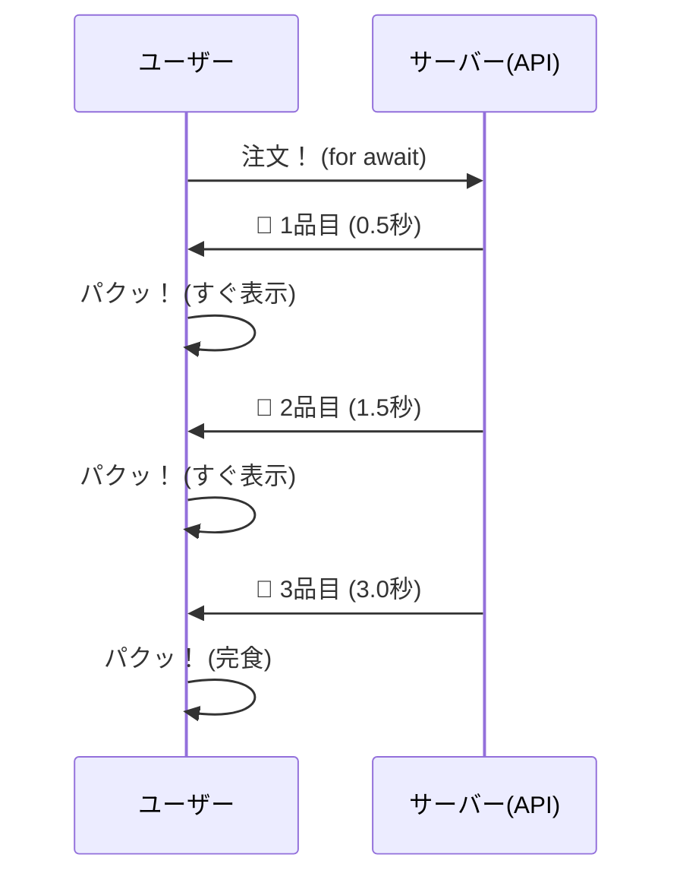

シリーズ最終回、**Day 13** のコンテンツです。  
13日間にわたる「非同期処理」の旅、ついにゴールです！

最後は、プロのエンジニアなら必ずケアしている **「想定外のトラブル」** への対処法です。  
「ページが見つかりません（404）」や「通信中にキャンセルされた」といった状況でも、アプリを壊さずに、スマートに振る舞うための **「大人のマナー」** を身につけましょう。

これで、あなたのアプリはどんな時でも動じない「堅牢（けんろう）」なものになります！

-----

# 🕰️ Day 13：トラブル対応とキャンセル ～堅牢な通信～

## 🚦 13.1 サーバーの「機嫌」を知る ～ステータスコード～

Day 12で、サーバーにデータを送ったりもらったりしました。  
このとき、サーバーはデータと一緒に **「ステータスコード」** という3桁の番号を返してきます。  
これは、サーバーからの **「今の状況報告」** です。

全部覚える必要はありません。信号機のように **3つの色（番号帯）** だけ覚えればOKです！


### 🟢 200番台：成功（Green）

  * **200 OK** ： バッチリ！ 正常終了です。
  * **201 Created** ： POSTで新しいデータが作られました。

### 🟡 400番台：あなたのミス（Yellow/Red）

  * **400 Bad Request** ： データの形式が間違っています（荷札の貼り忘れなど）。
  * **401 Unauthorized** ： ログインしてません（会員証がない）。
  * **404 Not Found** ： そんなページ（データ）はありません。

### 🔴 500番台：サーバーのミス（Red）

  * **500 Internal Server Error** ： サーバー内部で火事（エラー）が起きています。ごめんね。

`fetch` した後は、まずこの番号を見て、「成功したか？」を判断するのが基本です。

-----

## 📚 復習：`throw` と `Error` を思い出そう！

この先で `throw new Error(...)` を使います。  
**「例外処理の学習で習ったやつだ！」** と思った人、その通り！ ここで軽くおさらいしておきましょう。

### 📌 `throw` ってなんだっけ？

| 用語 | 意味 | 例え |
|:---|:---|:---|
| `throw` | 自分でエラーを発生させる | 「緊急停止ボタン」を押す 🚨 |
| `new Error('メッセージ')` | エラーオブジェクトを作る | 「エラー報告書」を書く 📝 |
| `throw new Error(...)` | エラーを発生させて `catch` に飛ばす | 報告書を持って警報を鳴らす |

```javascript
// 同期処理で習った throw の使い方
function checkAge(age) {
    if (age < 0) {
        throw new Error('年齢がマイナスはおかしいよ！');
    }
    return `あなたは ${age} 歳ですね`;
}

try {
    console.log(checkAge(-5));  // ここでエラーが投げられる
} catch (error) {
    console.log('エラー発生:', error.message);  // 「年齢がマイナスはおかしいよ！」
}
```

### 🆕 非同期処理での `throw` は同じ？

**基本は同じです！** ただし、`async` 関数の中で `throw` すると、その関数が返す **Promise が reject される** という違いがあります。

```javascript
// async関数の中でも throw は同じように使える！
async function fetchUserData(userId) {
    if (!userId) {
        throw new Error('ユーザーIDが必要です');  // 即座に catch へ
    }
    
    const response = await fetch(`/api/users/${userId}`);
    // ...
}
```

> 💡 **ポイント**：`try...catch` で囲んでいれば、同期処理でも非同期処理でも、`throw` されたエラーは `catch` で受け止められます！


これを踏まえて、次のセクションで「なぜ `throw` が必要になるのか」を見ていきましょう。

-----

## 😱 13.2 `fetch` の落とし穴 ～404は「成功」！？～

ここで、多くの初心者がハマる**巨大な落とし穴**があります。  
以下のコードを見てください。

```javascript
try {
    // 存在しないURL（404）にアクセス！
    const response = await fetch('https://api.example.com/daremoc-inai-yo');
    console.log('やったー！ catchに行かずにここに来たよ！');

} catch (error) {
    console.log('エラーだ！ 404だからここに来るはず！');
}
```

「404 Not Found（見つからない）」なんだから、当然 `catch` ブロック（エラー）に行くと思いますよね？

**実は、`try` の中（成功ルート）を通ってしまうんです！**

### なぜ！？


`fetch` にとっての「成功」とは、 **「サーバーと会話が成立したこと」** そのものだからです。  
「404（ありません）」という返事であっても、サーバーが生きていて返事をくれたなら、**「通信自体は大成功」** なのです。


*   **成功（try）:** サーバーから返事があった（200 OKも、404 Not Foundも、500 Errorも含む）。
*   **失敗（catch）:** サーバーに繋がらない（Wi-Fi切れ、URLのドメイン間違いなど）。

だから、中身を見て「空っぽ（404）ならエラー扱いにする」のは、**人間（あなた）の役目** なんです。

### ✅ 正しいチェック方法：`response.ok`

本当の「成功（200番台）」かどうかを知るには、`response.ok` というプロパティを使います。

```javascript
const response = await fetch(URL);

// もし「成功（200-299）」じゃなかったら...
if (!response.ok) {
    // 自分でエラーを投げて、catchに飛ばす！
    throw new Error(`サーバーエラーです！ コード: ${response.status}`);
}

// ここまで来たら本当の成功！
const data = await response.json();
```


### 🧠 初心者さんの、心の旅

  * 「ええーっ！ トラック（fetch）は、荷物が『空っぽの箱』でも、届ければ『仕事完了！』って顔するんだ。」
  * 「だから、箱を開けて『納品書（response.ok）』を確認して、ダメだったら自分で『不良品だー！』って叫ばなきゃいけないんだね。」
  * 「これが『手動でエラーを投げる（throw）』ってことか…！」


### 🚨 手動で「緊急停止ボタン」を押す

`try...catch` の使い方はもう知っていますよね？（エラーが起きると勝手に `catch` に飛ぶ）。  
でも、404の場合は「エラー起きてないよ（正常だよ）」という顔をして進もうとします。

そこで **`throw`（スロー/投げる）** の出番です！  
さっきの復習セクションで思い出した通り、**「自分からエラーを発生させる」** 機能でしたね。

*   **システム:** 「問題ないです、進みます」
*   **あなた:** 「待て！ 中身が空っぽだぞ！ **緊急停止（throw）だ！**」
*   **システム:** 「わっ！ 分かりました、**強制的に `catch` に移動します！**」

こうやって、自分の意思で「失敗扱い」にするのが `throw` なんです。  
**fetchでは特によく使うテクニック** なので、しっかり覚えておきましょう！



-----

<br>  
<br>  
<br>


## 📦️エンプティ・プレゼント📦️ ペーパーバッグさんは自由を満喫中


### 💬「中が空っぽの時こそ、<br>　 　 私は自由を満喫するの<br>　 　 まぁ、受け取った人は戸惑うかもね📦」

<br>  
<br>  
<br>


-----

## 🛑 13.3 「やっぱりやめた！」 ～AbortController～

最後に、ちょっとカッコいい上級テクニック **「キャンセル処理」** を学びましょう。


### 📺 テレビとリモコンの関係

`AbortController` という長い名前にビビらないでください。これは単なる **「新しいリモコンを買ってくる」** 作業です。

1.  **`new AbortController()`** ： 新しいリモコンを買う。
2.  **`signal`** ： リモコンの受信機。これをトラック（fetch）に取り付ける（ペアリングする）。
3.  **`abort()`** ： リモコンの停止ボタンを押す！

これだけで、走り出したトラックを遠隔操作で急停止させることができます。

// 1. リモコンを作る（ペアリング用）
```javascript
const controller = new AbortController();

async function searchData() {
    try {
        console.log('📡 通信スタート...');

        // 2. fetchに「このシグナルで監視してね」と渡す
        const response = await fetch('https://slow-api.com/data', {
            signal: controller.signal
        });
        
        const data = await response.json();
        console.log('✅ データ到着！', data);

    } catch (error) {
        // 3. キャンセルされた時は、特別なエラーが出る
        if (error.name === 'AbortError') {
            console.log('🛑 ユーザーによってキャンセルされました');
        } else {
            console.log('😭 普通のエラー:', error);
        }
    }
}

// --- 3秒後に「やっぱりやめた！」とする ---
setTimeout(() => {
    console.log('😡 遅い！ キャンセルだ！');
    controller.abort(); // スイッチオン！
}, 3000);

searchData();
```

<details open>
<summary>🛠️ 実験用のURL設定（コピペ用）</summary>
`https://slow-api.com/data` は架空のURLです。
実際に「遅い通信」を再現してキャンセルを試したい場合は、以下のURLに書き換えてみてください。

```javascript
// 【書き換え用】3秒待たされる遅延API（httpbin.org）
const response = await fetch('https://httpbin.org/delay/3', {
    signal: controller.signal
});
```
</details>


### 🖼️ キャンセルの仕組み（イメージ図）




これを入れておけば、ユーザーが画面を閉じたり連打したりしても、古い通信をピタッと止めることができる **「お行儀の良いアプリ」** になります。

-----

<br>  
<br>  
<br>


## 🚦シグナル・ナンバー🚦 アカネ・ミドリコのチェンジシグナル


### 💬 「青（200）なら進め！<br>　 　 赤（500）なら止まれ！<br>　 　 黄色（404）でも普通は止まるべきね🚦」

<br>  
<br>  
<br>


-----

## 🌊 13.4 番外コラム：全部待たずに食べる技 ～for await...of～

Day 11 で学んだ `fetch()` は、データが全部届くまで `await` で待っていましたよね？
でも、もし「映画のストリーミング再生」のように、**「届いたそばから少しずつ処理したい」** 時はどうすればいいでしょう？

### 🍣 ベルトコンベアで受け取る

普通の `await` が「定食が全部揃うまで待つ」スタイルだとしたら、**`for await...of`** は **「回転寿司（ベルトコンベア）」** です。
お皿が流れてくるたびに、それを取って少しずつ食べ（処理し）ます。


実は、**`for` ループと `await` を合体させた最強の魔法** があるんです。


### 📦 実験：AIのように「文字が少しずつ出る」チャット

`fetch` で取得したデータを、コンソールではなく画面（HTML）に少しずつ表示させてみましょう。
これこそが、ChatGPTやGeminiなどの **「生成AIが文字を少しずつ表示する」** 仕組みに近いものです！

**HTML**
```html
<div id="chat-box" style="white-space: pre-wrap; background: #f0f0f0; padding: 10px; min-height: 50px;"></div>
<button id="stream-btn">受信開始</button>
```

**JavaScript**
```javascript
const btn = document.getElementById('stream-btn');
const box = document.getElementById('chat-box');

async function startChat() {
    box.textContent = "🤖 通信待機中...\n";
    
    // drip: サーバーがわざとゆっくり（10秒かけて）、50個の「*」を送ってくるURL
    // ※本当のAIは言葉を送りますが、実験なので「*」で代用します
    const response = await fetch("https://httpbin.org/drip?duration=10&numbytes=50&code=200&delay=0");

    // バイト列を文字に直す「翻訳機」
    const decoder = new TextDecoder();

    // ★ 届いた「かけら」から順に処理！
    for await (const chunk of response.body) {
        // 1. かけら（バイト）を文字に変換
        const text = decoder.decode(chunk);

        // 2. 画面に継ぎ足していく（+=）
        box.textContent += text;
    }

    box.textContent += "\n🎉 受信完了！";
}

btn.addEventListener('click', startChat);
```

**実行結果のイメージ：**

ボタンを押すと…

1. `🤖 通信待機中...`
2. `****...` （ポツポツと星が増えていく）
3. `*********...` （まるで誰かがタイプしているみたい！）
4. `******************************`
5. `🎉 受信完了！`

これまでの `await fetch` は「全部のデータが届くまで待つ」でしたが、
`for await...of` を使うと **「届いたそばからリアルタイムに表示する」** ことができます。
ユーザーを待たせないための、最先端のテクニックです！

### 🖼️ 違いのイメージ（図解）

「待たされてイライラ」と「すぐに見れてサクサク」の違いは、こうなります。

**1. 【従来】普通の fetch（定食）**
全部揃うまで食べられません。



**2. 【今回】Streaming（回転寿司）**
届いた順に食べられます！



-----

## ✅ 本編完走！次なるステージへ

お疲れ様でした！ これで「JavaScriptの『時間』を操る！非同期処理・集中講座」、**本編（Day 1 ～ Day 13）** が終了です。

振り返ってみましょう。

1.  **Day 1-2：** JSは「ワンオペ」だと知り、「タイマー」で時間をずらす遊びをしました。
2.  **Day 3-4：** 「イベントループ」の秘密を知り、「コールバック地獄」でもがきました。
3.  **Day 5-7：** **`Promise`** と **`async/await`** という魔法を手に入れ、時間を止められるようになりました。
4.  **Day 8-9：** エラーに対応し、並行処理で時間を短縮しました。
5.  **Day 10-12：** **`fetch`** で世界とつながり、データを送受信しました。
6.  **Day 13：** ステータスコードとキャンセル処理、そして **`for await...of`** でストリーミングも学び、プロ品質の堅牢さや、気配りを身につけました。

今のあなたはもう、「動かない…」と呆然とする初心者ではありません。  
**「なぜ動かないのか（待っていないからか？ エラーか？）」** を推測し、 **「どうすれば動くか（awaitするか？ try-catchするか？）」** を知っているエンジニアです。

ここから先は、あなたの作りたいものを自由に作ってください。  
天気予報アプリ、チャットアプリ、画像検索アプリ…  
インターネットの向こう側には、無限のデータが待っています。

…と言いたいところですが、実はもう一つだけ、  
**「どうしても教えたい魔法（技術）」** が残っているのです。

それは、シェフ（JavaScript）が長年抱えてきた「孤独」を救う、禁断の秘術…。

ここから先は **【番外編】** です。ここから先は利用シーンは限定的となります、  
中級者でも「一度も使ったことがない」といった人も少なくありません。  
「概要だけを知っておく」ぐらいの楽な気持ちで望みましょう。

---

## 🍚️本日のイチカ丼のごはん🍚️

### バンザイ・チョコ苺パフェ


-----
<h1><a href="D14.md">Day 14（番外編）へ進む</a></h1>
