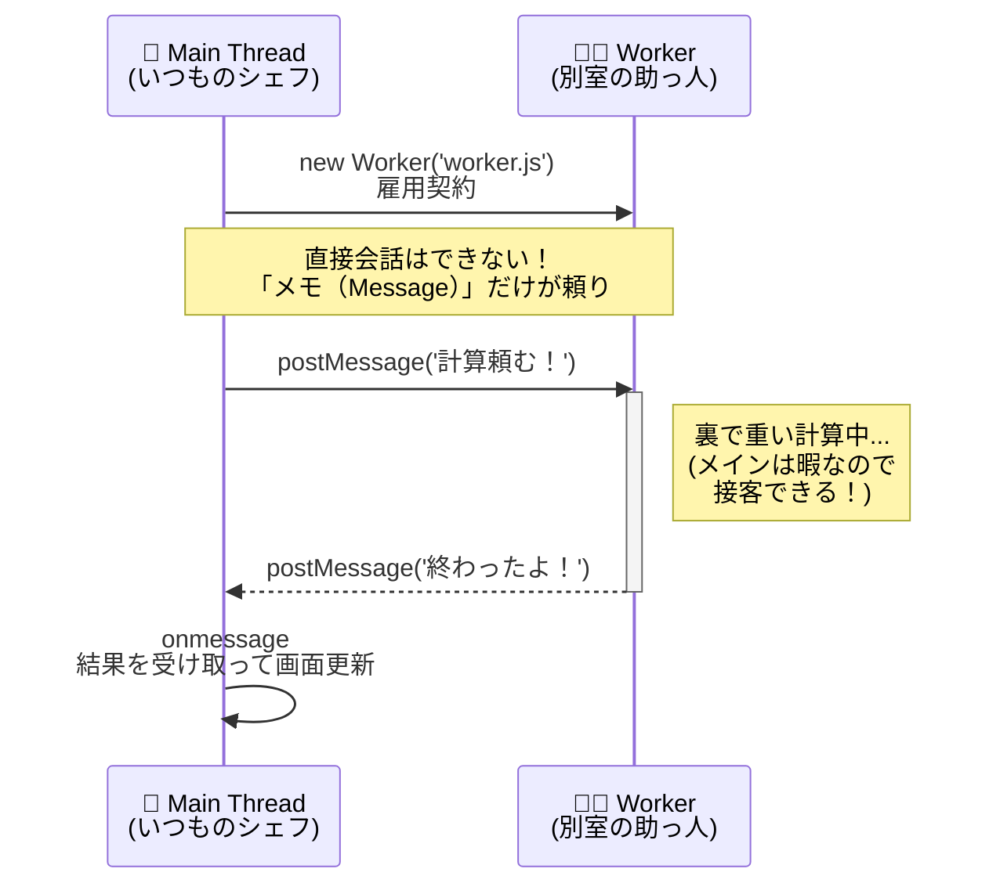

シリーズ14日目、**Day 14** のコンテンツです。  
物語は終わったと思いましたか？ 実は「番外編」として、もう一つの重要なトピックが残っています。

> 🎁 **ボーナスステージへようこそ！**  
> Day 13 までで非同期処理の基本はマスター済み。ここからは **上級編** です。  
> 難しければスキップしてOK！ 実務で「UIが固まる…」と困った時に戻ってきてください。

---

### ⚠️ 始める前に：環境の確認

**Web Worker は `file://` では動きません！** 必ず以下のいずれかで実行してください：

| 方法 | 説明 |
|:---|:---|
| **VS Code + Live Server** | 拡張機能をインストールして「Go Live」をクリック |
| **ローカルサーバー** | `npx serve` や `python -m http.server` など |

```
❌ file:///C:/Users/.../index.html  ← これは動かない！
✅ http://localhost:5500/index.html ← これならOK！
```

---

これまで私たちは、「JavaScriptはワンオペ（シングルスレッド）だから、待たせてはいけない」と何度も繰り返し学んできました。  
しかし、最新のJavaScriptには、ついに **「助っ人」** を呼ぶ機能が搭載されたのです。

今日は、その助っ人 **「Web Worker（ウェブ・ワーカー）」** との出会いです。

-----

# 🕰️ Day 14：もう一人の自分 ～Web Worker～

## 👯 14.1 シェフは孤独…じゃなかった！？

思い出してください。Day 1からDay 13まで、私たちのシェフ（メインスレッド）は、たった一人で注文を聞き、料理を作り、皿を洗ってきました。

> **「重い計算（無限ループなど）をすると、画面がフリーズする」**

これは、シェフが料理にかかりきりで、お客さん（ユーザー）の注文（クリックなど）を聞けなくなるからでした。  
だからこそ、「非同期処理（後でやる）」を使って、待ち時間を有効活用してきたわけです。

しかし、もし **「別のキッチン」** があって、そこに **「もう一人のシェフ」** がいたらどうでしょう？

「おい、この計算だけやっといてくれ！」と頼んで、自分はお客さんの接客に集中できるとしたら……？

それが、**Web Worker（ウェブ・ワーカー）** です。


### 🍳 Web Worker の特徴：別室の助っ人

1.  **別スレッド（マルチスレッド）：**
    メインのシェフとは完全に別の **「パラレルワールド（別スレッド）」** で動きます。
2.  **UIには触れない：**
    助っ人は「別室」にいるので、ホールの様子（DOM/HTML）は見えません。  
    `document.getElementById` や `alert` は使えません。計算専用です。
3.  **会話は「メモ」だけ：**
    メインのシェフと助っ人は、直接会話できません。  
    **「メッセージ（データをコピーしたメモ）」** をやり取りすることで連携します。


### 🖼️ 仕組みのイメージ




### 🏢 実際どんな時に使うの？ ～現場での活躍シーン～

「画面がフリーズする計算」と言われても、ピンとこないかもしれません。  
実際のWebアプリで Web Worker が活躍する場面をいくつか紹介します！

| 用途 | 具体例 | なぜ重い？ |
|:---|:---|:---|
| 📊 **大量データの処理** | 10万件の商品リストを検索・フィルタリング | ループが膨大な回数になる |
| 🎮 **ゲームのAI計算** | 将棋・チェスの「次の一手」を探索 | 何万通りもの手を読む必要がある |
| 🔐 **暗号化・復号化** | ファイルのパスワード保護 | 複雑な数学的計算が必要 |
| 📝 **テキスト解析** | マークダウンをHTMLに変換 | 長い文書だと構文解析に時間がかかる |
| 🎨 **画像・音声の加工** | 写真にフィルターをかける | 何百万ピクセルを1つずつ処理 |
| 📦 **データ圧縮** | ファイルをZIP化してダウンロード | 圧縮アルゴリズムが複雑 |

> 💡 **つまり…**  
> 「ループが多い」「計算が複雑」「データが大きい」処理は、Web Worker を検討しよう！  
> これらをメインスレッドでやると、ユーザーが「固まった！」とイライラしてしまいます。

-----

## 🧪 14.2 実験：フリーズを回避せよ！

実際に動かして体験してみましょう。

### 😱 普通に重い処理をすると…

まず、メインスレッドで「30億回足し算する」という無駄に重い処理を書いてみます。

```javascript
document.getElementById('heavy-btn').addEventListener('click', () => {
    console.log('計算開始...');
    
    // メインスレッドで計算（ブロッキング）
    let sum = 0;
    for (let i = 0; i < 3000000000; i++) {
        sum += i;
    }
    
    console.log('計算終了！ 結果:', sum);
});
```

このボタンを押すと、計算が終わるまでの数秒間、**画面は完全にフリーズします**。  
他のボタンも押せないし、文字の入力もできません。最悪です。


### ✨ Worker に頼むと…

では、この計算を「助っ人（Worker）」に丸投げしてみましょう。

#### 1. 助っ人の台本を作る (`worker.js`)

まず、別ファイル（重要！）に、助っ人にやらせたい仕事を詳しく書きます。

  
**※ `index.html` と同じフォルダに保存してください！**

```javascript
// worker.js （これは別室のキッチンです）

// ■ メインからの依頼（メッセージ）を待つ
self.onmessage = function(event) {
    console.log('Worker: 「依頼が来たぞ！ 内容は...」', event.data);

    // 重い計算を実行！
    // ※ PCの性能によって「30億回」でも一瞬で終わったり、遅すぎたりします。
    //   「早すぎるな」と思ったら 0 を足し、「遅すぎる」と思ったら 0 を減らして調整してください。
    let sum = 0;
    for (let i = 0; i < 3000000000; i++) {
        sum += i;
    }

    // ■ 計算結果をメインに報告する（送り返す）
    // self.postMessage(送るデータ)
    self.postMessage(sum);
    console.log('Worker: 「計算完了。結果を送ったよ！」');
};
```

#### 2. メインから雇用する (`main.js`)

メインのシェフ側で、Workerを雇い（`new Worker`）、依頼を出します。

```javascript
// main.js （いつものメインキッチン）

const worker = new Worker('worker.js'); // 1. 雇用契約（読み込み）

// ■ 助っ人からの報告を受け取る準備
worker.onmessage = function(event) {
    const result = event.data; // event.data に結果が入っている
    console.log(`Main: 「助っ人から結果が届いた！ ${result} だね！」`);
};

// --- 重い処理ボタンが押されたら ---
document.getElementById('heavy-btn').addEventListener('click', () => {
    console.log('Main: 「おい助っ人、仕事だ！」');
    
    // ■ ここがポイント！
    // 処理を実行するのではなく、「やっておいて」とメッセージを送るだけ。
    // 引数には、渡したいデータを入れる（今回は特にないので空文字とかでOK）。
    worker.postMessage('start'); 
    
    console.log('Main: 「依頼完了。私は次のお客さんの対応に戻るよ。」');
});
```

### 🚫 重要：そのままでは動きません！

「よーし、ファイルを作ってダブルクリックしてChromeで開くぞ！」

**ちょっと待って！** それだと動きません。そして「エラーが出ないのに動かない」状態になります。

#### 🚧 セキュリティの壁（CORS）
さらに、ファイルの **「開き方」** に要注意です。

実は Web Worker には **「セキュリティの壁」** があります。


*   **原因**: パソコンのフォルダを直接開く（`file://...`）と、ブラウザは「怪しい！」と判断してWorkerをブロックします（CORSポリシー）。
*   **解決策**: 必ず **「ローカルサーバー」** を使って開いてください。
    *   VS Codeなら：拡張機能 **「Live Server」** を入れて「Go Live」ボタンを押す。
    *   Pythonなら：`python -m http.server` コマンドを使う。

URLが `http://127.0.0.1...` や `http://localhost...` になっていればOKです！
この準備をしないと、コンソールに真っ赤なエラーが出て泣くことになります（経験者談）。

Web Workerを動かすには、以下の3つのファイルを **同じフォルダに** 揃える必要があります。

#### 0. 実験室の準備 (`index.html`)

これが無いと始まりません。`main.js` を読み込むための土台です。

まず、以下のようなフォルダ構成になっていることを確認してください（重要！）。  
`worker.js` は `main.js` や `index.html` と **同じ場所** にないと動けません。

```text
worker_study/
  ├─ index.html
  ├─ main.js
  └─ worker.js  <-- ここにいないとエラーになる！
```

準備ができたら、`index.html` を作成して貼り付けましょう。

```html
<!DOCTYPE html>
<html lang="ja">
<head>
    <meta charset="UTF-8">
    <title>Web Worker実験</title>
</head>
<body>
    <h1>Web Worker実験室 🍳</h1>
    
    <!-- 激重計算をさせるボタン -->
    <button id="heavy-btn">💀 重い計算を開始</button>
    
    <!-- メインスレッドが止まってないか確認するためのボタン -->
    <button onclick="alert('生きてるよ！')">😊 生存確認</button>

    <script src="main.js"></script>
</body>
</html>
```


### 💀 現場で必須の「雇用マナー」2選

「便利だから何でもWorkerに投げちゃえ！」  
…と調子に乗ると痛い目を見ます。現場で先輩に怒られないための注意点を2つ伝授します。

#### 1. 「コピー機の渋滞」に気をつけろ（構造化複製コスト）

`postMessage(data)` でデータを渡すとき、実はメモをそのまま手渡ししているわけではありません。  
**「コピー機で全文コピーを取って、FAXで送っている」** ような凄い手間（構造化複製）がかかっています。


*   **NG：** 巨大な画像データ（数MB）を、1秒間に60回 `postMessage` する。
    *   → コピー機の処理だけでメインスレッドが止まります（本末転倒！）。
*   **OK：** 巨大なデータは分割して送るか、「SharedArrayBuffer（共有メモリ）」という上級技を使う。

「送るデータは必要最小限に」が鉄則です！

#### 2. 解雇通知はスマートに（terminate vs キャンセル依頼）

計算が終わった助っ人を帰らせるには、2つの方法があります。

*   **`worker.terminate()`** ： **【強制解雇】**
    *   「お前はクビだ！」といきなり電源を引っこ抜く。
    *   計算途中だろうと問答無用で消えるので、後片付けができません。
*   **メッセージで「終了」を送る** ： **【円満退社】**
    *   `worker.postMessage('stop')` などを送り、Worker側で `close()` してもらう。
    *   「キリのいいところで終わってね」と伝えられるので、お行儀が良いです。

基本は「メッセージで依頼」、暴走した時だけ「terminateで強制終了」と使い分けましょう。

-----

### 実行結果

ボタンを押した瞬間：
1. `Main: 「依頼完了...」` が **一瞬で** 表示されます。
2. その直後から、あなたが画面の他のボタンを押したり、アニメーションを見たりしても、**全くカクつきません**。
3. 数秒後、忘れた頃に `Main: 「助っ人から結果が届いた！」` と表示されます。

これが **「並列処理（パラレル）」** の威力です！

-----

## 🧠 初心者さんの、心の旅

*   「えっ、JavaScriptって『ワンオペ』じゃなかったの！？ 騙された！」
*   「……いや、違うな。別の人間がいるわけじゃなくて、『計算専用のロボット』を別室で動かしてる感じか。」

<br>

 
*   「今までの `setTimeout` は『後回しにするだけ（結局自分がやる）』だったけど、これは『本当に同時に動いてる』んだ。」
*   「でも、DOM（画面）をいじれないなら、計算が終わったら結果をメインスレッドに戻して（postMessage）、メインスレッドが画面を更新しなきゃいけないのね。連携プレーだ！」

-----

<br>  
<br>  
<br>

### 🚁ライトウェイト・Wジェット🚁JS店長（Wジェット付き）

<br>
自分一人だと手に余ることでも  
２機の独立したジェットエンジンを使うことで  
うまくいくことがある、ということをいうセリフ<br>

### 💬「****************************」

<br>  
<br>  
<br>

-----

## 📝 今日のまとめ

*   **Web Worker** は、メインスレッドとは別の場所で動くスクリプト。
*   **`new Worker('file.js')`** で作成する。
*   お互いに **`postMessage()`** で依頼し、 **`onmessage`** で受け取る。
*   Workerを使えば、どんなに重い計算をしても、UI（メインスレッド）は止まらない！

次回、もう一歩踏み込んで、この「並列ダンス」をより実践的に使いこなしてみましょう。

---

## 🍚️本日のイチカ丼のごはん🍚️

### <ruby>寿<rt>ことぶき</rt></ruby>カガミ<ruby>餅<rt>もち</rt></ruby> ＋ ぽかぽか<ruby>湯<rt>ゆ</rt>けむり<ruby>雑煮餅<rt>そうにもち</rt></ruby>


---

<h1><a href="D15.md">Day 15 へ進む</a></h1>
