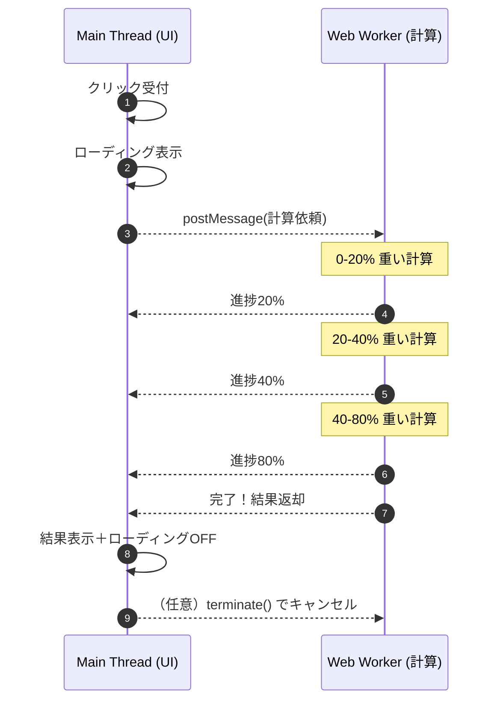

シリーズ15日目、**Day 15** のコンテンツです。  
今日は、前回手に入れた「助っ人シェフ（Web Worker）」をさらに使いこなし、ユーザーをおもてなしする **「究極の並列処理（パラレル・ダンス）」** を習得しましょう。

> 🎁 **ボーナスステージ（2/2）**  
> 最終日です！ Day 14 の内容を理解していれば大丈夫。  
> 引き続き **Live Server** で実行してくださいね。

-----

# 🕰️ Day 15：並列処理のダンス ～重い計算を裏側で～

## 🕺 15.1 メインとサブの華麗な連携

前回、私たちは「計算用ロボット（Worker）」を雇いました。  
しかし、ただ「計算して」と投げるだけではもったいない。

実際のアプリでは、もっと複雑な連携が必要になります。

*   **メインシェフ（UI）：** 「お客さん、お待ちの間こちら（ローディング画面）をご覧ください」
*   **助っ人シェフ（Worker）：** （裏で必死に計算）「終わりました！」
*   **メインシェフ（UI）：** 「はい、出来たて（計算結果）です！ お待たせしませんでしたね（UI止まってないし）」

この **「表の顔（接客）」** と **「裏の顔（重労働）」** を完全に分離することこそ、Web Workerの真骨頂です。


### 🖼️ 並列処理のダンス




> **解説：** 下の `Web Worker` が青い帯（計算）で埋まっていても、上の `Main Thread` は隙間があるので、ユーザーの「キャンセル」クリック等に即座に反応できます。これが **「並列（パラレル）」** です。

-----

## 🛠️ 15.2 実践：画像処理シミュレーション

例えば、「画像のフィルタ加工」のような重い処理を想像してください。  
これをメインスレッドでやると、加工中は「キャンセル」ボタンすら押せなくなります。

Workerを使って、**「加工中でもキャンセルできる（UIが生きている）」** 状態を作ってみましょう。

### 🎨グッバイ・オモい<ruby>ＵＩ<rt>ユーアイ</rt></ruby>🎨パレティーナの<ruby>オモてぇんだ～<rt>o m o t e n d e r</rt></ruby>


### <br>💬「あら、久しぶりね🎨<br>　 　あなたも「<ruby>時<rt>とき</rt></ruby>の<ruby>星<rt>ほし</rt></ruby>」に来ていたの？<br><br>　 　え？ <ruby>ＵＩ<rt>ユーアイ</rt></ruby>が重い？<br>　 　<ruby>You 愛<rt>ユー アイ</rt></ruby>はオモくちゃダメよ🎨<br><br> 　 　(サビ)<br> 　 　♬　── <ruby>You! 愛!!<rt>ユー! アイ!!</rt></ruby>🎨<br>　 　♬　それじゃ～　僕にとって君は何～？<br>　 　♬　オモ～くて分からない～<br>　 　♬　分か～りた～くもない～のさ～🎨<br><br>　 　　」


### 0. 舞台の準備 (`index.html`)

D15の実験には、進捗バーとボタンが必要です。貼り付けて準備しましょう！

ここでもフォルダ構成が重要です！

```text
worker_study_2/
  ├─ index.html
  ├─ main.js
  └─ worker.js
```

```html
<!DOCTYPE html>
<html lang="ja">
<head>
    <meta charset="UTF-8">
    <title>Worker進捗実験</title>
</head>
<body>
    <h1>画像処理シミュレーター 🎨</h1>
    
    <!-- 開始ボタン -->
    <button id="start-btn">▶ 処理開始</button>
    
    <!-- キャンセルボタン（重要！） -->
    <button id="cancel-btn">🛑 キャンセル</button>

    <hr>
    
    <!-- 進捗ログが出る場所 -->
    <div id="log-area" style="border: 1px solid #ccc; padding: 10px; height: 200px; overflow-y: scroll;">
        ここにログが出ます...
    </div>

    <!-- JS読み込み -->
    <script src="main.js"></script>
</body>
</html>
```

### 📄 worker.js （裏方）

```javascript
self.onmessage = function(event) {
    const jobName = event.data;
    console.log(`Worker: 「${jobName}の依頼だね。了解！」`);

    // 進行状況を報告しながら処理する（例）
    for (let i = 0; i <= 100; i += 20) {
        // 重い処理のフリ（0.5秒待つ）
        const start = Date.now();
        while (Date.now() - start < 500);

        // 途中経過をメインに報告！
        self.postMessage({ status: 'progress', value: i });
    }

    // 完了報告
    self.postMessage({ status: 'complete', result: '加工完了画像データ' });
};
```

### 📱 main.js （表方）

```javascript
const worker = new Worker('worker.js');

// 結果を受け取る
worker.onmessage = function(event) {
    const message = event.data;

    if (message.status === 'progress') {
        console.log(`Main: 進捗... ${message.value}%`);
        // ここでプログレスバーを動かせる！ UIは止まってないから滑らか！
    } else if (message.status === 'complete') {
        console.log('Main: ✨ 完成しました！');
    }
};

// 仕事を依頼
document.getElementById('start-btn').addEventListener('click', () => {
    worker.postMessage('セピア色変換');
});

// ★ここが大事！
// Workerが裏で動いていても、メインスレッドは暇なので、このボタンはいつでも押せる！
document.getElementById('cancel-btn').addEventListener('click', () => {
    console.log('Main: 「クビだ！ 処理中止！」');
    
    // 💀 強制終了（解雇）
    worker.terminate(); 
    console.log('Main: Workerを停止しました。');
});
```

### 🌟 何が起きているか？

1.  **プログレスバーがヌルヌル動く：**
    Workerから `postMessage` で「20%完了…」と届くたびに画面を更新できます。メインスレッドは計算していないので、描画もスムーズです。
2.  **いつでもキャンセル可能：**
    裏でどんなに重いループが回っていても、メインスレッドのクリックイベントは即座に反応します。  
    `worker.terminate()` を呼べば、Workerはその瞬間に抹殺…いえ、停止されます。

これが、ユーザーにストレスを与えない **「ノンブロッキングなUI」** です。

-----

## 🛑 15.3 注意点：Workerの「制限」

助っ人は万能ではありません。彼らには厳格なルールがあります。

1.  **DOMには触れない：**
    前述の通り、`document` や `window` オブジェクトの一部にはアクセスできません。  
    「画面の色を変える」などは、必ずメッセージを受け取った **メインスレッド** が行う必要があります。
2.  **渡すデータは「コピー」される：**
    メインからWorkerにオブジェクトを送るとき、それは「コピー」で渡されます（構造化複製）。  
    巨大なデータ（数百MBの画像など）をコピーすると、受け渡しだけで時間がかかることがあります。  
    *※`Transferable Objects` という上級技で回避可能ですが、それはまた別の物語で。*
3.  **起動コストがかかる：**
    `new Worker()` は少し時間がかかります。クリックのたびに作るより、最初に作って使い回すのが基本です。


-----

<br>  
<br>  
<br>

## 🍚スイハン・ジャー🍚 「たきね姉さん」の炊き上がり

<br>
直接手間をかけなくても、<br>
「ごはん炊いておいて」と処理をなげれば、<br>
メインのタスクとは別に並列で実行できるよ、というセリフ

### 💬「****************************🍚」

<br>  
<br>  
<br>

-----
## 🍚️本日のイチカ丼のごはん🍚️

### 梅干し・おにぎり

<br>

### お<ruby>節<rt>せち</rt></ruby>むすめ   ＋ <ruby>梅松吹雪<rt>うめまつふぶき</rt></ruby><ruby>伊達<rt>だて</rt></ruby>たまご


-----


## 📝 15日間のまとめ：時間の支配者

これで、非同期処理の旅は本当に終わりです。

*   **Day 1-4:** 基礎（setTimeout, コールバック）
*   **Day 5-9:** 応用（Promise, async/await）
*   **Day 10-13:** 通信（fetch）
*   **Day 14-15:** 並列（Web Worker）

あなたは今、**「時間をずらす（非同期）」** ことも、**「時間を重ねる（並列）」** ことも自由に操れるようになりました。  
もはや、JavaScriptのシングルスレッドの制約は、あなたの敵ではありません。

この強大な力を、ユーザーの「心地よい体験」のために使ってください。

さあ、今度こそ最後のエピローグへ！

---

## ⏳️時の回廊にて⏳️


### <br>💬「15日間の旅、見事だったわ。<br>　 　今のあなたなら、もう大丈夫。<br>　 　どんな『時』も、意のままに操れるはずよ⏰️<br> 　 　さあ──」

---

<h1><a href="D16.md">エピローグへ</a></h1>
